## What this session is about

Struggling to scale AI development? Discover how to build an intelligent, self-service Internal Developer Platform (IDP) on Google Cloud. Leveraging managed services, Vertex AI, and cloud-native solutions to streamline traditional and AI workflows. Actionable steps for automated pipelines and integrated toolkits that enhance developer experience and accelerate deployment.

**Speaker:** [Abhishek Sharma](https://linktr.ee/acloudpotato) (Cloud Architect, [Searce Inc.](https://searce.com/)) — known online as [acloudpotato](https://linktr.ee/acloudpotato), a handle whose meaning I sadly never got to the bottom of despite being told to ask him directly

---

## Agenda Meme

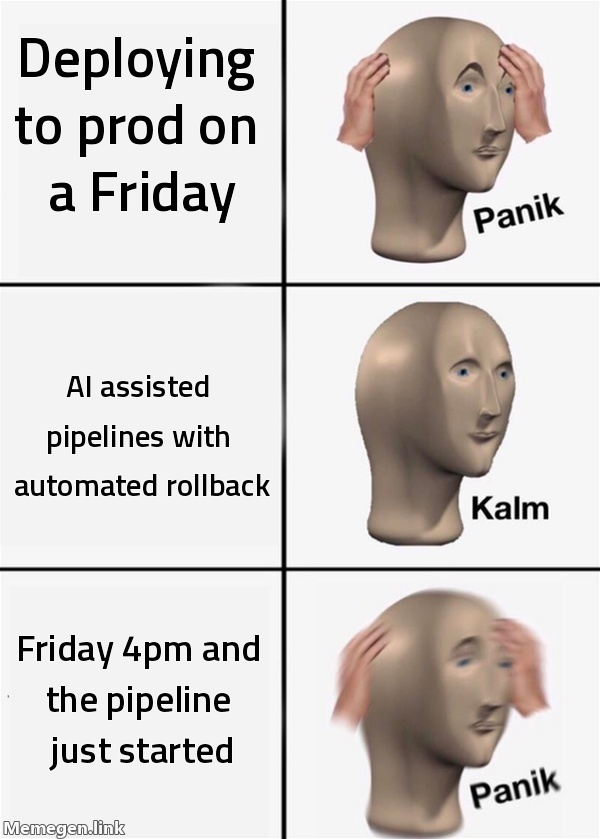

---

This was a Developer Theater lightning talk — 25 minutes, standing format, smaller audience. The kind of session that delivers more per minute than most full-length sessions.

The theater sits inside the main Expo Hall. Getting there meant my first proper walk through it — and that walk completely derailed my plans for the rest of the conference in the best possible way. I'll come back to that at the end.

---

## The problem: the legacy paradigm

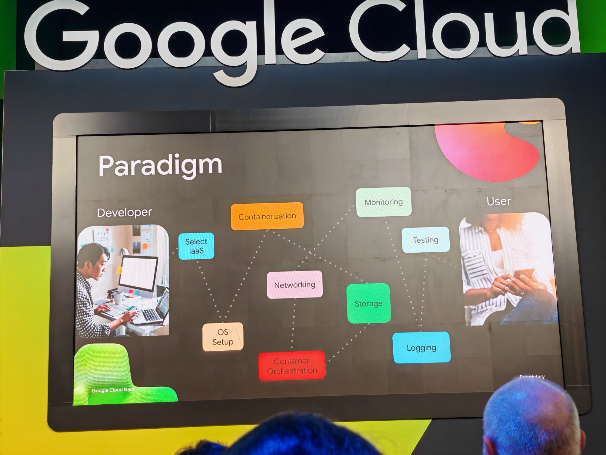

The opening slide said it plainly. A developer today has to navigate: select IaaS, OS setup, containerisation, container orchestration, networking, storage, logging, monitoring, testing — before a user ever sees anything. Every team solves this differently. Tooling is siloed. Cognitive load is high. Onboarding is slow. Security and compliance become afterthoughts rather than foundations.

Sound familiar? It should. This is the reality at most organisations operating at scale, including ours.

The DORA research backs it up: siloed teams with manual processes between dev and ops destroy velocity at the point where it matters most — getting production-ready software out the door without creating risk.

---

## The shift: Platform Engineering and developer self-service

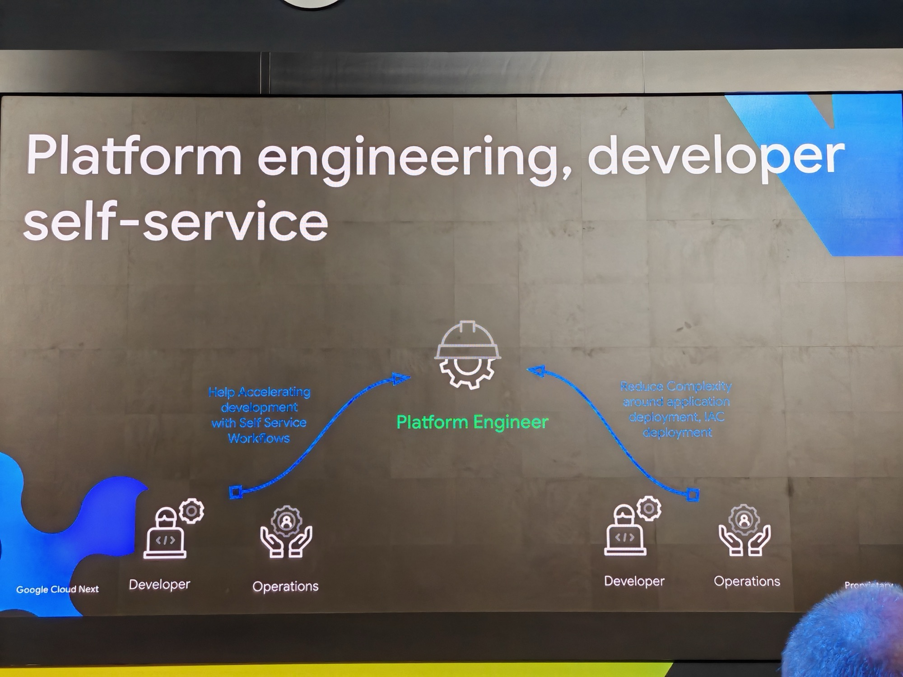

The answer is Platform Engineering — and the key word is *self-service*. The Platform Engineer sits between developer teams and operations, building the abstractions and workflows that let developers ship without needing to understand every layer beneath them.

The goal: a developer fills in a form. They get production-ready infrastructure.

That's it. Everything else — provisioning, security scanning, compliance checks, observability configuration — happens automatically.

---

## The ideal workflow

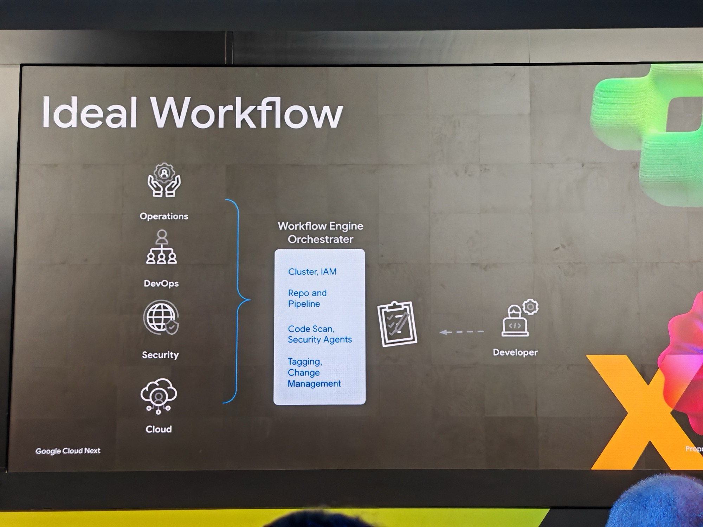

The ideal workflow has a single entry point: the developer. Behind that entry point, a **Workflow Engine Orchestrator** handles everything:

- Cluster provisioning and IAM
- Repository and pipeline setup
- Code scanning and security agents
- Tagging and change management

The developer never touches any of this directly. They describe what they want. The platform delivers it.

---

## The framework

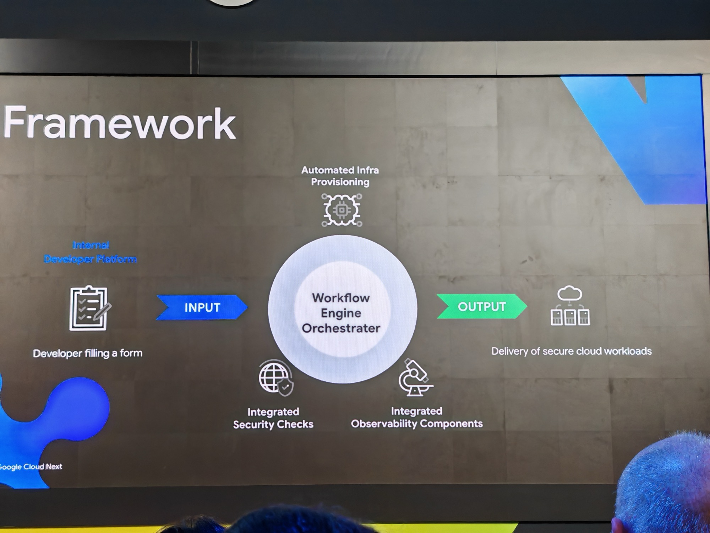

The framework is clean: INPUT → Orchestrator → OUTPUT.

- **Input:** a developer fills in a form — application type, environment, requirements
- **Orchestrator:** automates infra provisioning, security checks, and observability configuration
- **Output:** secure cloud workloads, ready to go

The platform choices underneath — VM-based, Kubernetes-based, or agentic workflow — are abstracted away. The developer doesn't choose the foundation. They choose what they're building.

---

## Implementation architecture

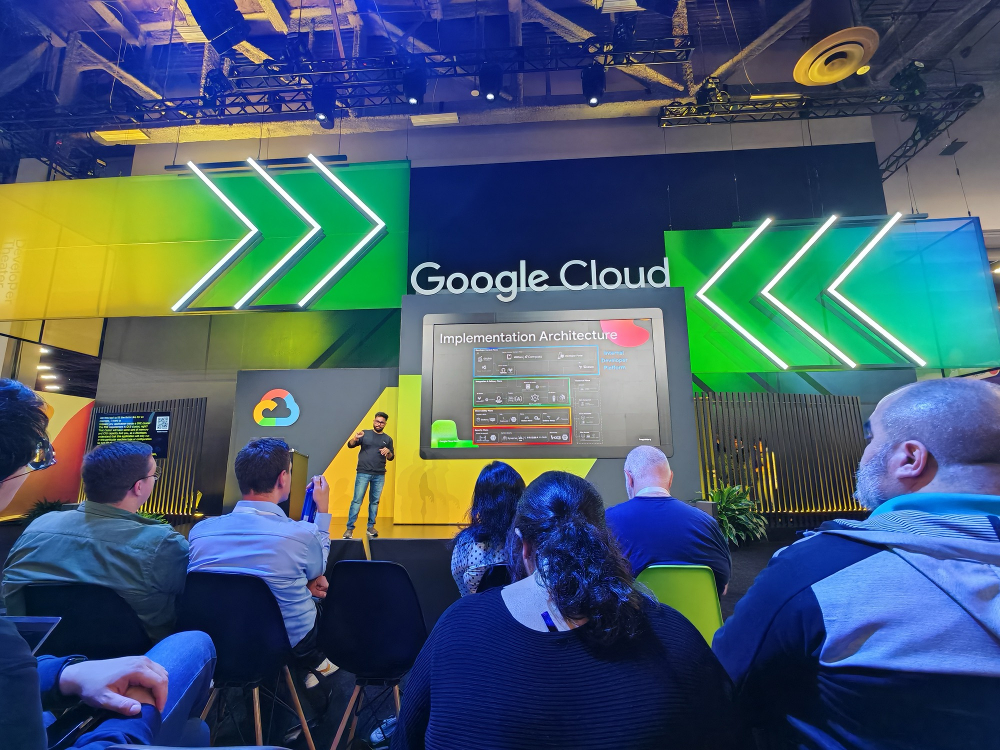

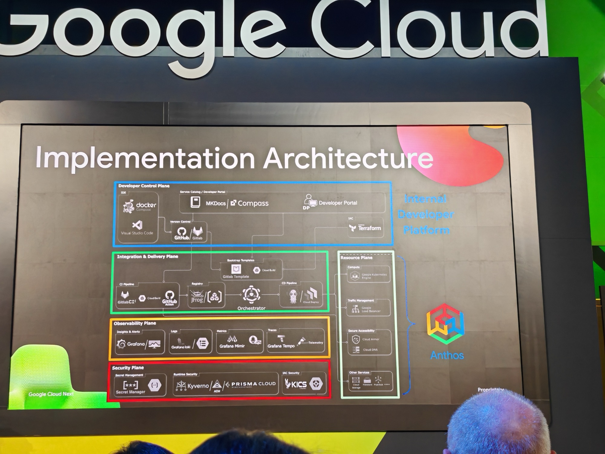

The full stack breaks into five planes:

- **Developer Control Plane** — IDE (VS Code, Docker Compose), version control (GitHub/GitLab), service catalog (MKDocs/Compass), IaC (Terraform)
- **Integration & Delivery Plane** — CI/CD (GitLab CI, GitHub Actions, Cloud Build), artifact registry (JFrog), orchestrator, Cloud Deploy
- **Observability Plane** — Grafana, Grafana Loki, Grafana Mimir, Grafana Tempo, OpenTelemetry
- **Security Plane** — Secret Manager, Kyverno, ACM, Prisma Cloud, KICS
- **Resource Plane** — GKE, Google Load Balancer, Cloud Armor, Cloud DNS

The unifying layer: **[Anthos](https://cloud.google.com/anthos)** — Google's single control plane for managing workloads across GCP, AWS, and Azure. True multi-cloud platform engineering, not just GCP-centric thinking.

---

## AI-powered operational excellence

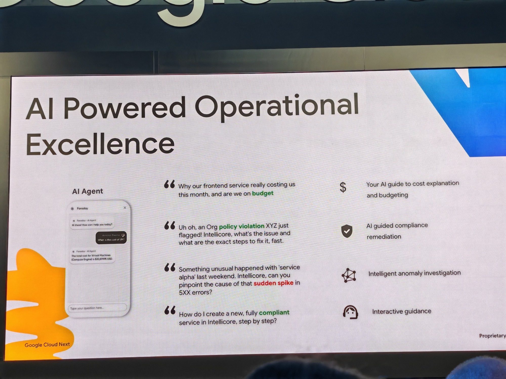

The AI layer sits on top of the platform and connects to Vertex AI. The agent handles:

- **Cost explanation and budgeting** — "Why is our frontend service costing so much this month?"
- **Compliance remediation** — "An Org Policy violation just flagged. What are the steps to fix it, fast?"
- **Anomaly investigation** — "Something unusual happened with service-alpha last weekend. Can you pinpoint the 5XX spike?"
- **Interactive guidance** — "How do I create a new, fully compliant service, step by step?"

This is the operational layer that turns the IDP from a provisioning tool into an intelligent platform that actively helps engineers do their jobs.

---

## Standardisation across clouds

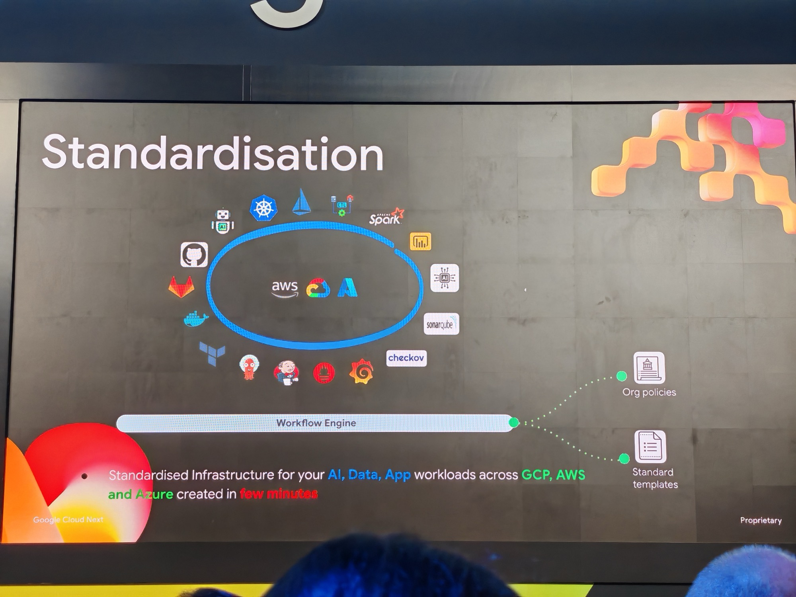

One Workflow Engine. Standardised infrastructure for AI, Data, and App workloads. Deployable across GCP, AWS, and Azure — in minutes, against org policies and standard templates. The tools in the orbit (Kubernetes, Terraform, GitHub, Docker, Checkov, SonarQube) are the same tools teams already use. The platform standardises how they're applied, not what they are.

---

## The impact

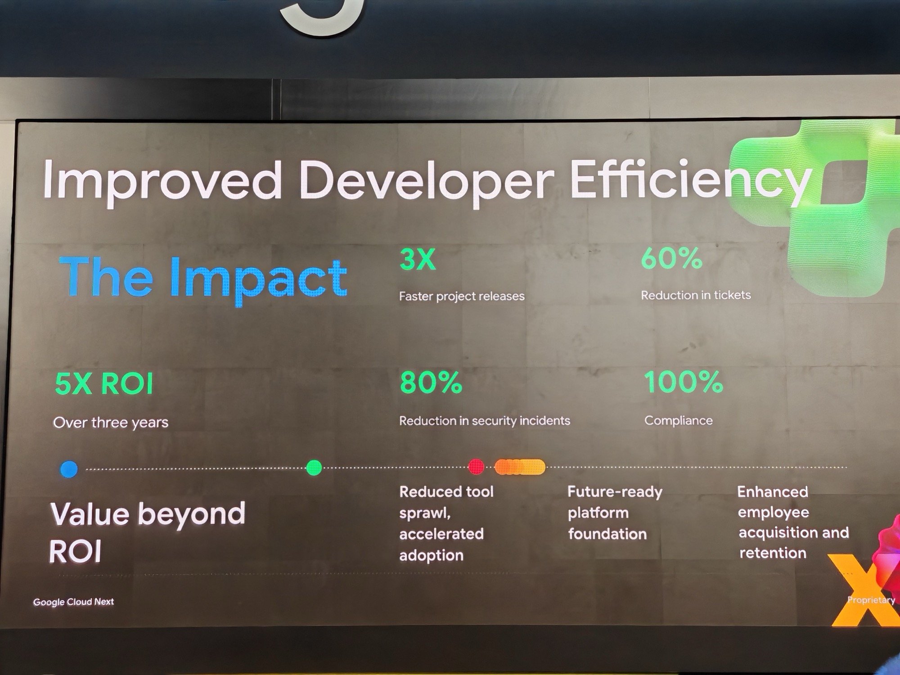

Numbers from the slide:

- **3X** faster project releases
- **60%** reduction in tickets
- **5X ROI** over three years
- **80%** reduction in security incidents
- **100%** compliance

Value beyond ROI: reduced tool sprawl, accelerated adoption, future-ready platform foundation, enhanced employee acquisition and retention.

---

## The demo: Intellicore

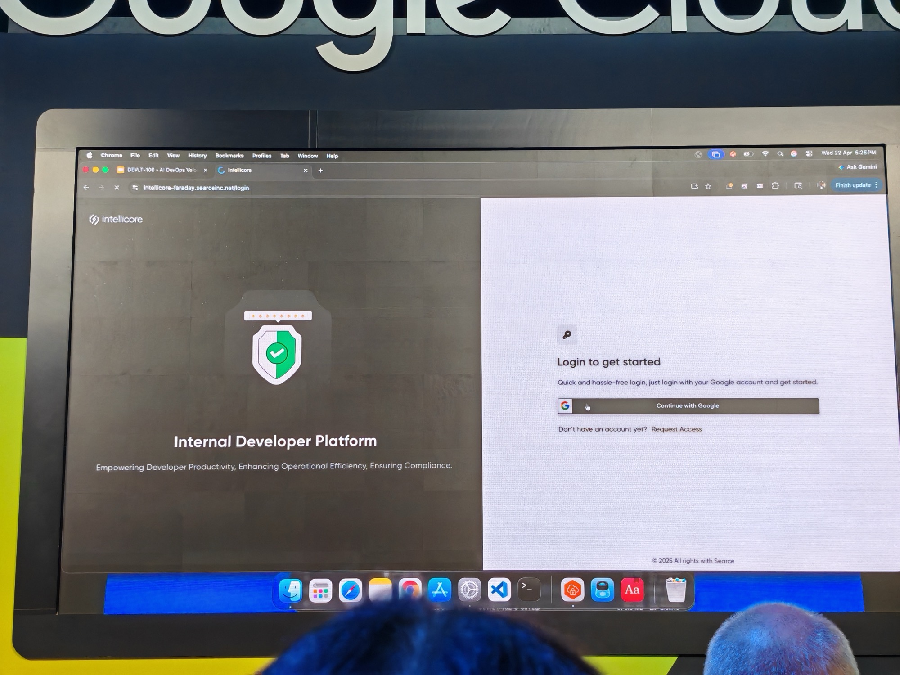

Abhishek demoed [Intellicore](https://searce.com/) — Searce's own IDP product, live on screen. A real platform, not a mockup. Login via Google, instant access to cost overview, resource overview, security overview, observability overview. Integrations include Checkov, GCP Cost Agent, Kyverno, Prometheus, Grafana, SonarQube, and more — all pluggable.

This wasn't theoretical. It exists. It runs.

---

## Why I picked this

I want to build a true IDP for Beyond and Qodea.

The notes I took during this session were less about what Abhishek was saying and more about mapping it against what we have today. Slow developer onboarding — manual provisioning, no golden path. Siloed teams and tooling creating bottlenecks. High cognitive load — engineers with wildly different baselines, no standardised foundation. Compliance and security risks from inconsistency.

These are not theoretical problems. They are the problems I deal with.

The line that stayed with me after the session: *we call ourselves Platform Engineers, but we don't do any Platform Engineering.* That's not a criticism — it's an honest read of where we are. We do infrastructure. We do DevOps. But a self-service platform that abstracts the complexity away from developers and bakes in security and compliance by default? We're not there yet.

This session, alongside the [Config Connector session]() earlier in the day, gave me the clearest blueprint I've seen for what that journey looks like. KCC handles reconciliation. Anthos handles multi-cloud. The Workflow Engine handles provisioning. The AI layer handles operations. The pieces exist.

Now it's about building the will and the team to put them together properly.

---

## The Expo Hall — and the Puppy Park

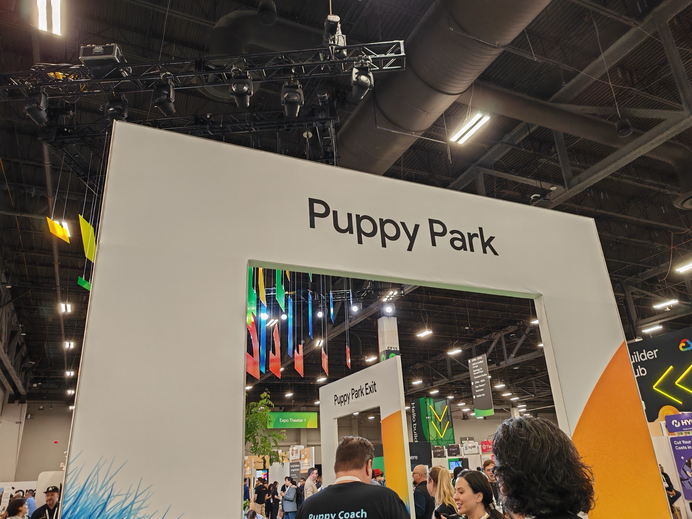

Walking to this session meant cutting through the main Expo Hall for the first time. I had spent most of the day in breakout rooms and conference halls. The Expo Hall is something else entirely — the scale, the installations, the vendor presence, the live demos. I had roughly five minutes before the session started and I could already tell I had been allocating my time wrong. I rearranged my schedule on the spot for Days 2 and 3 to spend more time in there.

But first: I had seen the Puppy Park on the conference map and I was determined to find it.

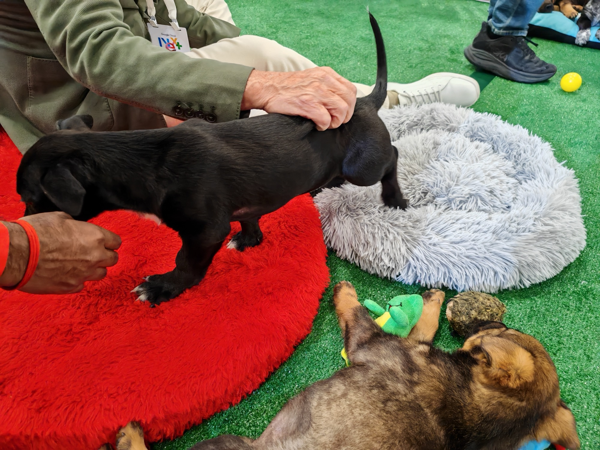

Google had set up an actual Puppy Park in the Expo Hall. Astroturf, dog beds, toys, and a rotation of rescue dogs available for a proper cuddle break between sessions. The idea is sound. Conference fatigue is real, and apparently the cure is a room full of dogs.

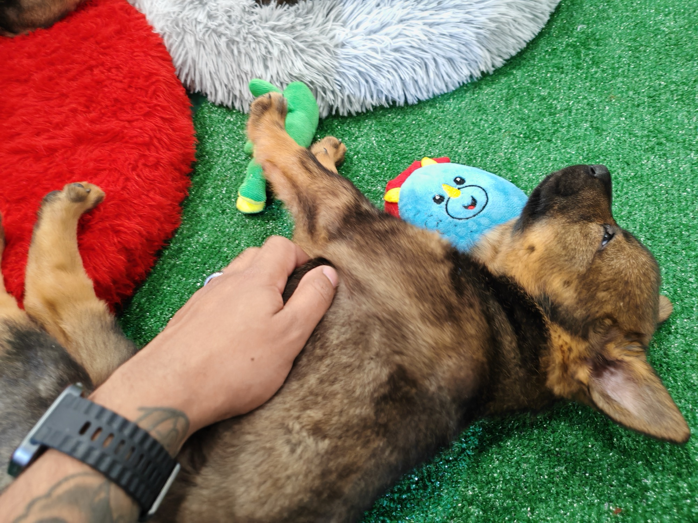

I arrived at the end of the day. The puppies were done. Flat out, barely registering that humans were present. Completely puppied out.

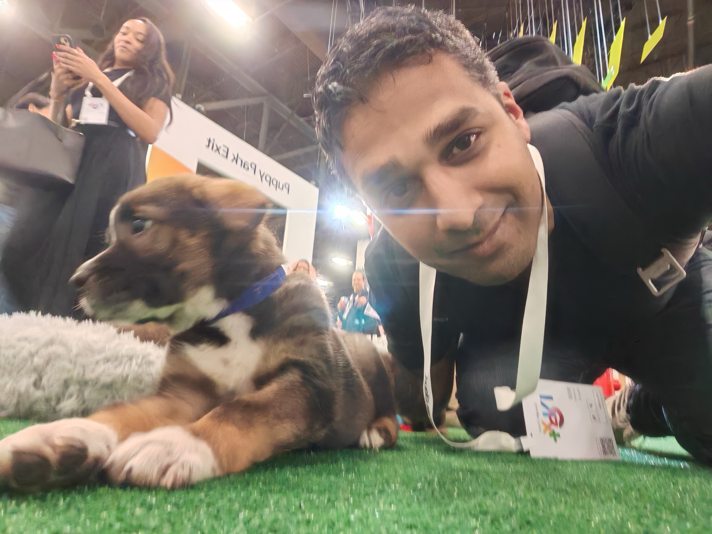

Can confirm: still worth it.
