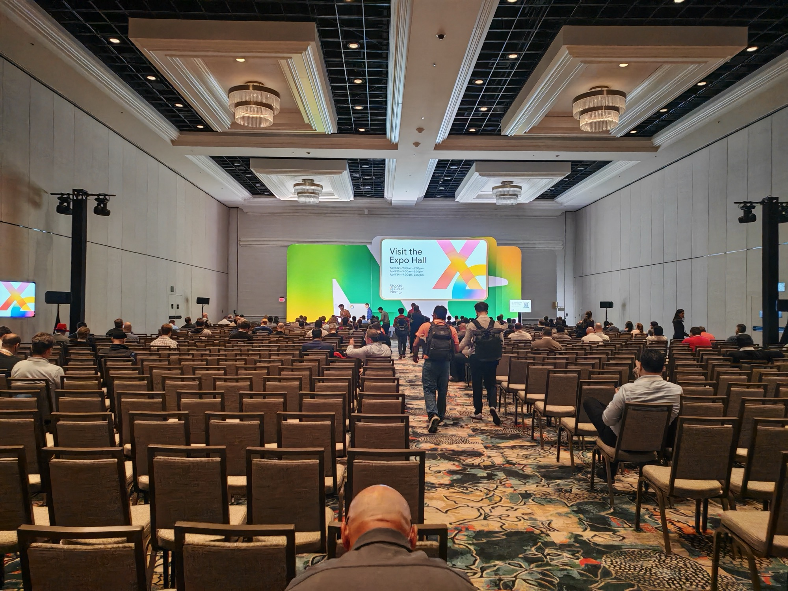
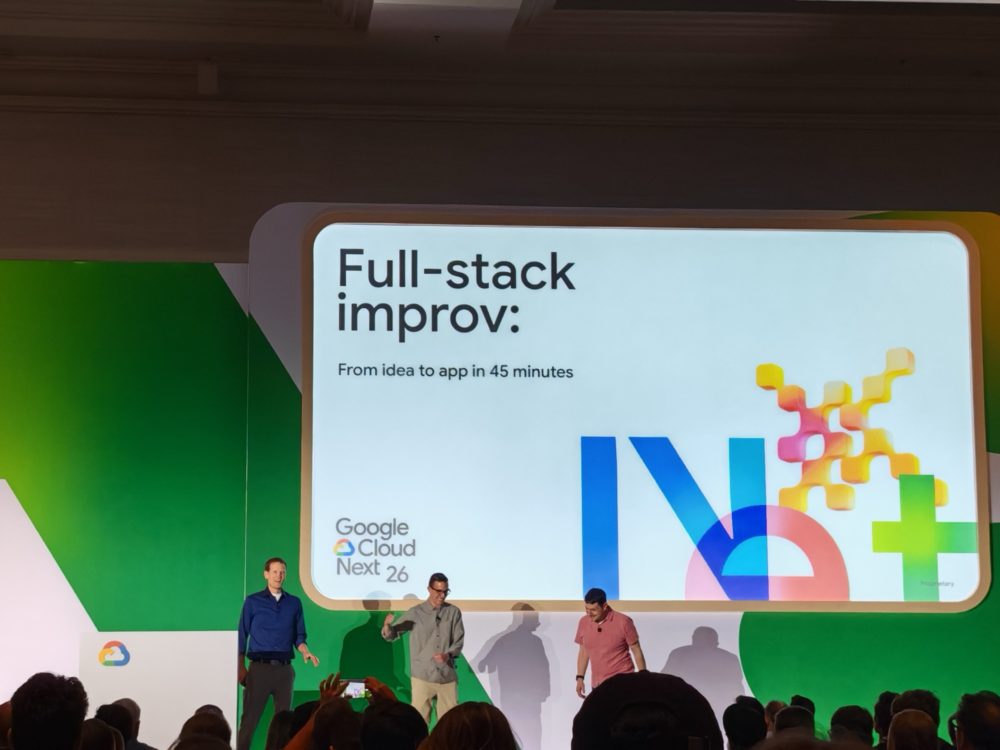
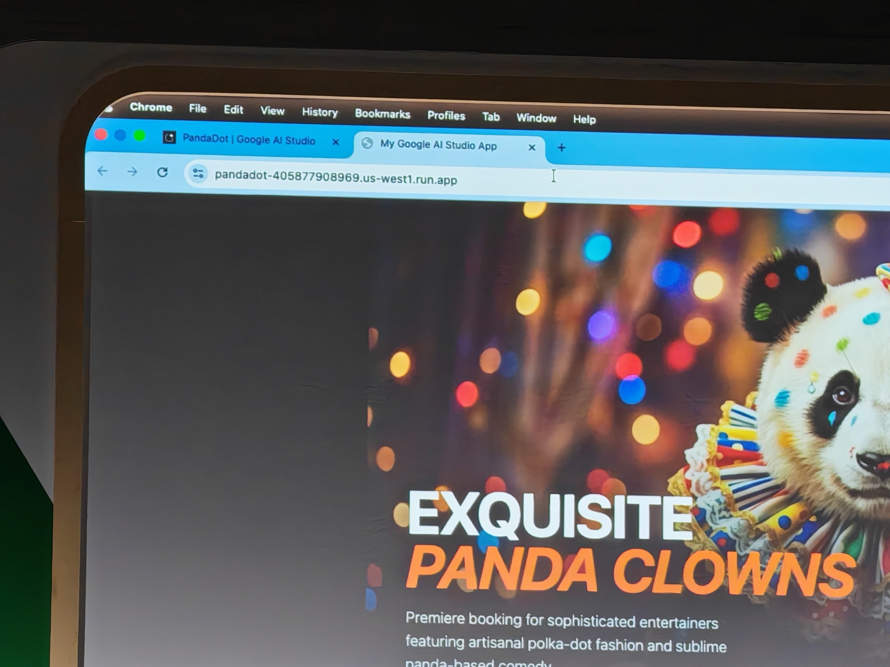

## What this session is about

Watch a full-stack application get built from scratch in 45 minutes — live, with intentional improvisational elements. No pre-baked demos, no safety net. This session showcases how Google Cloud tools can take you from idea to working app at speed, including a dose of chaos to show how you recover when things don't go to plan.

**Speakers:** Justin Mahood (Group Product Manager, Google Cloud) · Simon Margolis (Associate CTO & Distinguished Technologist, Insight) · Luke Schlangen (Developer Advocate, Google Cloud)

---

After a run of smaller, more intimate sessions, this one was back in the main conference ballroom. Different energy entirely.

Three speakers on stage. Their framing going in:

> *Sometimes live demos feel too polished without enough opportunities for things to go wrong, so we're going to throw out the script and do this one live.*

The format: the audience shouts out an app idea, they build it live, start to finish, in 45 minutes. No pre-loaded project, no hidden scaffolding. The "improv" is literal — direction changes on the fly based on what the audience wants.

---

## What they built

The audience voted on the app concept. After a Bigfoot sightings tracker got floated, the room landed on something considerably better: a booking platform for polka-dot panda clowns.

The stack:

- **[Google AI Studio](https://aistudio.google.com/)** — the browser-based IDE used to generate the full-stack app via natural language prompts
- **[Cloud Run](https://cloud.google.com/run)** — serverless deployment, the app was live at a `*.us-west1.run.app` URL by the end of the session
- **[Firestore](https://cloud.google.com/firestore)** — NoSQL document database storing the listings
- **[IAP (Identity-Aware Proxy)](https://cloud.google.com/iap)** — authentication layer so only authenticated users could submit new entries

The three-tier architecture — frontend, backend, database — was generated, configured, and deployed almost entirely through prompts in Google AI Studio. The audience called out changes in real time, the speakers adapted, and the app was running on a live URL before the 45 minutes were up.

The final product: **PandaDot**. "Exquisite Panda Clowns — Premiere booking for sophisticated entertainers featuring artisanal polka-dot fashion and sublime panda-based comedy." Deployed, live, working.

I added a listing. A panda clown named Sephiroth, whose key skill was tormenting all types of Cloud.

I'll see myself out.

The demo didn't run completely clean — IAM propagation latency caused a delay, and even after the speakers thought they'd locked it down, meme phrases were still surfacing on the booking page instead of listings. "All your pandas belong to us" was one of them. The audience found this considerably funnier than the speakers did. Which, in fairness, is exactly what the session promised.

---

## What I actually thought

I enjoyed it — the interactive format worked well and it was genuinely fun to watch something ship live with decent banter. It *did* feel more like a showcase for Google AI Studio than a session with transferable insight. The "improv" framing was clever but the underlying message was essentially *look how fast AI Studio deploys to Cloud Run.*

That's not a criticism of the speakers — they pulled it off well and the energy in the room was good. It was fun - after deep dive technical sessions throughout the day.

---

## Why I picked this

After four sessions of structured content, I wanted something lighter. Live coding under pressure with audience participation — that sounded like a good way to end the afternoon session block. It was.

---
