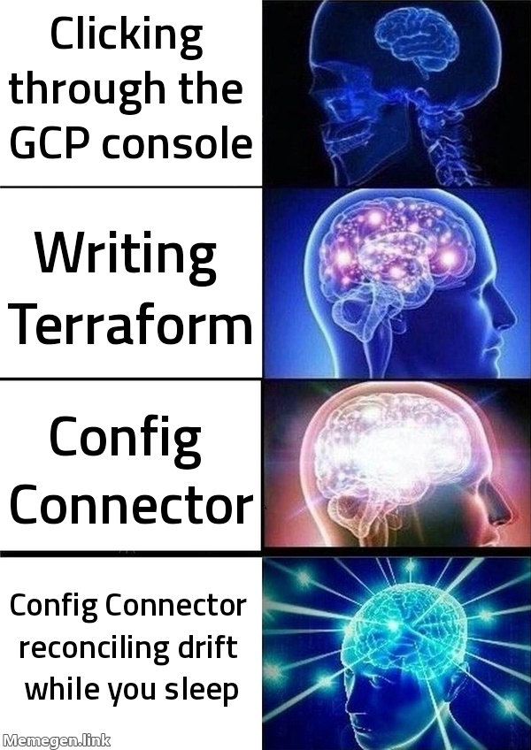
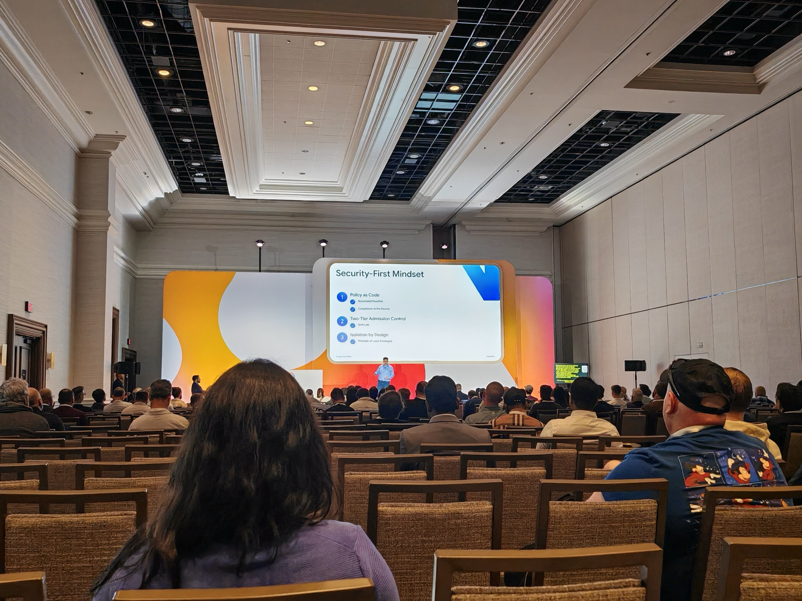
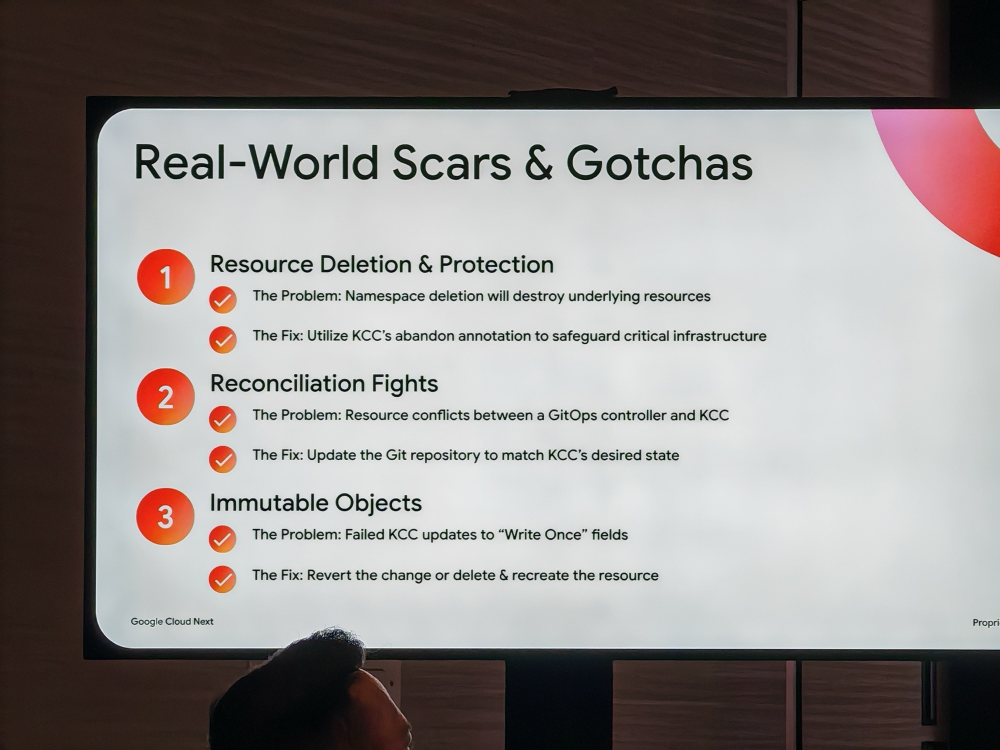
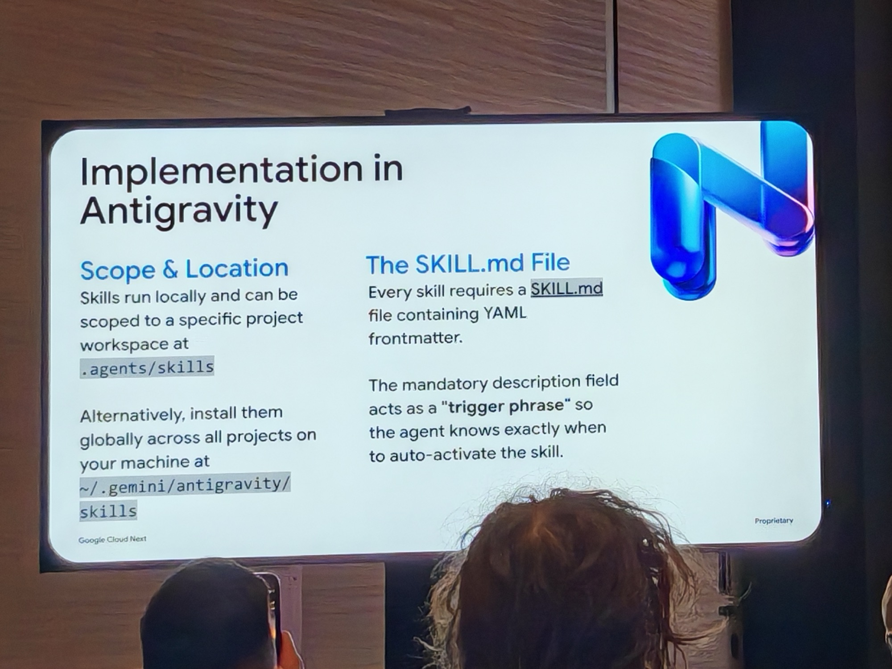
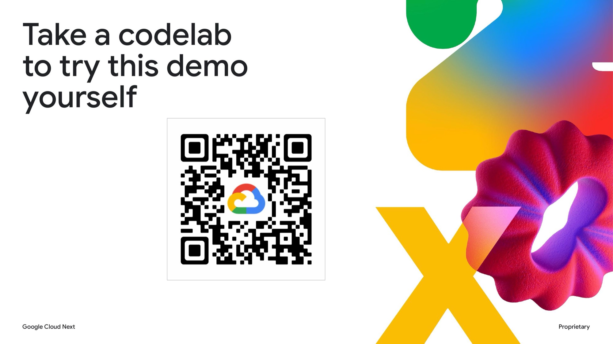

## What this session is about

How Gemini and Config Connector help establish a secure, AI-ready foundation for cloud teams — shifting from ticket-ops to GitOps with self-service platform engineering.



**Session slides:** [PDF](https://content-cdn.sessionboard.com/content/xKYYNVoSJefuy0iXJ6MF_BRK2-111.pdf)

---

## Agenda Meme

---

## Made it

Somehow. The corridors after the keynote are claustrophobic. I felt safe at all times but the picture in the previous post did not do it justice. Anyway the session for this was three floors up on the other side of the conference centre. I knew where I was going from my recon the previous day.

---

## The golden path: from Ticket-Ops to GitOps

[Config Connector (KCC)](https://cloud.google.com/config-connector/docs/overview) is Google's Kubernetes-native way to manage GCP resources — you declare what you want in YAML, KCC reconciles it with actual cloud state. The session framed it as the foundation for a genuine GitOps culture: not just a deployment tool, but a shift in how teams operate to deploy infrastructure on Google Cloud. It is similar to Crossplane.

The architecture is clean: map KCC Namespaces to GCP Projects with dedicated Git repos per namespace. From there you get self-service onboarding, reusable abstractions, and a golden path that doesn't require reinventing anything. Pair it with (for example) an Argo Workflow for initiating workloads, templated YAML, and input validation at the Git layer, and you have a proper promotion path from dev to production.

Key concepts that stuck:

- **Policy as Code** — compliance at the source, not bolted on afterwards
- **Two-Tier Admission Control** — enforcement at both the cluster and policy level
- **Shift Left** — not just a GitOps pattern, applicable anywhere
- **Iterative Hardening** — it forces engineers to learn and not be locked in to legacy. That's the point, and that's the future.

One thing the session was honest about: KCC can't deploy itself. You still need to bootstrap it — the Terraform chicken-and-egg problem doesn't disappear, it just moves. Worth accounting for upfront.

---

## Real-World Scars & Gotchas

The most useful part of the session. Real operators sharing what actually breaks in production.

Three main failure patterns from the slide:

1. **Resource Deletion & Protection** — deleting a namespace destroys all underlying resources. The fix: use KCC's abandon annotation to safeguard critical infrastructure. The safe deletion workflow is three PRs: add the abandon annotation → delete the resource from KCC (which abandons it in the cloud, not destroys it) → remove the annotation.

2. **Reconciliation Fights** — resource conflicts between a GitOps controller and KCC. The rule: KCC should always win. Fix: update the Git repository to match KCC's desired state.

3. **Immutable Objects** — failed KCC updates to write-once fields. Fix: revert the change, or delete and recreate the resource.

Three more that didn't make the slide but came up:

- **IAM limits** — each project is capped at 1500 members. Use Google Groups before you hit it. It is unlikely we will hit this internally but as we continue to scale - just reinforces best practice.
- **Project Quota Limits** — distribute API calls through the Config Connector context to define the specific project and define the service account explicitly. KCC clusters can exceed the quota of the host project if you're not deliberate about it.
- **Policy Overload** — extensive security policies trigger Gatekeeper webhook timeouts. Fix: use a Vertical Pod Autoscaler to ensure Gatekeeper has sufficient resources - again, more for a huge enterprise but an architecture decision to keep in mind.

---

## The agent angle

The session ended with something I hadn't expected: a KCC Ops Agent Skill running on [Antigravity](https://antigravity.google/) — Google's agentic development platform. The model is Discovery, Activation, Execution. Skills can bundle Bash or Python scripts and execute them directly, and are loaded only when needed.

The insight that landed:

> *You don't have to force every engineer to learn the KCC internals from scratch. Build the KCC Ops Skill, make it good enough, and the learning curve disappears — replaced by something more capable and consistent than a human trying to remember the abandon annotation workflow at 2am.*

That isn't an argument for skipping the learning. It's the opposite — someone needs to build and own that skill, and it needs to be someone who understands what it's doing underneath.

That said - I strongly recommend learning CRD and YAML.

This immediately connected to a tool we have internally Peacekeeper — An internal automated security response platform built before Wiz was a thing. Essentially a set of Cloud Functions deployed via Terraform that auto-remediate SCC findings and Cloud Logging events in real time alongside Org policies in Sandbox projects. It can get pretty granular, like a CRD file. KCC reminded me a lot of that, but faster. If violations are defined as policy, KCC will just reconcile them back automatically — no event chain, no Pub/Sub, no Cloud Function in the middle. Faster, and native to the platform. That's worth exploring as the better long-term path.

There was also a mention of using Gatekeeper / [Gator](https://open-policy-agent.github.io/gatekeeper/) to compare local YAML against policy YAML in Git before commit and push. Always vet against the CRD manifests before it reaches the cluster — don't wait for KCC to reject it.

Pair this with AI as your robot housekeeper and a custom Agent skill. This keeps the house clean before it even gets messy.

---

## Why I picked this

I'll say it plainly: I want to re-architect our internal IDP to use KCC instead of the current stack. I don't know the full legacy story behind the current setup, but I have inherited it. More companies are adopting the GitOps way of thinking and I would love to ensure we are not left behind.

I want to do this properly and not solo. I have built connections internally with new and existing colleagues and together, we will build this out in a fully structured and documented way, using agents, and an automatic stack to track progress. Working with Engineers across levels and disciplines — so we're learning from each other rather than watching videos individually or vibe coding without oversight. That kind of cross-level collaboration on something real is how knowledge actually transfers and we can all benefit from this. Watch this space.

Existing workflows (in my view) slow down velocity, and I dislike anything that does that. This is the better path. The tools are there, the direction is clear, and the agent angle removes the last remaining excuse. Having a KCC agent to maintain it while we are on customer project has been what is missing, and now I have seen how this can help.
