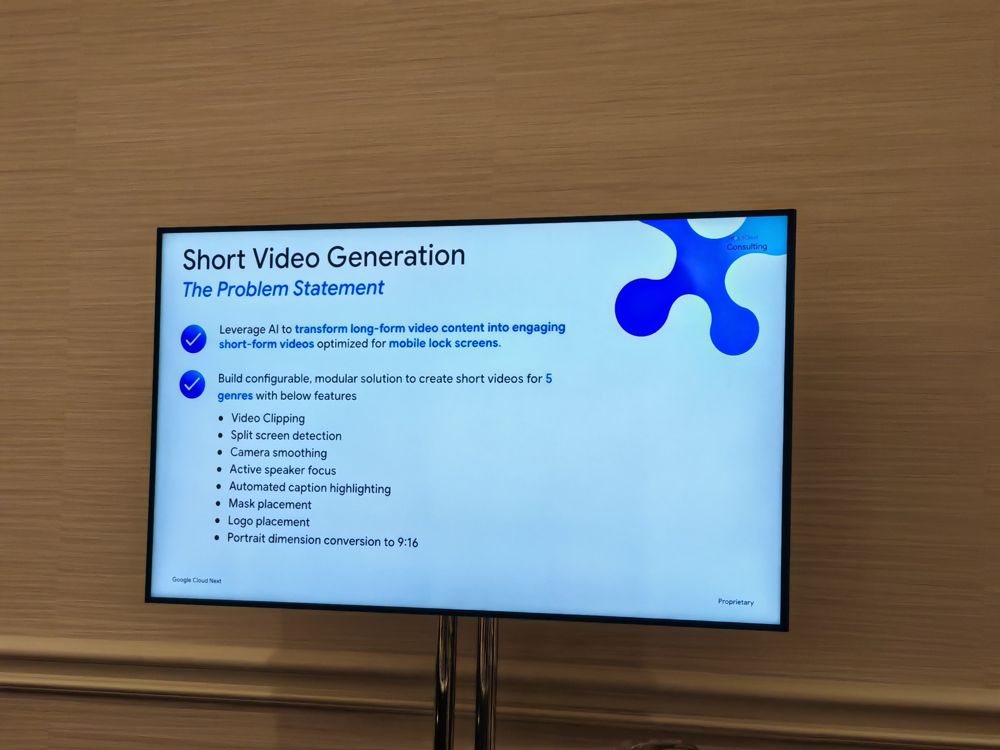
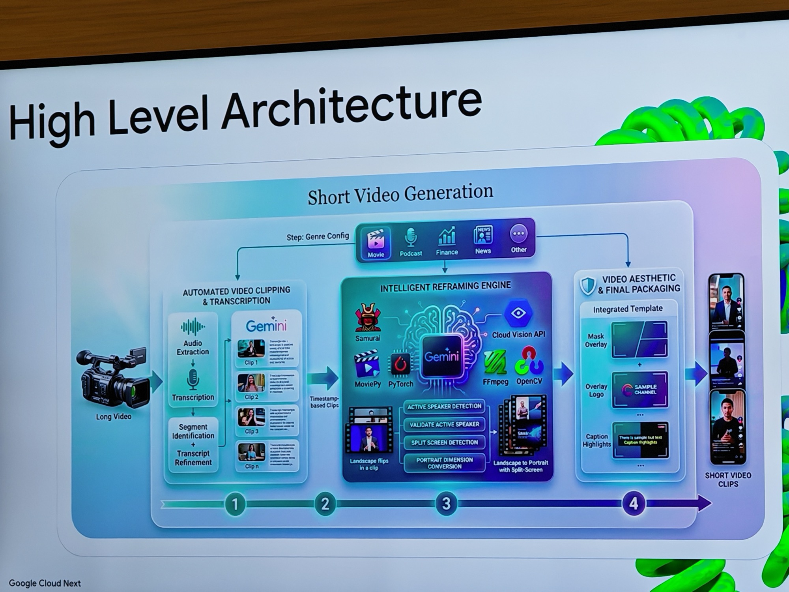
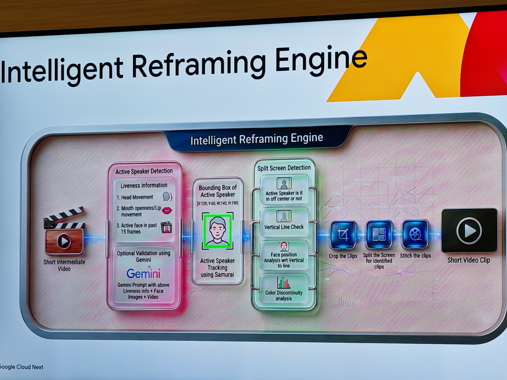
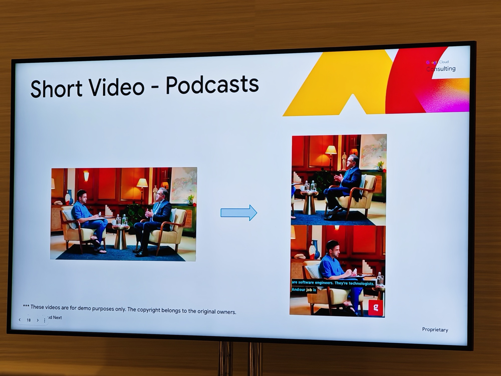

## What this session is about

How do you transform 10,000 videos daily into mobile-optimised clips? Scaling production requires an AI-driven studio, not a massive editing team. Join this session to go behind the scenes of Glance's "Short Video Generation Studio" on Google Cloud. We'll explore a modular pipeline through three stages: an AI Writer for storyboarding, an AI Director for intelligent reframing and active speaker tracking, and an AI Editor for automated post-production. Gain a practical blueprint for turning dormant videos into significant business value.

**Speakers:** Himanshu Aggarwal (Machine Learning Engineer, Glance) · Sharmila Devi (AI Consultant, Google)

---

I actually joined this session because the subject matter — while irrelevant to my day-to-day — seemed like a very bespoke use case that leveraged Google Cloud tech to build a pretty unique solution involving AI and Machine Learning. I just wanted to hear it.

## What is Glance?

[Glance](https://glance.com/) is an AI-driven content platform pre-installed on Android devices — you MAY have seen it on a lock screen. It serves personalised news, entertainment, games, and live shopping directly without the user unlocking their phone, and currently reaches over 300 million active users across 450 million Android devices globally. It's an [InMobi](https://www.inmobi.com/) subsidiary, big in India, Indonesia, Japan, and increasingly the US.

The session opened with Glance positioning itself as it is today — more of an **agentic commerce platform** — not just a content feed, but a layer that connects the right content to the right person at the right moment, at massive scale. 10,000 videos processed daily is the context behind why you need a pipeline like this rather than a team of editors.

---

## The problem statement

The core challenge: Glance had tens of thousands of long-form videos from content creators and needed to produce engaging short-form clips optimised for mobile lock screens, across five genres — Movies, Podcasts, Finance, News, and Other at scale. Of course, each genre needs a different definition of what "engaging" means. For example — movie stars saying a punchline.

The feature set in the solution also required:

- Video clipping
- Split screen detection
- Camera smoothing
- Active speaker focus
- Automated caption highlighting
- Mask and logo placement
- Portrait dimension conversion to 9:16

Doing this manually at scale is not viable. The session was about how they automated all of it.

---

## The pipeline

The architecture breaks into four stages.

**Stage 1 — Automated Video Clipping & Transcription**

A two-hour video lands in a GCS bucket. [pydub](https://github.com/jiaaro/pydub) extracts the audio and converts it to `.flac`. The audio is transcribed with timestamps and that transcript is fed to Gemini 2.5, which validates the text and identifies key moments — returning timestamp ranges for each clip.

What makes this configurable: the prompt is genre-aware. For a podcast, Gemini finds the most engaging exchanges. For a movie, it identifies the punchline moments. Same model, different instructions, different output.

**Stage 2 — Intelligent Reframing Engine**

The most technically interesting part. [SAMURAI](https://github.com/yangchris11/samurai) — an enhanced adaptation of Meta's [SAM2](https://ai.meta.com/sam2/) that adds motion-aware memory for zero-shot video object tracking — follows subjects continuously through each clip even when they move quickly or are temporarily hidden. Gemini then handles active speaker detection on top of that tracked data.

**Stage 3 — Video Aesthetic & Final Packaging**

Mask overlays, logo placement, caption highlighting, and portrait conversion to 9:16 — all applied through integrated templates using [MoviePy](https://github.com/Zulko/moviepy), [FFmpeg](https://ffmpeg.org/), and [OpenCV](https://opencv.org/). Output: a finished short clip ready for the lock screen with split screens/focusing/cuts. Pretty cool.

---

## Active speaker detection: the deep dive

The reframing engine is where the real engineering lives. Given a clip with multiple faces, it needs to know who is speaking — and whether to split screen or focus on one person.

Three liveness signals feed into Gemini: head movement, mouth openness and lip movement, and active face presence in the past 15 frames. Gemini receives all of that alongside the face images and video, and returns the active speaker with bounding box coordinates.

SAMURAI tracks that speaker continuously through the clip. Split screen logic runs in parallel: is the active speaker off-centre? Run a vertical line check. Analyse face position relative to that line. Check for colour discontinuity. Based on all of that — crop to one speaker, or split screen.

---

## The output

The demo showed a podcast interview — two people in a wide landscape shot — transformed into a vertical 9:16 split screen with the active speaker tracked and highlighted and captions auto-overlaid. Clean result. The kind of output that would take an editor real time to produce manually, done automatically at scale.

For the user — a much more visually pleasing experience that could free up more screen space which seems to be a commodity smart phones love showcasing.

---

## Why I picked this

The topic sounded genuinely interesting and I wanted a more interactive format — this was a smaller room, round tables, whiteboard-style. I have speculative ideas about GenAI video for gaming and Lovecraft content, so something like this was partially relevant although the one I did vibe code, had a different kind of flow.

Honest assessment: This seemed like one of those typical bespoke use cases that I could see working really well for Glance but hard for me personally to see being adopted easily anywhere else. I can see why it is successful but at the same time question the production quality vs what I see a human editor produces on YouTube.

Still enjoyed it, first experience of something like this.

What struck me most on reflection is that this is essentially what I do — take a customer's problem, select the right combination of available tools, and build a solution that solves it. Himanshu and Sharmila did exactly that here: a real customer problem, stitched together with Gemini, SAMURAI, pydub, FFmpeg, and Cloud Vision, built into something that actually works at scale. That's the craft. Full credit to them both — you could tell how much they cared about the work.
