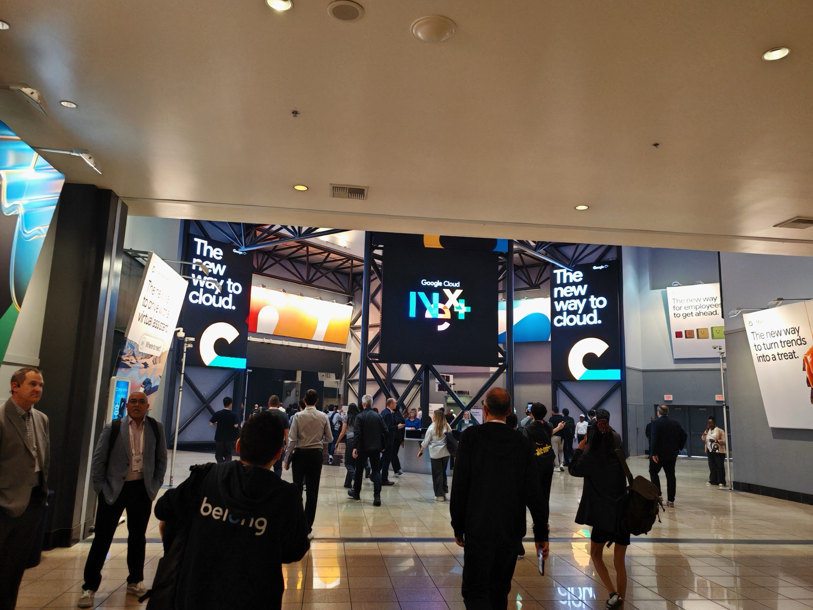
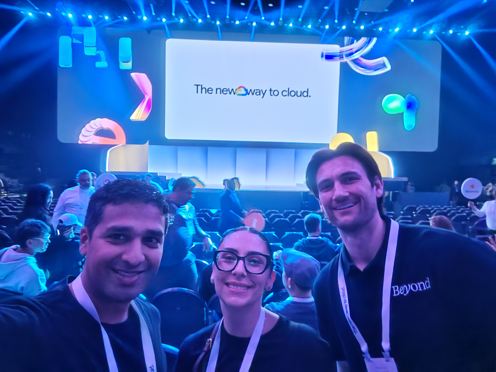
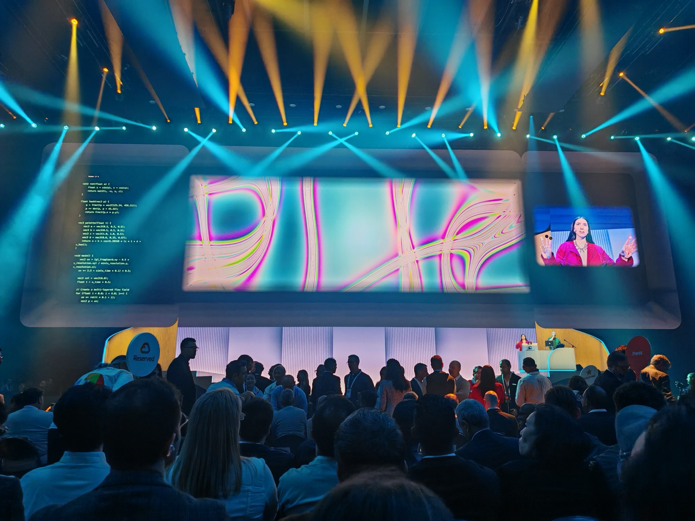
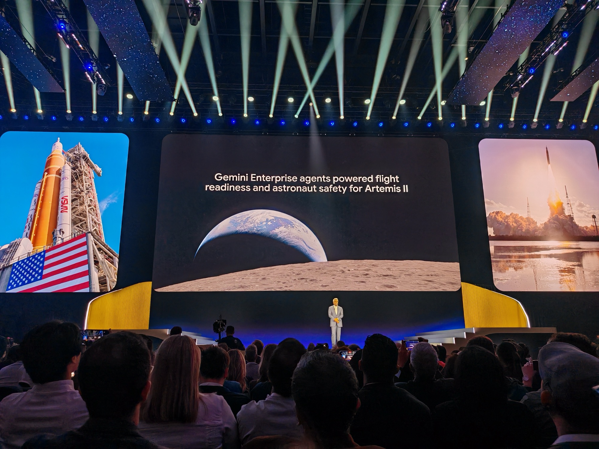
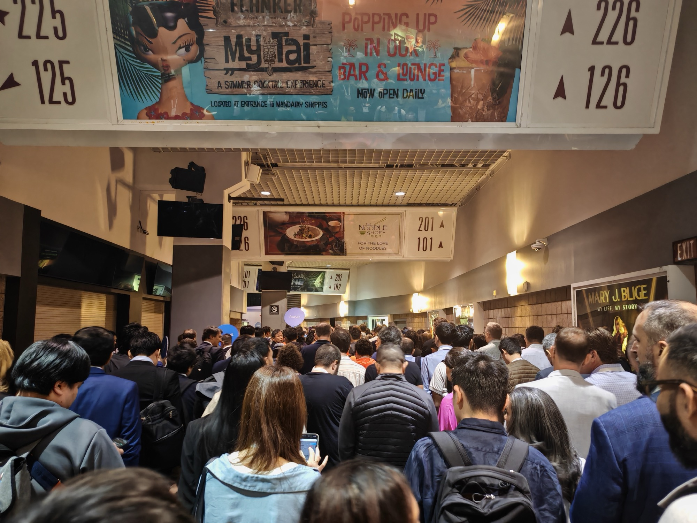
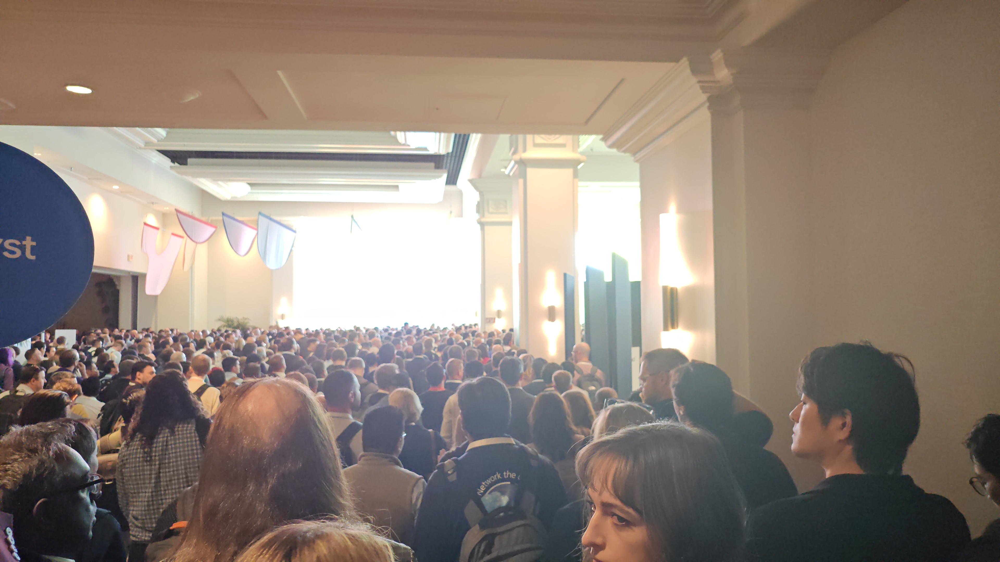

## What this session is about

The Next '26 Opening Keynote introduces the blueprint for the agentic enterprise, guiding businesses through the shift from AI adoption to large-scale transformation. Google Cloud CEO Thomas Kurian was joined by Google SVP Amin Vahdat, Chief Product Officer Karthik Narain, and COO Francis deSouza for major product announcements, live demos, and a clear statement of where Google Cloud is heading.



This post isn't a full breakdown — watch the video for that. This is my personal take on some of the areas that sparked interest and what I think it means for a Platform Engineer, and what may change in my own growth roadmap as a result.

---

## Getting there

Short walk from the Luxor to the Mandalay Bay Queue at 7am for a 9am start. It was in the Arena and  Sam and I got there early before Andreeea joined us — the only realistic way to guarantee a seat. Our CEO and other members of leadership had advised just how busy this gets — the highlight of Next. If you want to be in the room for the opening keynote at a conference this size, you need to treat it like a gig.

We did pretty well with the seats. The YouTube video which has good shots of the arena for scale.

---

## The opening — literally Vibing

Before the keynote, we were entertained by a performance that set the tone for everything that followed.

AI-generated music using Gemini 2.5 Flash played live by a DJ. A performer controlled visuals in real time using hand signals — no controller, no keyboard, just gestures tracked by [MediaPipe](https://ai.google.dev/edge/mediapipe/solutions/guide). Gemini was simultaneously listening to the music and generating the visuals.

It reminded me of visiting the [Museum of the Future](https://museumofthefuture.ae/) in Dubai — that same feeling experiencing something when Human energy is directed the right way. The difference is that the museum is largely theoretical, a vision of what could be. What happened on that stage was actually being built right now, using tools that are already available, driven by people with vision. Pretty cool!

---

## "The era of the pilot is over"

Thomas Kurian's opening statement to the partners was clear:

> *"You have moved beyond a pilot. The experimentation phase is behind us, and now the real challenge begins: how do you move AI into production across your entire enterprise?"*

The era of the agent is here.

This wasn't positioning or marketing framing — it was a challenge to the room. The rest of the keynote was essentially the answers to it: things already being built, shipped, and serving millions of people.

---

## Gemini Enterprise Agent Platform

The headline product was the Gemini Enterprise Agent Platform — Google's answer to orchestrating agents at scale. I felt this must have been what it was like when GKE first became a thing — and how much (enjoyable) pain it takes away to set up a K8 cluster ([I fully recommend Kubernetes the Hard Way by Kelsey Hightower](https://github.com/kelseyhightower/kubernetes-the-hard-way)) so you can truly appreciate something like GKE.

They jumped to a slide of companies already building agents for industry and switching to agentic workloads and that put a lot of things into perspective. I am on client projects full time, delivering an SoW that doesn't adapt to new tech that comes into play while we are delivering. Things like Agentic Workflows. It causes a lot of "What to do in my spare time" thinking to ensure I stay relevant.

The broader point also landed clearly: Google is unique in that it owns the entire stack — models, infrastructure, TPU chips, security, partnerships. That's not true of most competitors, and it matters.

When they put that slide up about Gemini being trusted for the safety of astronauts on Artemis II — that wasn't a throwaway line. That is a statement of intent about where they are placing this technology and how seriously reliability and trust are aligned with the Google name. Imagine something had gone wrong and the blame was assigned to the agent. This was an event watched around the world for days and Gemini was a key part of that.

---

## Agentic Data Cloud

The cross-cloud Lakehouse and [Knowledge Catalog](https://cloud.google.com/data-catalog/docs/concepts/overview) announcements stood out for me also. The Lakehouse removes vendor lock-in and the data migration headache — cross-cloud reading as a native capability rather than an expensive workaround. This is huge for connecting other vendors but also concerning for revenue-generating data migration projects.

The Knowledge Catalog is similar in spirit to [NotebookLM](https://notebooklm.google/) but built for enterprise context — patterns, institutional knowledge, and trusted context that agents can rely on to operate with certainty rather than hallucinating their way through a workflow. I love the concept of this because it allows a business's entire unique context to be fed to agents when executing workloads. The demo was insane.

The Workspace Gemini integration was also impressive. The demo on turning old data into revenue-generating opportunities in minutes — having worked in a corporate, something like that would take weeks if not months. A reckoning for companies and people that do not know how to drive AI.

---

## Coding agents are the new junior developer

I'll write more on this in my [Day 1 recap](link) but Sundar stated how 75% of new code at Google is now AI-generated and engineer-approved, up from 50% the previous year. Complex migrations are completing six times faster than a year ago. These are Google's own internal numbers, but the direction of travel is the direction of travel. My extended thoughts on this will be in the recap later today — having made my transition to engineering just before AI took off and then utilised it to supercharge my development, it is a very interesting contrast to consider if I would have been able to do that with the AI tools we now have today.

---

## Security at machine speed

Security got a significant chunk of the keynote, which felt right. The partnership with [Wiz](https://www.wiz.io/) was front and centre — combining Google Threat Intelligence and Security Operations with Wiz's Cloud and AI Security Platform into what they're calling Agentic Defense.

The point about Shadow AI resonated: hidden AI usage inside organisations is a real and growing security risk that most companies are underestimating. Human analysts cannot keep up with AI-driven attacks. Security has to operate at machine speed now — the Gemini Native Agentic SOC is Google's answer to that. I attended a session on this — [read that post](link).

If you're not already looking seriously at Wiz or other platforms like Crowdstrike or Datadog, now is the time. Security first, before you scale anything else. Shift left, always. I'm hoping they add more to the Professional Security Engineer cert — that is next on my list.

---

## Then it ended

Two hours goes fast when the content is good. Everyone in the arena needed to be somewhere else immediately. I had to skip the reaction video my company was filming and started the march — potentially late for my first session which was on the other side and 3 floors up of the conference centre.

A pro tip - stick to the sides. Way more room to overtake and nimble your way through

---

## Thinking out loud

It's very easy to sit in a keynote like this and immediately start firing off in multiple directions. My brain was doing exactly that in real time — processing, tangenting, refining, filtering, criticising.

After running it through the filter: here's what I actually took away with some context.

I'm a Platform Engineer with a DevOps slant — I live to make problems easier and automate as much as possible when fixing them. Optimisation for a max positive result. One of the benefits of consultancy is that I'm not locked in to a certain technology, each client is a different stack which I get to learn. Internally I get to experiment with anything (with justification) alongside my own interests outside of work.

The question this raised for me immediately: how do I upskill and add value to organisations that want to switch to AI workflows and to stay relevant? Beyond the personal roadmap question, there's a genuine and immediate opportunity to build custom agents for back office processes, individual productivity acceleration, and everything currently falling through the gaps.

1. **Master fundamentals.** When an agent breaks something — and they will — you need the context and capability to understand why and fix it no matter the underlying cause. Businesses with agentic workflows will now operate at increased velocity. They will keep/hire the engineers that can help them get back to that speed, quickly. Therefore the engineers who understand the plumbing are the ones who stay relevant. By fundamentals (in my own view) I mean model training, CI/CD and MLOps pipelines, security, and prompt engineering — learn to program not just script.

2. **Understand system and architecture design.** How on-prem, Google Cloud (or other Cloud providers), and different services connect — that is where the human value will still come in. Those who understand fundamentals, who can review what an AI architect has produced and spot the gaps, the security issues, the things that will quietly fail at 3am on a Sunday — those people become more valuable, not less. AI still needs a system architect. It still needs someone who understands the context.

3. **Build your own agents.** Start by automating parts of your own job. The idea of an agentic version of yourself is equally interesting and equally dangerous but in my view will save time. I find myself answering the same questions and having to manually do something — I am automating all of that with an agentic workflow. While I value human connection, I live in the now and can see what would benefit the business and my own time more. This stems from when I was working in Recruitment. My approach was always personal, it was successful but that could never scale to a corporate culture (understandably). When I wanted to leave recruitment behind — the delay was caused by my then lead telling me "we can't afford to lose you." or "You are doing too good a job to lose that". Without any arrogance, these comments just annoyed me. I just wished there was an AI version of me to double my output. I actually preferred this approach instead of hiring another recruiter. There are real questions about where that thought path ends.

4. **Be a builder.** To survive you need a self-starter mentality. Someone who can adapt and present solutions not just problems. Not just watch, not someone who debates whether AI is overhyped (it is not), not someone waiting to be handed a roadmap or a task. A company in transition needs people who pick up the tools and start using them. More companies are going to shift in this direction because the benefit is clear. There is no excuse not to be upskilling continuously — but it's also completely okay to ask for support and feedback.

We are too far down the looking glass now. Businesses are willing to move faster, because the returns come faster and we as Engineers need to adapt to this.
