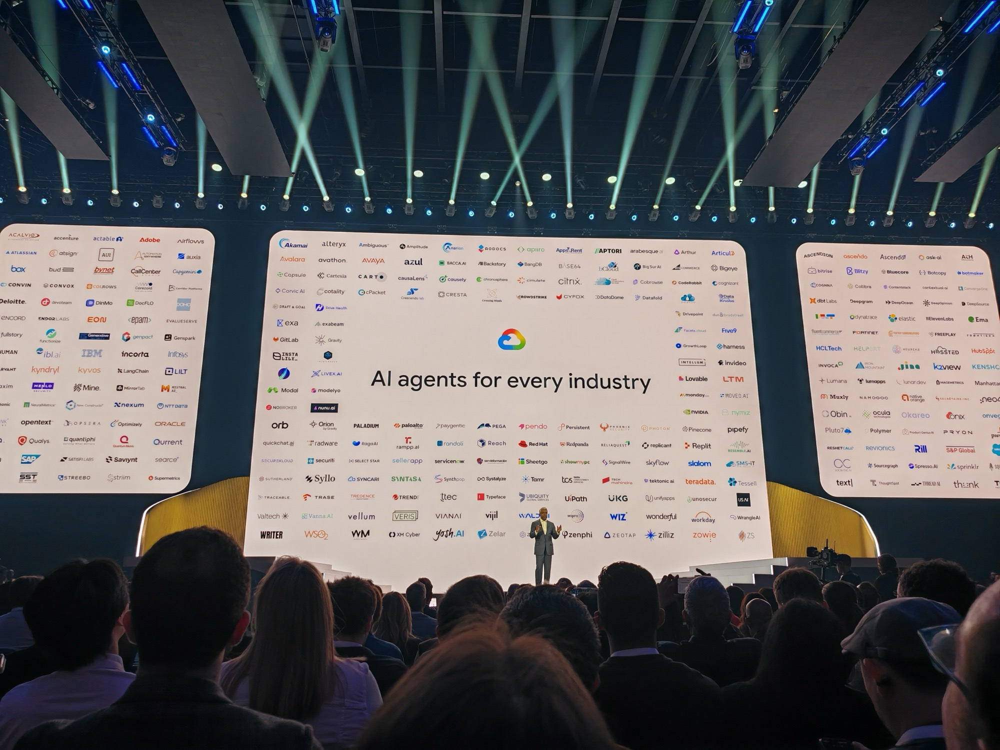

## What this session is about

The Next '26 Opening Keynote introduces the blueprint for the agentic enterprise, guiding businesses through the shift from AI adoption to large-scale transformation. Google Cloud CEO Thomas Kurian was joined by Google SVP Amin Vahdat, Chief Product Officer Karthik Narain, and COO Francis deSouza for major product announcements, live demos, and a clear statement of where Google Cloud is heading.



---

## Getting there

Queue at 7am for a 9am start. Sam and I got there early and Andreeea joined us — the only realistic way to guarantee a seat. If you want to be in the room for the opening keynote at a conference this size, you need to treat it like a gig.

It was worth every minute of the wait.

---

## The opening — vibe coded

Before a single slide, the keynote opened with a performance that set the tone for everything that followed.

AI-generated music using Gemini 2.5 Flash played live. A performer controlled visuals in real time using hand signals — no controller, no keyboard, just gestures tracked by [MediaPipe](https://ai.google.dev/edge/mediapipe/solutions/guide). Gemini was simultaneously listening to the music and generating the visuals dynamically. The whole thing was vibe coded, start to finish.

It reminded me of visiting the [Museum of the Future](https://museumofthefuture.ae/) in Dubai — that same feeling of standing in front of something that shows you human potential. The difference is that the museum is largely theoretical, a vision of what could be. What happened on that stage was actually being built right now, using tools that are already available.

---

## "The era of the pilot is over"

Thomas Kurian's opening statement was blunt:

> *"You have moved beyond a pilot. The experimentation phase is behind us, and now the real challenge begins: how do you move AI into production across your entire enterprise?"*

The era of the agent is here.

This wasn't positioning or marketing framing — it was a challenge to the room. The rest of the keynote was essentially the answer to it. AI is clearly the future, and agentic workflows are where it's going. The question of how you manage thousands of agents — not one, not ten, thousands — is real and it's now.

---

## Gemini Enterprise Agent Platform

The headline product was the Gemini Enterprise Agent Platform — Google's answer to orchestrating agents at scale. The full stack includes:

- **Mission Control** — centralised governance and oversight for agentic workflows
- **Agent Designer** — low-code studio for building agents without deep engineering investment
- **Agent Registry** — your own personal workforce of specialised agents
- **Agent Marketplace** — shared agents teams can discover and adopt across an organisation
- **Projects and Skills** — structured building blocks for agent behaviour
- **Inbox** — managing agent activity and long-running tasks

The question this raises immediately: where do you add value in an organisation that runs on AI workflows?

My take: master fundamentals. When an agent breaks something — and they will — you need the context and capability to understand why and fix it. The engineers who understand the plumbing are the ones who stay relevant. Beyond that, there's a genuine and immediate opportunity to build custom agents for back office processes, individual productivity acceleration, and everything currently falling through the gaps.

The idea of an agentic version of yourself is equally interesting and equally dangerous. There are real questions about where that ends. You need to be intentional about which parts of your work you automate.

---

## Built for agents from the ground up

The infrastructure announcements were significant. Two new 8th Generation TPUs were unveiled:

- **TPU 8t** (training-focused): scales to 9,600 TPUs, three times the processing power of the previous Ironwood generation
- **TPU 8i** (inference-focused): 1,152 TPUs in a single pod, built for low-latency concurrent agent operations

The broader point landed clearly: Google owns the entire stack — models, infrastructure, TPU chips, security, partnerships. That's not true of most competitors, and it matters.

When they put that slide up about Gemini being trusted for the safety of astronauts on Artemis II, that wasn't a throwaway line. That is a statement of intent about where they are placing this technology and how seriously they are taking reliability and trust.

75% of new code at Google is now AI-generated and engineer-approved, up from 50% the previous year. Complex migrations are completing six times faster than a year ago. These are Google's own internal numbers, but the direction of travel is the direction of travel.

---

## Agentic Data Cloud

The cross-cloud Lakehouse and [Knowledge Catalog](https://cloud.google.com/data-catalog/docs/concepts/overview) announcements stood out. The Lakehouse removes vendor lock-in and the data migration headache — cross-cloud reading as a native capability rather than an expensive workaround.

The Knowledge Catalog is similar in spirit to [NotebookLM](https://notebooklm.google/) but built for enterprise context — patterns, institutional knowledge, and trusted context that agents can rely on to operate with certainty rather than hallucinating their way through a workflow.

The live Agentic Data Cloud demo was genuinely impressive. Data scientists need to adapt, and adapt quickly. The manual analysis workflows that exist today cannot keep pace with what was shown on that stage.

---

## Security at machine speed

Security got a significant chunk of the keynote, which felt right. The partnership with [Wiz](https://www.wiz.io/) was front and centre — combining Google Threat Intelligence and Security Operations with Wiz's Cloud and AI Security Platform into what they're calling Agentic Defense.

The point about Shadow AI resonated: hidden AI usage inside organisations is a real and growing security risk that most companies are underestimating. Human analysts cannot keep up with AI-driven attacks. Security has to operate at machine speed now — the Gemini Native Agentic SOC is Google's answer to that.

If you're not already looking seriously at Wiz, now is the time. Security first, before you scale anything else.

---

## Then it ended

Two hours goes fast when the content is good. Then the corridor happened.

Everyone in the arena needed to be somewhere else immediately. I was going to be late for my first session. Worth it.

---

## Thinking out loud

It's very easy to sit in a keynote like this and immediately start firing off in ten directions. My brain was doing exactly that in real time — processing, excitement, tangenting, refining, filtering. It's exhausting and I wouldn't have it any other way.

After running it through the filter: here's what I actually took away.

You need to be a builder. Not someone who watches, not someone who debates whether AI is overhyped, not someone waiting to be handed a roadmap. A company in transition needs people who pick up the tools and start using them. There is no excuse not to be upskilling continuously — but it's also okay to ask for support, and to back your own ideas.

The roles of Platform Engineer, DevOps Engineer, Data Scientist, Infra Engineer — none of them disappear. What those roles do is going to change significantly. The people who understand fundamentals, who can review what an AI architect has produced and spot the gaps, the security issues, the things that will quietly fail at 3am on a Sunday — those people become more valuable, not less. AI still needs a system architect. It still needs someone who understands the context.

Those who want to do things manually because that's how it's always been done will get left behind by businesses willing to move faster. That's just the reality of where things are going.

I also apparently need to buy a Google Pixel Fold 11. My brain filed that during the session and I can't explain why.
