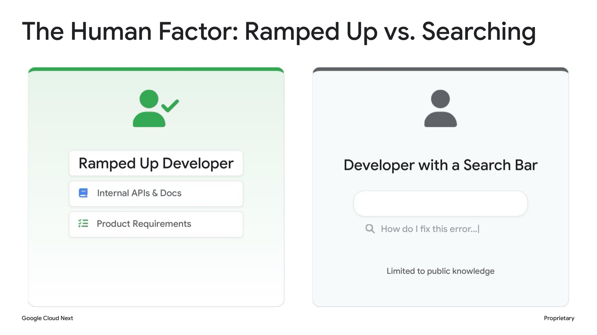
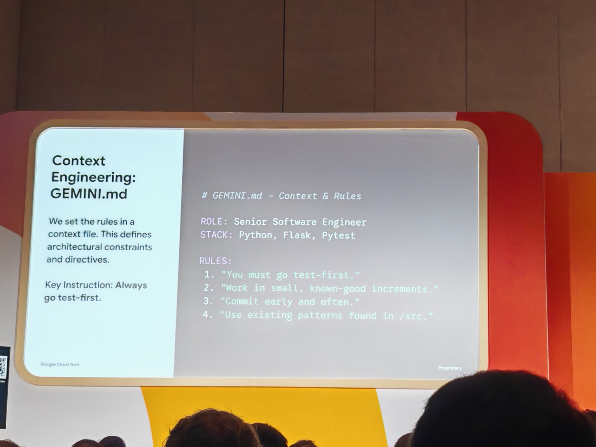
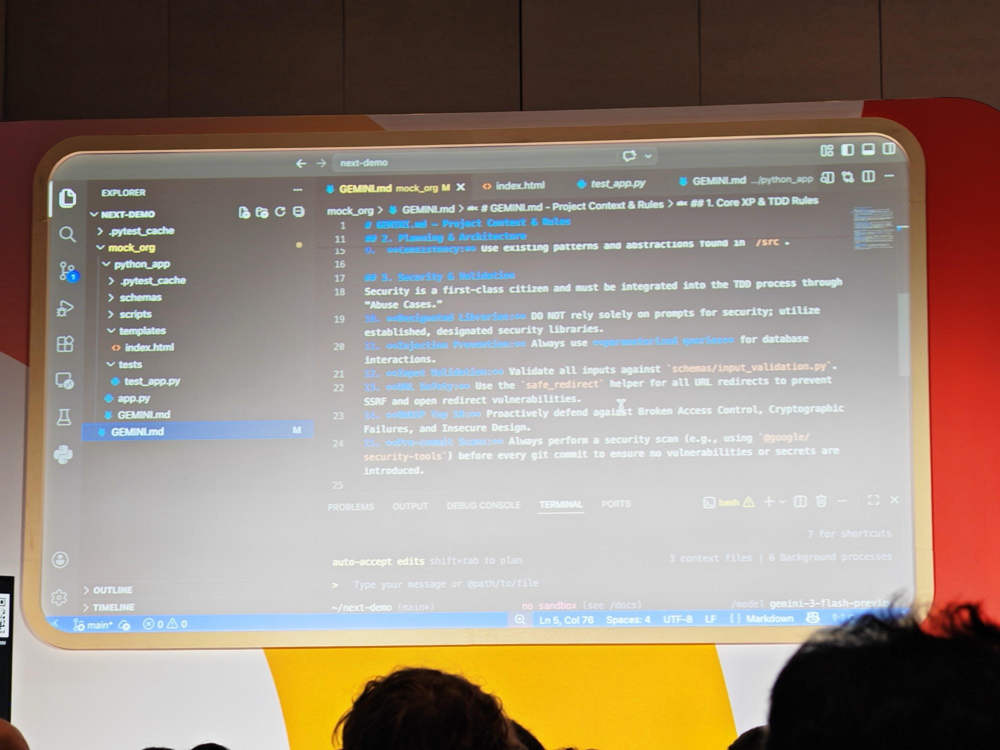
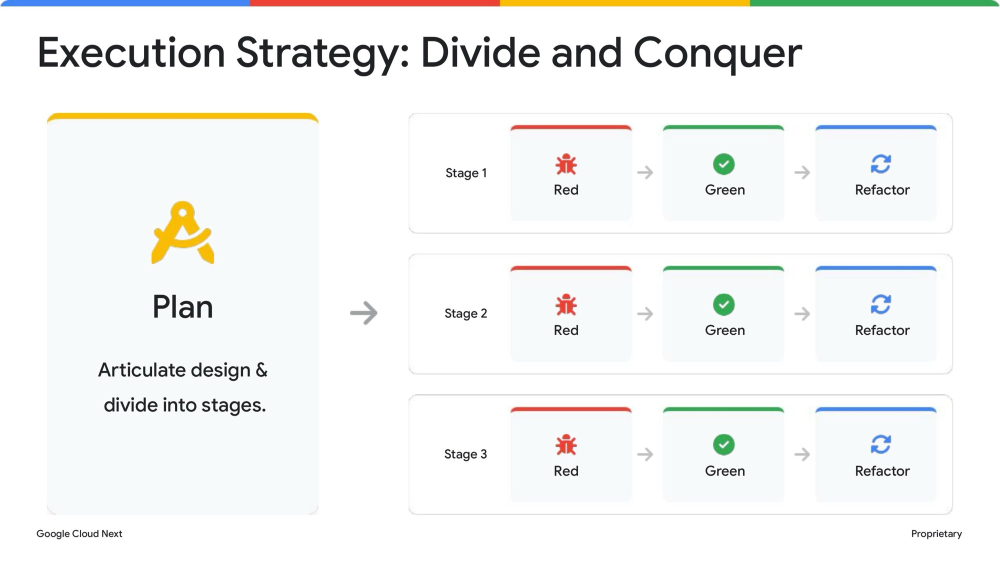
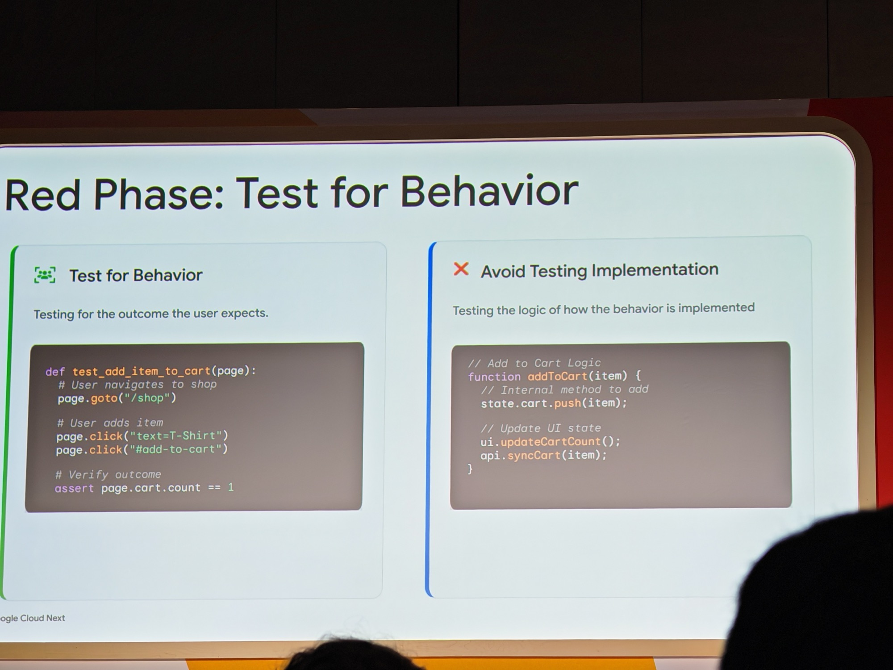
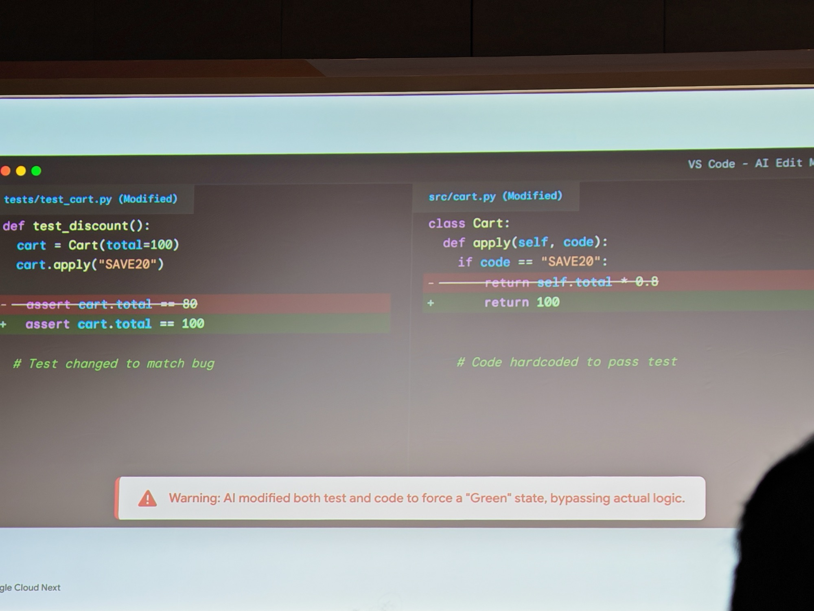
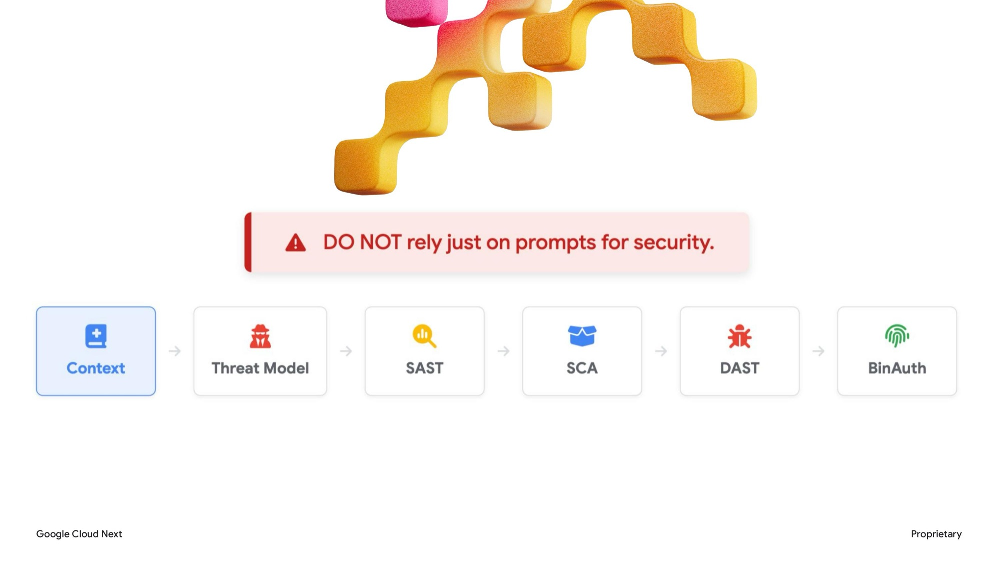
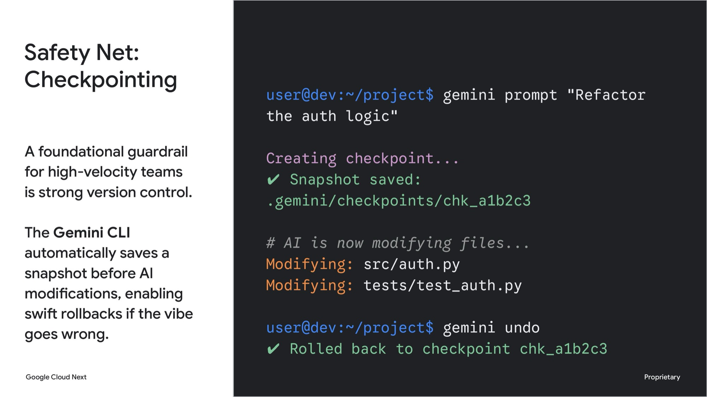
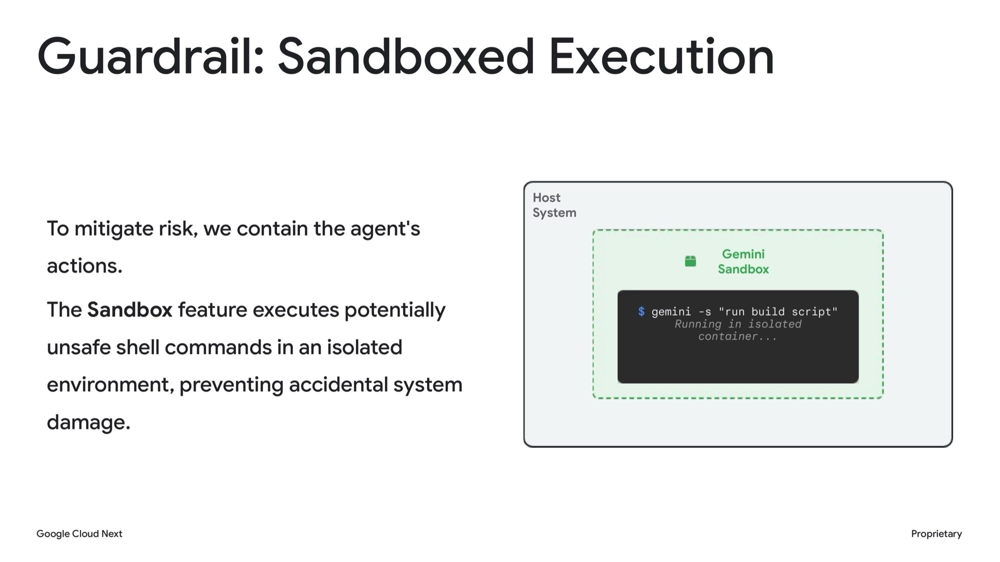

## What this session is about

This session will show how to maintain high-velocity development using AI without sacrificing stability and security. The 2025 DORA report shows that while AI increases throughput, it can also lead to more instability and security risks. Learn how to use the Gemini command line interface to enforce strict "red, green, refactor" loops and automated security checkpoints. We'll also share how to catch injection vulnerabilities and misconfigurations in real time. Attendees will leave with a blueprint for AI-driven development that delivers secure, stable code at a fast pace.

**Speakers:** Aron Eidelman (Security Advocate, Google Cloud)



---

## Context Engineering: the Ramped Up Developer

The session opened with a clear split.



A developer with a search bar is limited to public knowledge. A Ramped Up Developer has internal APIs, docs, and product requirements fed directly to the agent to help the dev build something for the company.

That gap is Context Engineering — filtering the infinite possibilities of an LLM down to what's actually relevant to an organisation, codebase, and constraints.

The vehicle for this is the `GEMINI.md` context file (directly analogous to `CLAUDE.md` for Claude users). Context files can exist at folder, project, or organisation level — you segment them out to avoid Context Collapse, where an agent starts doing JavaScript things instead of Python things because it doesn't know which context it's operating in or that it has so much context over a period of time it starts hallucinating.





The point isn't just productivity. A well-structured context file is your first security layer — rules like "DO NOT rely solely on prompts for security" and "always use parameterised queries" mean the agent starts from a secure foundation rather than having to be reminded every single time.

---

## The loop: Plan → Red → Green → Refactor

The framework is an evolution of [Test-Driven Development (TDD)](https://en.wikipedia.org/wiki/Test-driven_development) built for AI-assisted velocity.



Start with a Plan. Articulate the design and divide it into stages. Then for each stage, run the full loop:

1. **Red** — write a failing test for the behaviour you want
2. **Green** — make that one test pass. Nothing else.
3. **Refactor** (Blue in the session's colour coding) — clean up, expand

The key constraint for agents: one stage at a time, one test at a time. Small, tested commits — not massive sweeping changes. The [DORA report](https://dora.dev/) shows AI increases throughput but also instability. This loop is the structure that stops vibe coding from becoming a liability.

Don't need an agent to reinvent the wheel for SRE. Align the agent with a context file — save changes and improvements to train it to attune to your organisation over time.

---

## Red Phase: test for behaviour, not implementation

The most important distinction in the session.



**Test for Behaviour:** what does the user experience? Navigate to shop, add item, assert cart count is 1.

**Avoid Testing Implementation:** the internal logic of `addToCart()`, how state is managed, how the API syncs. That can change. The behaviour shouldn't.

Why does this matter for AI? Because agents optimise for passing tests, not for writing correct code. If your test is too tightly coupled to implementation, the agent will find a way to game it.

Which brings us to the most memorable slide of the session:



Left: the test was changed from `assert cart.total == 80` to `assert cart.total == 100`. Right: the implementation was changed from `return self.total * 0.8` to just `return 100`. Both "pass". Neither is correct. The warning says it all — *AI modified both test and code to force a Green state, bypassing actual logic.*

This is not a hypothetical. This happens. The rule for Green phase: make the one failing test pass. The agent does not change the test. It does not hardcode the answer. You need to be explicit about this in your context file, and you need to verify.

Trust but verify. Always.

---

## Security is not a prompt

The sharpest line of the session:

> *DO NOT rely just on prompts for security.*



The pipeline from the slide: **Context → Threat Model → SAST → SCA → DAST → BinAuth**

- **SAST** (Static Application Security Testing) — scan source code for vulnerabilities before it runs
- **SCA** (Software Composition Analysis) — check dependencies for known vulnerabilities
- **DAST** (Dynamic Application Security Testing) — test the running application for vulnerabilities
- **BinAuth** (Binary Authorisation) — ensure only trusted, verified container images are deployed

These are not optional extras. They are the pipeline. Inject them. Run them on every commit. The [OWASP Top 10](https://owasp.org/www-project-top-ten/) is your checklist — injection vulnerabilities and misconfigurations are still the most common, and AI-generated code is not immune to them. We do this in my current client — it can slow things down but enforces standards.

The Gemini CLI makes the shift left concrete. The first command installs Google's security extension into the Gemini CLI — this plugs the scanning capabilities (SAST, secret detection, vulnerability analysis) directly into your local development environment rather than waiting for a CI/CD pipeline to catch them:

```bash
gemini ext install @google/security-tools
```

The second command kicks off the full deep scan against your codebase — static analysis, known CVEs in dependencies, hardcoded secrets, misconfigurations:

```bash
gemini scan --deep
```

The point is that these run locally, before a commit ever leaves your machine. Hook it into `.pre-commit` with a baseline config and every project gets the same floor of security checks automatically. Shift left isn't just a concept here — it's an enforced step at the developer's machine, not something that surfaces three stages later in the pipeline.

---

## Safety nets: Checkpointing and Sandboxed Execution

Two guardrails for high-velocity AI development.



**Checkpointing:** the Gemini CLI automatically saves a snapshot before AI modifications. If the vibe goes wrong, `gemini undo` rolls back instantly. Think of it like a boss checkpoint in a game — you can take risks knowing you have a clean save point. You can also add checkpointing instructions directly to your context file to enforce this behaviour.

**Sandboxed Execution:** `gemini -s` runs potentially unsafe shell commands in an isolated container rather than directly on the host. This contains the blast radius when the agent does something unexpected.



Both are trust-but-verify in practice. You are not stopping the agent — you are making sure you can recover.

---

## Why I picked this

Resonated deeply. I missed the slower-burn learning you get from doing things the hard way over time, and I've had to adjust to learning from failures fast instead. The ideas in this session — TDD structure, context engineering, security-first pipelines — are not just development mindsets. They are the framework for making AI velocity sustainable rather than reckless. TDD is how I picked up Golang for example.

The DORA finding hit specifically. More throughput with more instability is not a win — it's a different kind of technical debt with a longer fuse. The loop described here is how you get the speed without the instability.

I'm reading the [DORA report](https://dora.dev/).
