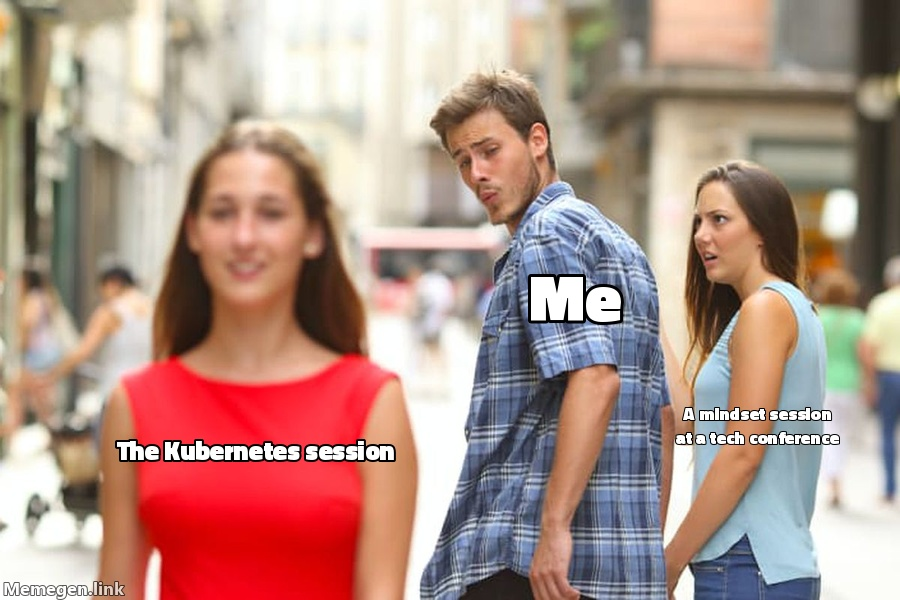
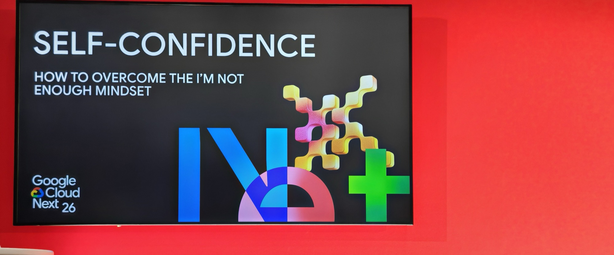
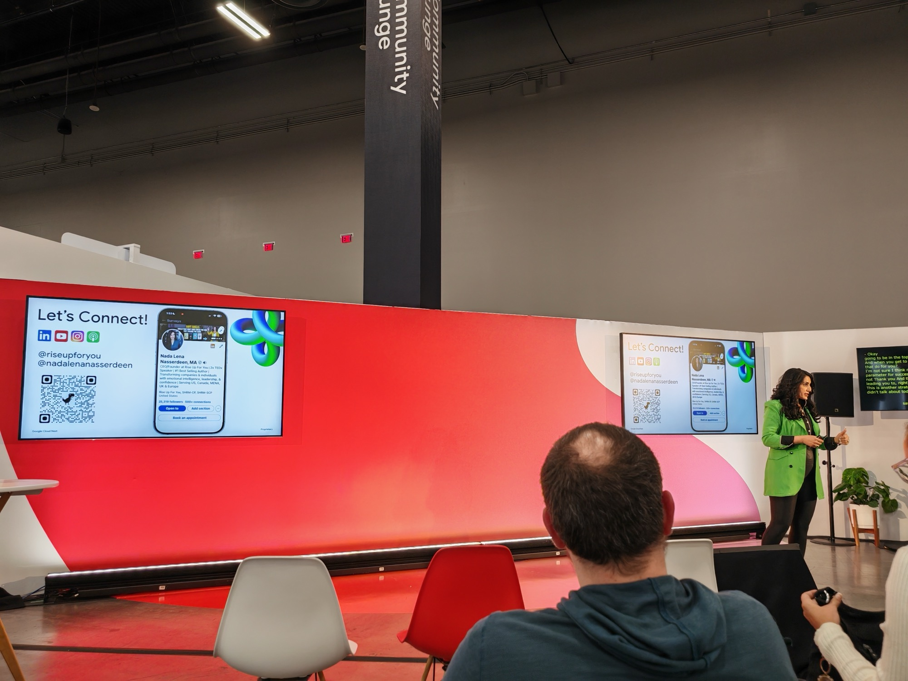

## What this session is about

Even the most successful leaders often struggle with the "I'm not enough" narrative — a mindset that quietly sabotages influence and decision-making. [Nada Lena Nasserdeen](https://riseupforyou.com/), founder of Rise Up For You, delivered this session to dismantle the limiting beliefs holding you back. Self-confidence isn't a fixed trait — it's a scalable skill. Actionable strategies to overcome imposter syndrome, strengthen leadership presence, and unlock human potential.

**Speaker:** Nada Lena Nasserdeen (CEO & Keynote Speaker, [Rise Up For You](https://riseupforyou.com/)) — 2x TEDx speaker, #1 bestselling author, and executive coach who has worked with approximately 50,000 individuals globally.

---

## Agenda Meme

---

This was a Community Lounge session — smaller format, round tables, no stage. I had been checking the agenda for a free seat every day for two weeks. Got lucky at the last minute.

Now I will pre-face this by stating I have zero issues with confidence anymore - I accept who I am, my achievements, how I deal with situations in my personal and work time and also what I choose to spend my energy on.

This has caused what I could call instability in some aspects - but it works for me.

I believe the "I'm not enough" mindset is the single biggest blocker preventing people from making the jump to Senior — not technical skill, not experience. The people I know are good enough, who potentially are at that plateau. What they are missing is the belief that they belong there.

Therefore what I write below are just hypotheticals I used to apply the techniques Nada spoke about to see how they processed with scenarios I dealt with previously.

---

## The 4Bs of Reverse Engineering

Strategy 1: break down a limiting belief by pulling it apart across four dimensions.

**Belief** — what's the limiting belief? - I am not an Engineer.

**Backstory** — where does it come from? I'm a career changer from Recruitment into Engineering. I was promoted before colleagues who have been doing this far longer and so have guilt — this includes people I consider friends and also interviewed and hired. I missed the slow burn - and I feel that is my biggest issue.

**Behaviour** — how does it show up? Second-guessing myself. Doubting my approach. Sometimes failing to speak up when I know I have something to say.

**Breaking** — the reframe: acknowledge I deserve to be here. I am capable. I am proven. I can do this.

The line that landed hardest:

> *Fear can come into the car, but do not let it drive. Just put a seatbelt on it.*

That is exactly what I did a while back - I just took a different route to the above.

---

## Your Personal Council

The second strategy: be deliberate about who you surround yourself with. You are the average of the five people you spend the most time with — but applied with intention, not by accident.

Nada's framework is five avatars, each playing a different role:

- **Cheerleader** — unconditional belief in you, regardless of outcome - This is my Wife.
- **Mentor** — someone who has already done what you want to do, who can guide you there - I am fortunate to have multiple of these.
- **Connector** — the person who constantly thinks about you and makes introductions without being asked - Again - I am fortunate this happens. I stand up for myself to be visible. That is why I am at NEXT.
- **Constructive Trustee** — keeps you accountable and grounded, calls you out on your values when you drift from them - I have a select few I have deep conversations with to go into this depth.
- **Advocate** — someone who speaks well of you when you're not in the room. Similar to the **Connector** - Interestingly my personality type was a Connector when we did Ivy House.

My honest reaction: I already do this subconsciously. Not with a framework, but I've built these relationships organically over time. Hearing it structured made me realise it wasn't accidental. I would gladly talk through this with anyone as it is a very powerful technique that has supercharged my growth.

---

## Commit to You

The third strategy is the hardest to fake: the difference between being *interested* in something and being *committed* to it.

Interested means you'll do it when it's convenient. Committed means you do it regardless.

For me, that moment was being made redundant as a Recruiter, then after securing a job, losing it to Covid. Having a wife that did not work and two kids (at the time) meant a very very dark period. I parked a lot of feelings and signed up to Amazon Warehouse before that withdrawal came. I learned more about Leadership and Humanity than any other position while working there. When I landed my next role - I was fully committed to self-train and move into engineering - being honest about my ambitions especially when the first merger was announced. I made it. That wasn't interest — that was commitment.

> *The greatest tragedy today is the waste of Human Potential.*

---

## Why I picked this

Partly self-validation. I've been doing these things — the council, the reframing, the commitment — for years, without a framework to point to. I wanted to see if the approach held up.

It did.

I'm a firm believer in executive coaching. It got me through redundancy and through other genuinely challenging periods in my life. Over time I've also built my own techniques on top of that foundation — things like a nostalgia reset, which I use to pull myself back to a stable emotional baseline when things get hard. Hearing Nada present a structured framework for what I've been doing intuitively was both validating and useful — it gives me language for things I already knew worked.

Part of why that foundation exists goes back to [Ivy House](https://www.ivyhouse.co.uk/). Back in 2018, the corporate I was working for identified me as a leader worth investing in and put me through their first Masterclass — a leadership development programme that now operates across 37 countries. The techniques I learned there are still what I use today. That programme rewired how I think about leadership, presence, and self-awareness, and I carry it into everything I do. I joined this session to validate that foundation and to see what Nada could add to it. She added a lot.

The other part of why this session mattered was the timing. Just before flying out to Next, I went through a difficult moment at work — the kind that puts you in a headspace you could do without. What Nada said that cut through: you can only stand a particular emotional state for so long before it starts to eat at you. Feel the emotions — you're allowed to. Learn from the experience. But you still have to show up in the world and be your best. What's done is done. Self-reflection and growth, not self-punishment.

My leadership will always be contingent on my emotional state. That's worth being very conscious of — everything I do is a byproduct of that.

If you want more from Nada directly, she posted about the session [on LinkedIn](https://www.linkedin.com/feed/update/urn:li:activity:7453948603468783616/).

I will not be taking up any coaching with her, but I would fully recommend her if you were considering it.

---
