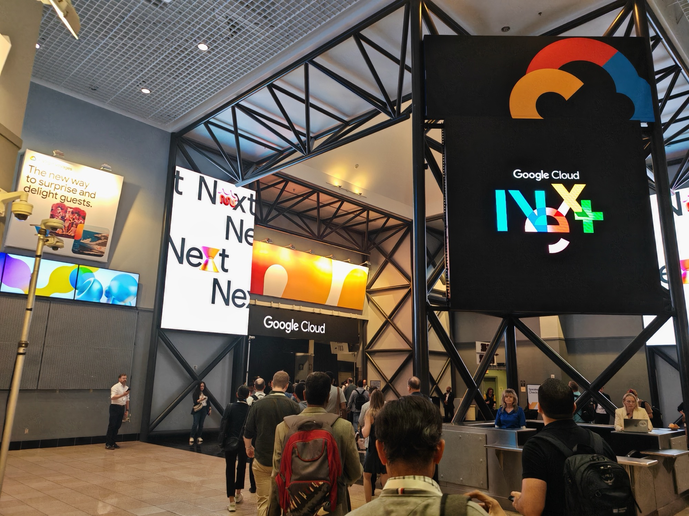
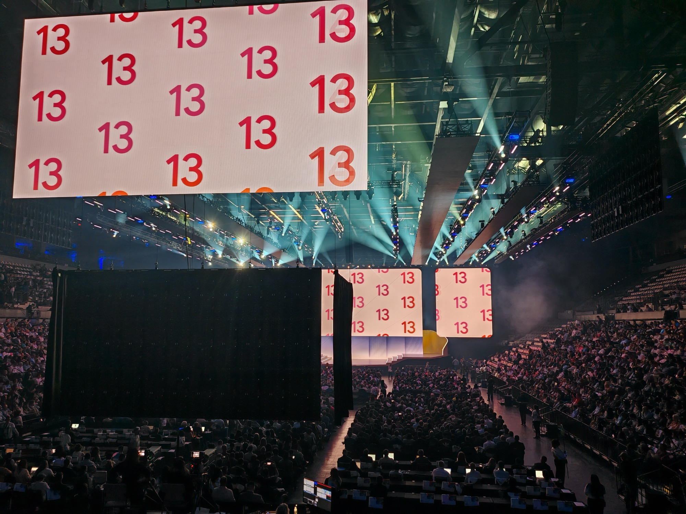

## What this session is about

Move beyond the basics of coding with AI to the real engineering challenges of building agentic applications. This keynote covers multi-agent orchestration, durable memory, and zero-trust security — with practical demonstrations of using AI to create agents, operate platforms autonomously, and deploy agents at scale.

**Speakers:** Brad Calder (President, GCP and SRE), Richard Seroter (Chief Evangelist), Emma Twersky (Developer Relations Engineer), and others.



---

## Getting there

The morning walk through the convention centre to the keynote hall. Repeat of Wednesday but much less busy — this being a 10:30 and targeted mainly at Developers. This followed my earlier Hunting AI Threats Infrastructure Session and another brief foray into the Expo hall

Worse seats this time - screen was super clear though.

---

## The pitch

This year's theme was building an agentic marathon simulator — routing 10,000 runners through the Las Vegas Strip, using a real multi-agent system built live on stage in various sections presented by different Googlers.

Like the keynote yesterday, this will not be a full write up, just highlights assisted by Claude- advise the video for the full watch and I should highlight I had to leave early but everything I saw during.

The presentation also had codelab links for each section, so Ill be able to catch up and try.

---

## Gemini Enterprise Agent Platform

[Brad Calder](https://www.linkedin.com/in/brad-calder-1b49/) opened with the framing: this is their evolution of Vertex AI. The new name is **Gemini Enterprise Agent Platform** — a full suite for building, scaling, governing, and optimising autonomous agents.

The marathon simulator was built on three main agents:

- **Planner** — generates a route
- **Evaluator** — assesses the route against business and community criteria
- **Simulator** — adds actors and randomised behaviours to stress-test the route against the city

They used another tool (they mentioned it but I forgot) of someone who mapped Los Angeles and other maps in a kind of 90s simulator style like Transport Tycoon (one of my favourite games) for the simulation - definitely checking that out.

---

## Building the agent: ADK + MCP + Agent Runtime

[Mofi Rahman](https://www.linkedin.com/in/mofirahman/) came onstage first to build the planner agent. The stack:

- **[Agent Development Kit (ADK)](https://google.github.io/adk-docs/)** — Google's open-source framework for building agents, with instructions, skills, and tools baked in
- **Google Cloud remote MCP servers** — [Model Context Protocol](https://modelcontextprotocol.io) used to give the agent access to external tools and data sources
- **Agent Runtime** — the managed execution environment for running agents at scale

The combination gave the planner agent everything it needs.

I would probably use this approach to build a suite of agents to help me with my day to day.

---

## Evaluating and connecting agents: A2UI, A2A, Agent Registry

Ivan Nardini and Casey West took over to show evaluation and UI.

The key move: deploy a *separate* model to judge the route, checking both deterministic criteria (route length) and non-deterministic criteria (community impact). Different agent to mark the homework.

Two standards that stood out:

**A2UI (Agent-to-User Interface)** — an open-source standard developed by Google that generated a complete interface in a single shot. No front-end scaffolding by hand.

**A2A (Agent-to-Agent Protocol)** — the standard for agent-to-agent communication, combined with **Agent Registry** to track which agents are deployed and discoverable.

Casey's line on Agent Registry: *"Think of Agent Registry as the DNS of your internet of agents."*

---

## I had to leave early

A last-minute client lunch came up around 11:00 — missed the second half of the keynote. Based on the [Day 2 recap](https://cloud.google.com/blog/topics/google-cloud-next/next26-day-2-recap) the second half covered:

- **Memory Bank + Agent Platform Sessions** — persistent agent memory, so learnings from one run inform the next without cramming raw text into every request
- **Agent Runtime trace view** — debugging agentic systems at scale via natural language investigation
- **Antigravity IDE** (powered by Gemini 3, connected via MCP) — vibe coding your way to a fix, commit, and redeploy without leaving the editor
- **GKE scaling** — moving agent services from Cloud Run to GKE for greater control, and migrating to a custom Gemma 4 model
- **Agent Identity + Agent Gateway** — each agent gets a unique, immutable credential; IAM policies control what agents can access
- **Agent Policies** — configurable guardrails on agent behaviour
- **Wiz integration** — security scanning for agent code and infrastructure, with remediation suggestions; notably demoed with Claude Code + Opus

---

## Why I picked this

I am an Engineer - this is the highlight for us - to see cool stuff being built and showcased live on stage.

The multi-agent architecture on stage — planner, evaluator, simulator — is a repeatable pattern that keeps coming up in use cases and things being showcased here. It made sense as its current frontier tech I want to get involved in.

---
