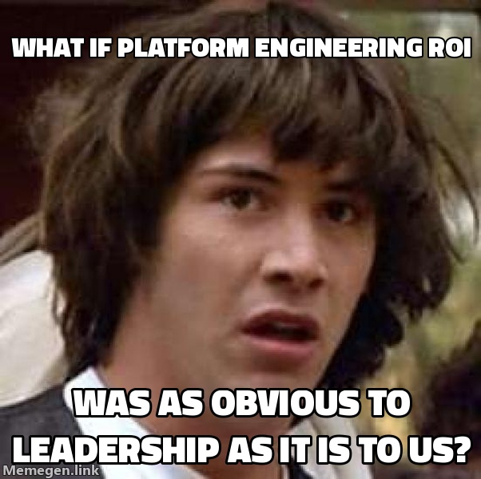
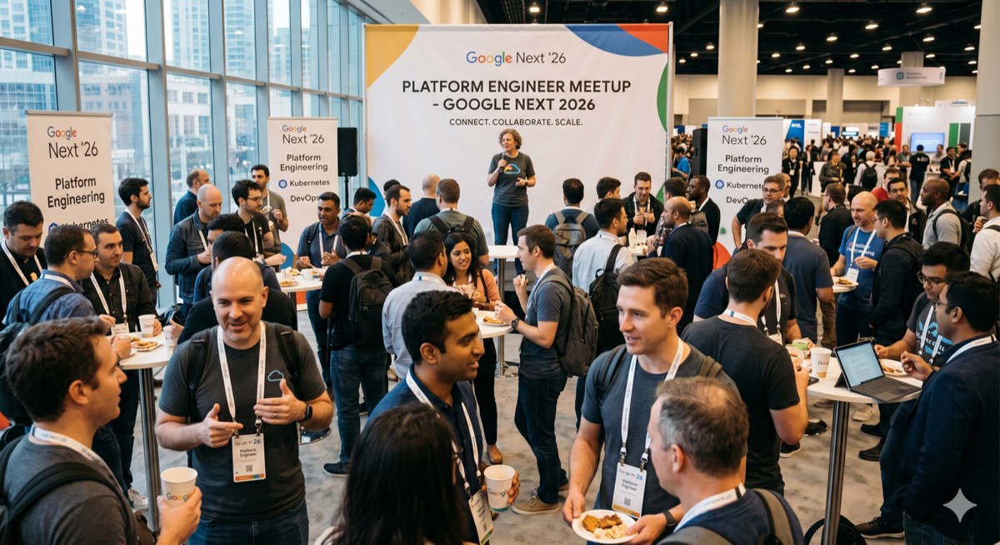

## What this session is about

Platforms are one of the main keys to unlocking AI benefits — quality platforms amplify AI's impact on performance while acting as a risk mitigator for security and reliability. A first-come, first-served gathering for DevOps, SRE, and Platform Engineering practitioners to explore the tools and principles needed for successful AI-era digital transformation.

---

## Agenda Meme

---

One thing immediately noticeable walking in: the room was almost entirely male. A stark reminder of where the profession still is. There were several Women in Tech and empowerment sessions running at the same time, which may partly explain it — but it is still worth calling out.

---

## The format

No slide deck, no forced engagement. The session opened with topic suggestions from the room, we voted on them, and then split into self-selected breakouts.

The hosts also gave a piece of advice at the start that I thought was worth noting: use mobility. If a topic isn't resonating or you're not adding anything to it, move on. No obligation to stay.

---

## What made it interesting

Most of the people in the room worked in industry — in-house Platform Engineering at their own companies. That is a different context to mine. In consultancy we apply Platform Engineering internally and largely plug in to whatever clients already have. The challenges are not really the same but these are specialist people because they are deep in whatever stack their companies use, and they were at NEXT - which allowed for interesting conversations.

Hearing what they were actually dealing with was the most useful part. The recurring theme was leadership investment — making the case for platform work to people who see it as infrastructure cost rather than multiplier or accelerator - making them see Return of Investment and highighting it - a challenge for a notoriously introverted profession - a trait not really seen in consultancy as we need to be customer facing and justify our decision making / answer questiosn / walk through designs etc.

---

## Why I picked this

Platform Engineering is what I do, and a room full of practitioners tends to surface problems and patterns that you do not get from a keynote or other sessions.

---

## Honest take

The format did not fully resonate with me. Open-floor breakouts without much structure can diffuse the energy that makes these things work (for me). I get more out of smaller settings — city meetups where you are seated next to someone and have to actually talk - I did plenty of these as a Recruiter and actually met some of my existing colleagues this way at a Google event in 2022.

The time I spent there was still worthwhile. I came away with at least one pattern I had not considered. But I left when I stopped getting value, which is probably the right move at a conference the size of this one.
