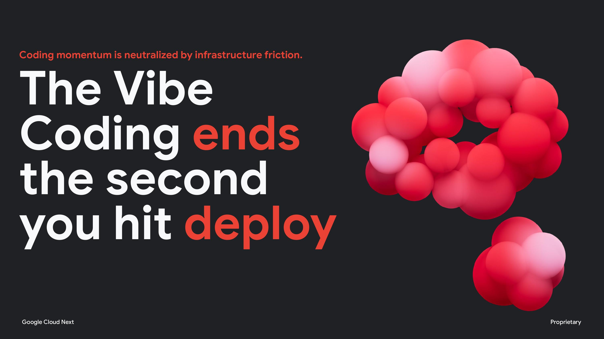
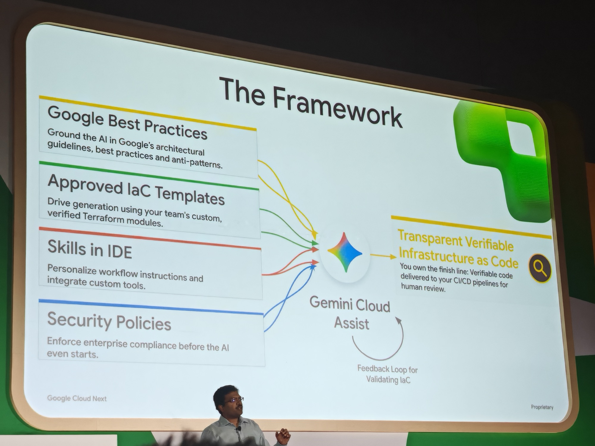
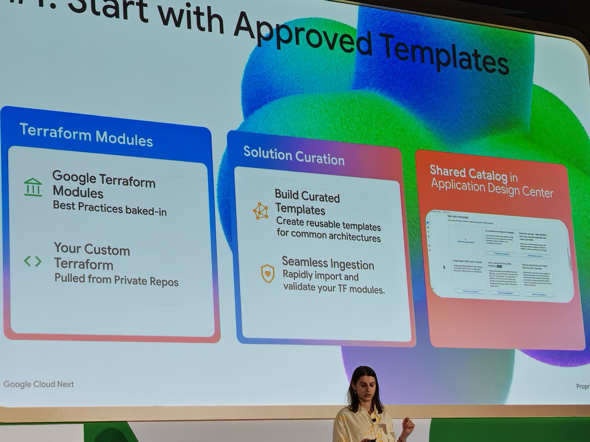
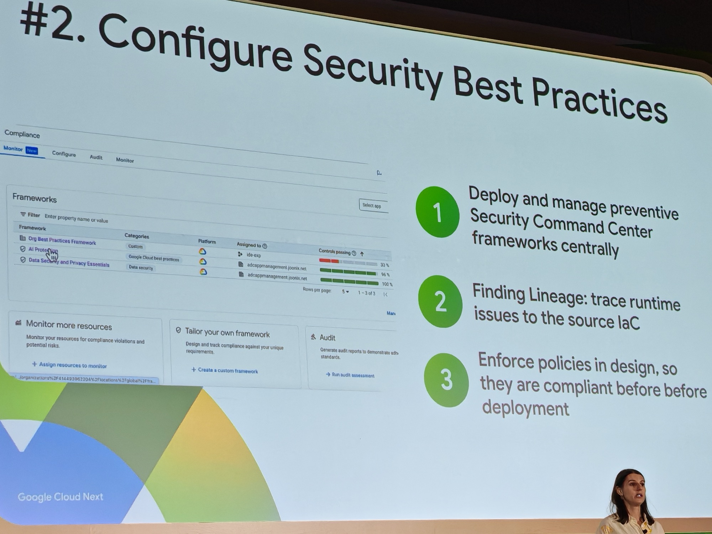
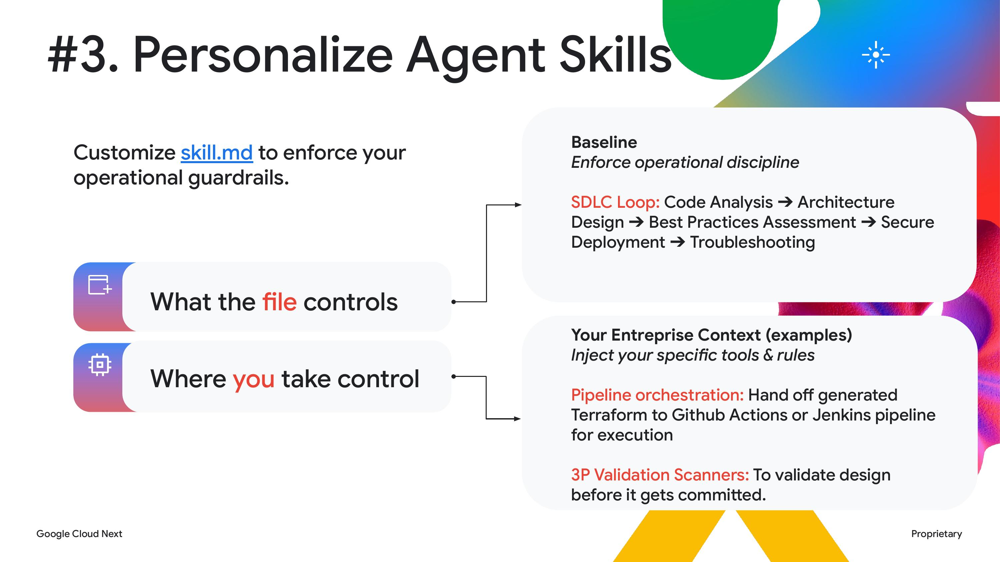
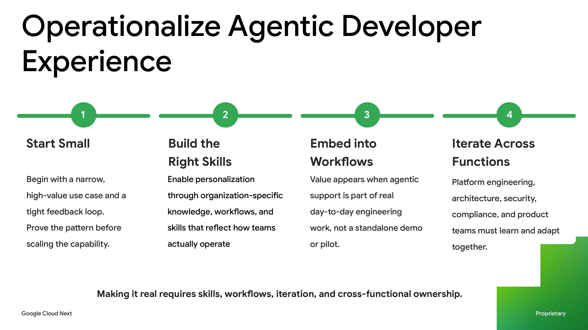



**Session slides:** [PDF](https://content-cdn.sessionboard.com/content/xSlaaeonT1awZQSR0geH_BRK2-221.pdf)

---

## What this session is about

A live teardown of the full pipeline from IDE to production. How to streamline app creation and deployment directly from AI-assisted development environments — cutting the friction between writing code and shipping it to Google Cloud.

**Speakers:** [Oana Ionel](https://www.linkedin.com/search/results/all/?keywords=Oana+Ionel+Google) (Product Manager, Google Cloud), [Praveen Killamsetti](https://www.linkedin.com/search/results/all/?keywords=Praveen+Killamsetti+Google) (Senior Staff Software Engineer, Google Cloud), and [Ervis Duraj](https://www.linkedin.com/search/results/all/?keywords=Ervis+Duraj+MediaMarktSaturn) (Principal Software Engineer, [MediaMarktSaturn](https://www.mediamarktsaturn.com/)).

---

## The room

Busy theatre. Oana opened by asking how many people had used AI to build an app or feature in the last two weeks. Nearly every hand went up including mine.

Then she put this on the screen:

Everyone vibing their way to a working app which is pretty straightforward to do these days but then hitting the wall when they are asked to productionize it. IaC, security policies, CI/CD configuration, blast radius. The question the session then tried to answer was what it would look like to vibe all the way to prod.

Technically, this blog was built that way.

---

## The enterprise problem

Praveen framed the underlying issue:

The distinction between **Shifting Right** and **Shifting Down** is worth keeping. Shifting Right means more AI velocity but the same governance gaps — the failure point just moves closer to production. Shifting Down means embedding governance into the toolchain so the developer does not have to carry it manually.

---

## The real-world numbers: MediaMarktSaturn

Ervis Duraj brought the case study. [MediaMarktSaturn](https://www.mediamarktsaturn.com/) — Europe's largest consumer electronics retailer, 134 delivery teams, 26 platform teams, 5,000+ code repos, 1,000+ cloud projects.

Their challenge: scaling decisions, standards, and ways of working while helping developers move fast. What they found when they started applying AI-generated code at scale:

- Failed security testing **spiked 45%** — AI-generated code regularly conflicted with organisation-specific guardrails
- Failed deployments **increased 58%** — correct-looking code still required developers to troubleshoot and supply missing organisational context

The root cause in both cases was the same: generic models lack internal context. They do not know an organisation's approved modules, design standards, or architecture decisions. Unless that context is given to them.

---

## The Framework

The solution puts [Gemini Cloud Assist](https://cloud.google.com/products/gemini/cloud-assist) at the centre with four things feeding into it:

- **Google Best Practices** — ground the AI in Google's architectural guidelines and anti-patterns
- **Approved IaC Templates** — drive generation using the team's custom, verified Terraform modules
- **Skills in IDE** — personalise workflow instructions and integrate custom tools
- **Security Policies** — enforce enterprise compliance *before* the AI even starts

The output: Transparent Verifiable Infrastructure as Code, delivered to the CI/CD pipelines for human review. The feedback loop validates IaC and feeds back in. The team owns the finish line.

Worth noting: this was not the only session where Gemini Cloud Assist sat at the centre of the answer. It was a recurring pattern across Day 1 & 2 — whatever the problem being discussed, all roads seemed to lead through it. Make of that what you will — especially as a Platform Engineer whose day job covers most of what this tool is promising.

---

## Step 1: Start with Approved Templates

Start from a catalogue, not a blank context. Google Terraform Modules with best practices baked in, plus the team's own custom Terraform from private repos. These feed a Solution Curation layer — reusable templates for common architectures, with seamless ingestion and validation. Everything surfaces in a Shared Catalog inside the [Application Design Center](https://cloud.google.com/application-design-center/docs/overview).

The AI is not making it up. It is working from a catalogue of things the organisation has already approved, sometimes with Google-led development.

---

## Step 2: Configure Security Best Practices

1. Deploy and manage preventive Security Command Center frameworks centrally
2. **Finding Lineage** — trace runtime issues back to the source IaC
3. Enforce policies at design time, so infrastructure is compliant before it ever hits deploy

That third point is the meaningful shift. Compliance checking before generation rather than scanning what already shipped.

---

## Step 3: Personalize Agent Skills

The `skill.md` file is the Gemini equivalent of a `CLAUDE.md` — a set of constraints and context the agent cannot drift from. It controls:

- **Baseline** — enforce operational discipline
- **SDLC Loop** — Code Analysis → Architecture Design → Best Practices Assessment → Secure Deployment → Troubleshooting
- **Enterprise Context** — inject organisation-specific tools and rules
- **Pipeline Orchestration** — hand off generated Terraform to GitHub Actions or Jenkins
- **3P Validation Scanners** — validate design before it gets committed

Context collapse is the main danger with vibe coding at scale. This is the mechanism that prevents it.

---

## Operationalizing it

The MediaMarktSaturn piece ended with a practical framework for actually rolling this out:

---

## The thing about intentional velocity

This is what I kept coming back to during the session.

The people who vibe code well are not winging it. They know what they want, the accepted architecture pattern, what the directory structure should look like, what a CI/CD pipeline needs. They are not asking AI to figure that out — they are asking it to build what they have already designed in their head, and do it quickly so they can review and test rather than build manually.

That is intentional velocity. It still needs a driver.

AI is an accelerator, not a replacement. It will not replace engineers fully — not yet — but it can genuinely 10x the capability of someone who already knows what they are doing.

---

## Why I picked this

To see if there was anything I was missing with hardening the vibe — I have vibe coded two apps - a [Lovecraft](https://en.wikipedia.org/wiki/H._P._Lovecraft) AI Encyclopedia and a [Solo Levelling](https://en.wikipedia.org/wiki/Solo_Leveling) Style Task app. Lets say I wanted to harden and release these (I will not) what would I need to have in place? This session answered that.
---
