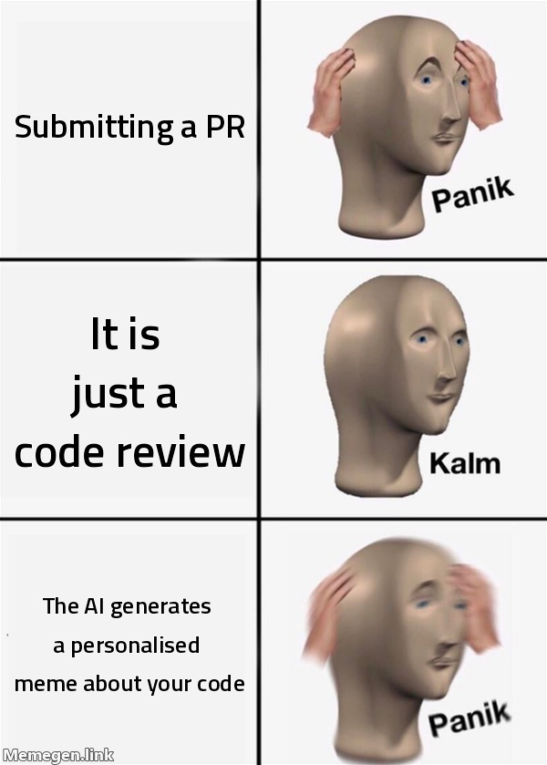
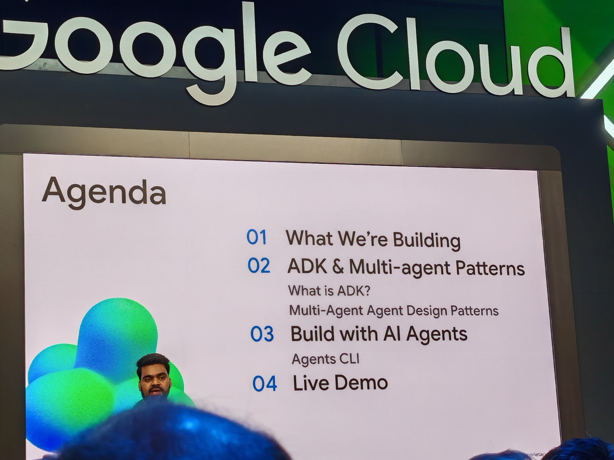
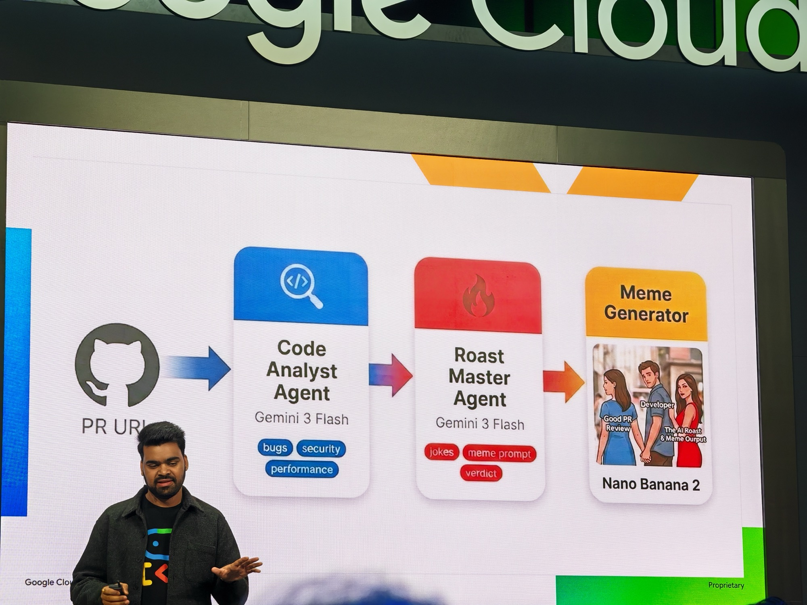
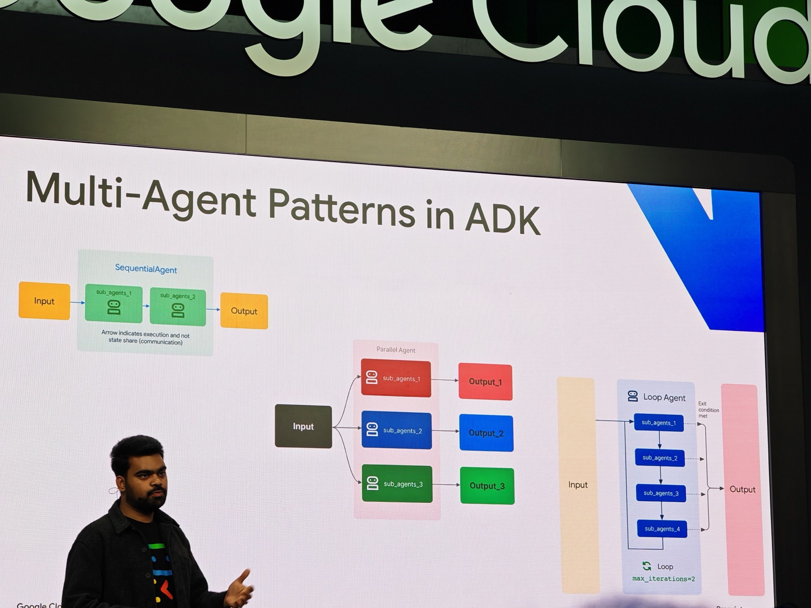
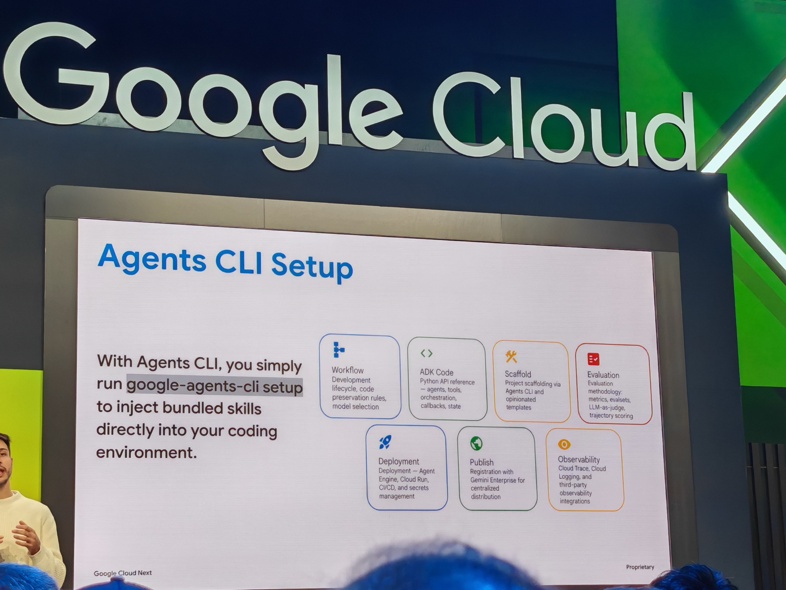
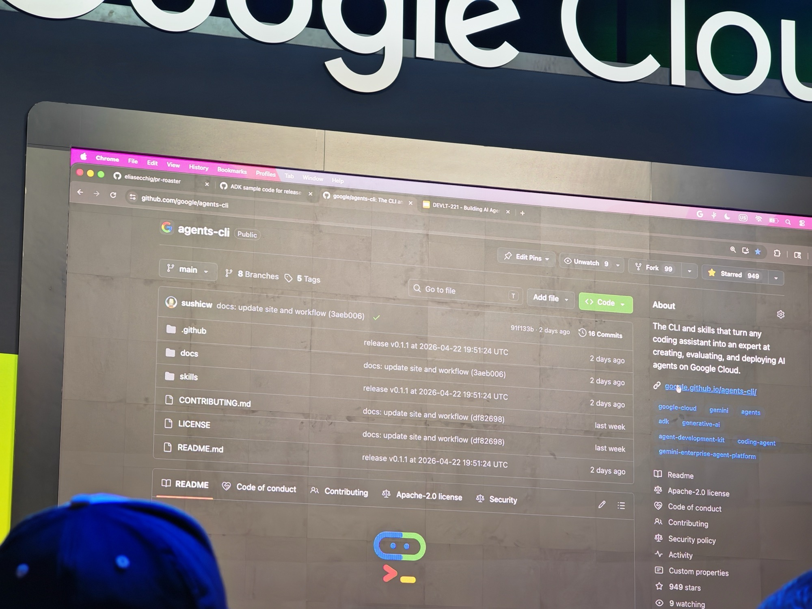

## What this session is about

Watch an AI agent build a team of agents live. Using [ADK](https://google.github.io/adk-docs/) and the [Agents CLI](https://github.com/google/agents-cli), the speakers built, evaluated, and deployed a multi-agent PR roaster from scratch — Agent 1 analyses a GitHub PR for bugs, security issues, and performance problems; Agent 2 takes that analysis and generates a roast plus a custom meme.

**Speakers:** [Shubham Saboo](https://www.linkedin.com/in/shubhamsaboo/) (Senior Product Manager, Machine Learning, Google Cloud) · [Elia Secchi](https://www.linkedin.com/in/eliasecchi/) (Solutions Specialist, Machine Learning, Google Cloud)

---

## Agenda Meme

---

## The setup

This was a booth session on the Google Cloud expo floor rather than a main theatre — standing room, demo-forward. There was a slide deck but at time of writing it had not been uploaded to the NEXT catch-up site.

---

## What they built

Three components, chained together:

1. **Code Analyst Agent** (Gemini 3 Flash) — takes a PR URL, analyses for bugs, security issues, and performance problems
2. **Roast Master Agent** (Gemini 3 Flash) — takes the analysis and generates jokes, a meme prompt, and a verdict
3. **Meme Generator** (Nano Banana 2) — produces the actual meme image

The whole thing ran as a [Streamlit](https://streamlit.io/) app for the frontend.

The session also started by running the agents locally with [Gemma](https://ai.google.dev/gemma) before deploying to GCP — showing the progression from local development to production, which is the actual path most people take.

---

## Multi-Agent Patterns in ADK

Three patterns covered:

- **Sequential Agent** — sub-agents run one after another, passing output forward. The PR Roaster uses this pattern.
- **Parallel Agent** — sub-agents run simultaneously, each producing independent output. Useful when tasks do not depend on each other.
- **Loop Agent** — sub-agents run in a loop until an exit condition is met, with a configurable `max_iterations` ceiling.

---

## Agents CLI

The build used [Agents CLI](https://github.com/google/agents-cli) — a single `google-agents-cli setup` command that injects bundled skills directly into the coding environment. Seven capability areas:

- **Workflow** — development lifecycle, code preservation rules, model selection
- **ADK Code** — Python API reference for agents, tools, orchestration, callbacks, and state
- **Scaffold** — project scaffolding via Agents CLI with opinionated templates
- **Evaluation** — metrics, evalsets, LLM-as-judge, trajectory scoring
- **Deployment** — Agent Engine, Cloud Run, CI/CD, secrets management
- **Publish** — registration with Gemini Enterprise for centralised distribution
- **Observability** — Cloud Trace, Cloud Logging, third-party integrations

The repo was live on screen — public, 949 stars at the time, already being used. The demo also noted that the build was done in Go rather than Python.

---

## How it went

Unfortunately, there was an issue when they fed the URL of the repo to the app. Something to do with Streamlit, which I was unfamiliar with - but the idea was pretty cool and it was good to see how agents were used to build something like this to add humour. Something I might introduce for one of our internal repos for a bit of fun.

---

## Why I picked this

The multi-agent pattern is everywhere this week — planner, evaluator, and simulator in the keynote; code analyser and judge in the threats session. Seeing it built live end-to-end in under an hour, with the actual code and tooling on screen, was the most practical demonstration of the concept across the three days.

Also — I love a good meme. A PR review tool that spits out a personalised roast and a generated meme as output is the kind of thing that will actually get used, because it makes an otherwise dry process funny.
