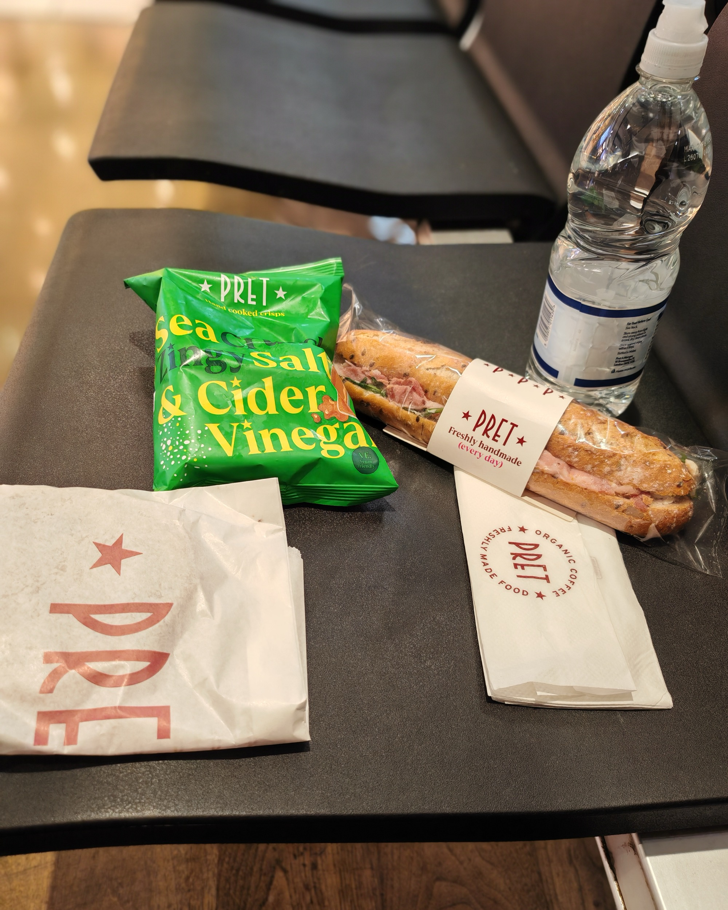
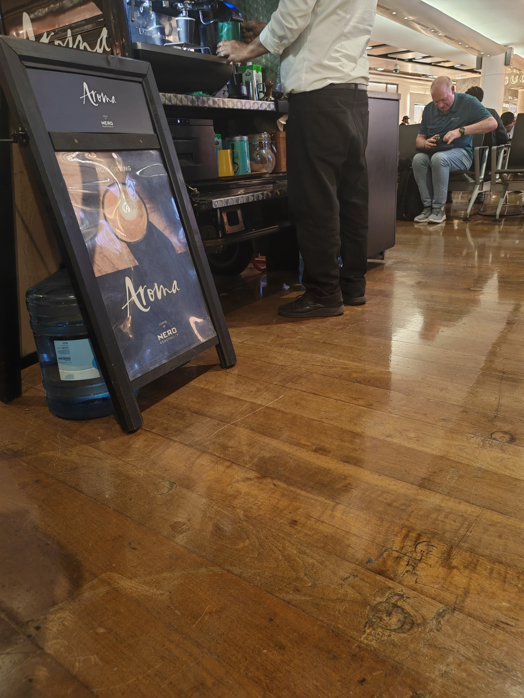

<!--more-->

I want to be upfront: this is a boring first food entry. I know it. You'll know it. Let's get through it together.

---

## The exploration

I had 3.5 hours before boarding and so I did a lap of the terminal to scope out the options (ah the flashback to NOT being able to do this on our family holiday to Dubai last year).

One thing that caught my eye was the Beyond Burger on the menu. At Heathrow Terminal 3.

For context: I work for [Beyond](https://www.bynd.com/). I am flying to a Google Cloud conference. I found this funny in a way that's hard to fully explain. Fate keeps showing up today — trespassers on the line but my train was not cancelled, Arsenal's title lead evaporating on the weekend leading up to heading to the airport — and now this. The universe has a sense of humour.

I did not order the Beyond Burger.

---

## The inevitable conclusion

After all of that — the scouting, the philosophy — I ended up at Pret. I am not too keen on restaurants (long story) and this was not school holidays so there was plenty of empty seats to sit.

Chicken Caesar & Bacon baguette. Sea Salt & Cider Vinegar crisps (I noticed they've switched from plain Salt & Vinegar — this is an upgrade). Water. White Chocolate & Raspberry cookie.

This is, almost to the item, what I get when I visit the Beyond London office. There is comfort in that kind of consistency. Pre-flight is not the time for culinary adventure, I get hard to explain travel nerves only on the outgoing journey. Pre-flight for me is the time for something you know works.

The cookie could have been a little softer, felt over baked if I'm being honest. The American-style cookies — bigger, filled, apparently a completely different experience — are something I'm looking forward to trying in Las Vegas. That's one real food objective of this trip.

Everything else is just warm-up.

## The strategic seating decision

There is an art to airport time-killing. I had 3.5 hours to kill. I found a spot near the coffee counter — close enough to get the full benefit of freshly ground coffee aromas without actually paying for any. Be like me.

---
