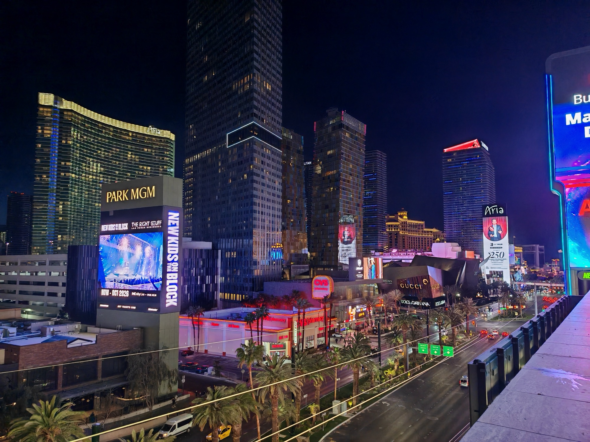
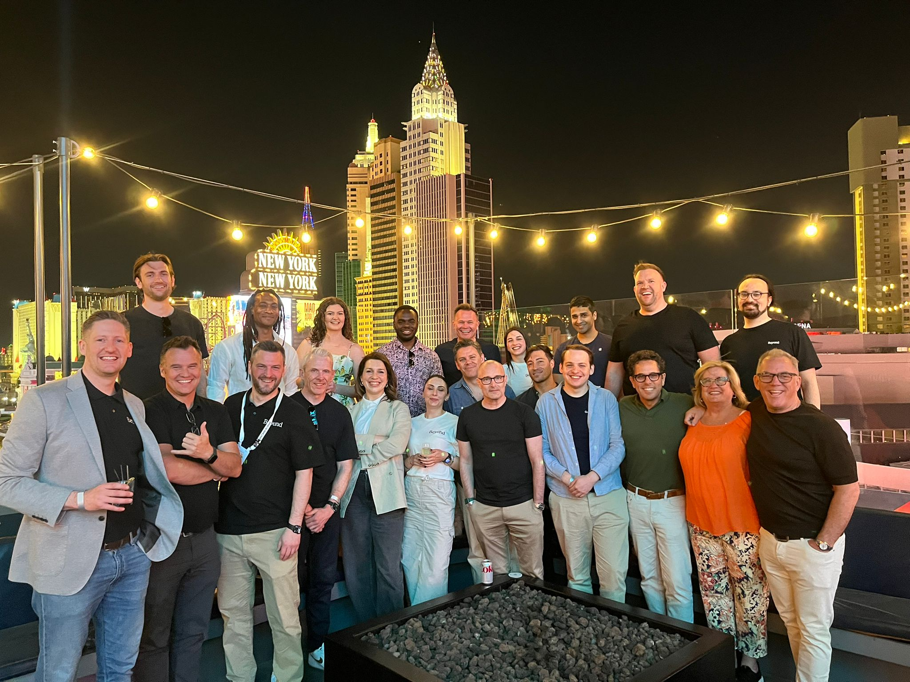
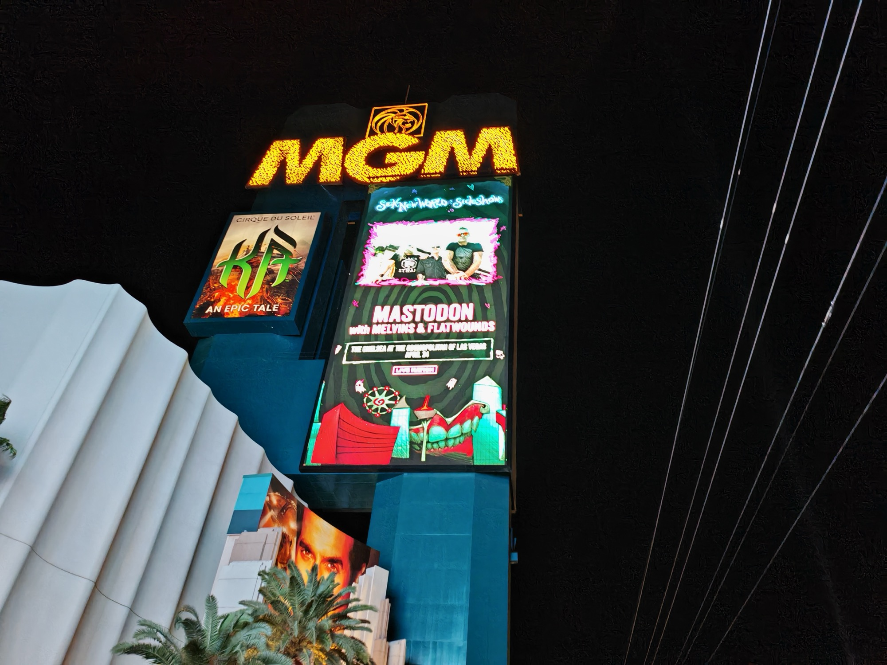
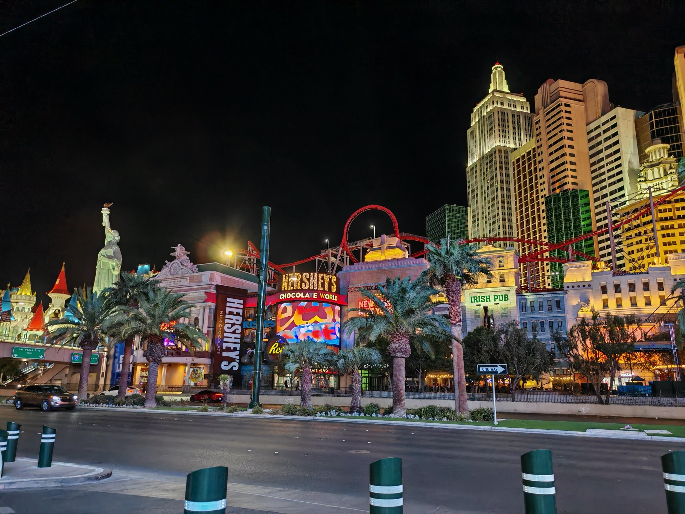
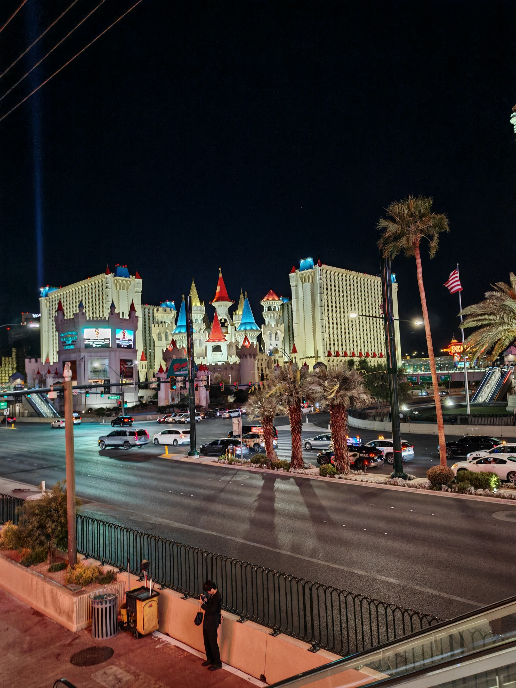
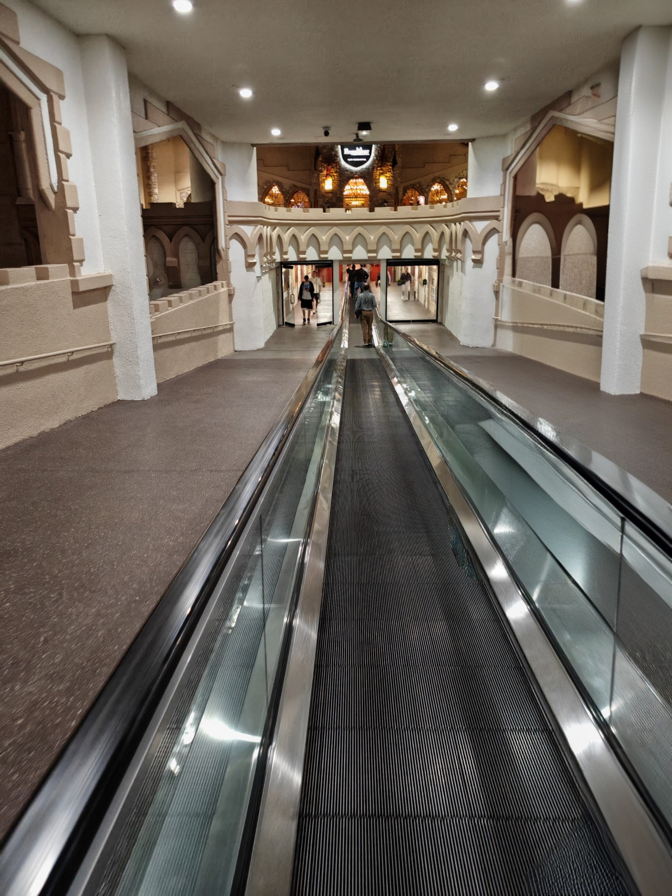
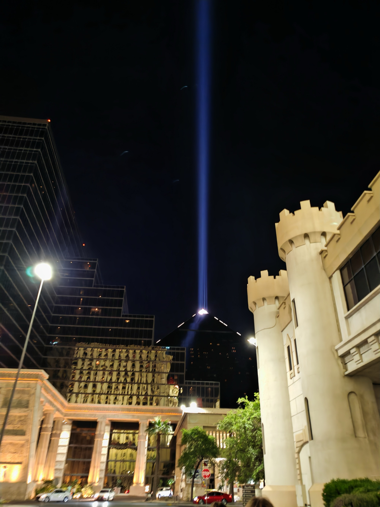

<!--more-->

## The vibe

First full day in Vegas — a chance to finally meet up with [Qodea](https://qodea.com/) and [Beyond](https://bynd.com/) colleagues in person at a pretty stellar venue.

Jet lag had not fully set in, but my body had only allowed four hours of sleep despite staying up the whole flight the day before. Even so, everyone was in a celebratory mood — finally putting faces properly to names and connecting with people I'd only ever seen over a screen.

Roughly twenty of us ended up on the rooftop of [BrewDog Las Vegas](https://www.brewdog.com/usa/bars/usa/las-vegas) with an unobstructed view of the Strip.

One note: I had a brain fog moment and asked for a Budweiser. Do not do this unless you want to be a social pariah. I did rescue the situation but consider this a public service warning.

Hard to take a bad photo here.

---

## The food

Not really a dinner in the traditional sense — more snacks and buffet-style. Pizza, wings, bits and pieces. No food photos as I prioritised actually talking to people, which felt like the right call. The pizza I did grab was good.

---

## The team

[New York New York](https://en.wikipedia.org/wiki/New_York-New_York_Hotel_and_Casino) photobombing in the background. Could be worse.

---

## The walk back

The route from BrewDog to the Luxor is a proper Strip experience — all elevated walkways, connected hotel malls and signs competing for your attention.

The indoor travelator through the hotel mall is a strange experience — you're essentially walking through a medieval castle to get home.

The Luxor sky beam is visible long before you get back — easily the best landmark to navigate by.

---

## Worth noting

[BrewDog](https://www.brewdog.com/) will also be the venue for our private drinks event on Thursday night. Looking forward to returning.
