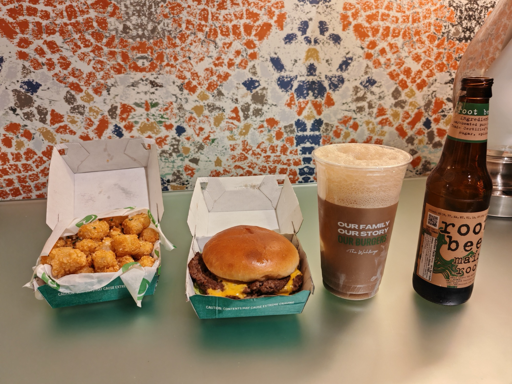

Lunch on Day 1 was pre-sorted Quest Bars, coffee, and water. Intentional — I wasn't about to stop to queue up in the lunch hall when there were sessions to get to. Maximise the day, eat properly later. I'd planned this ahead of time, but the food (as I experienced on Day 3) — was amazing.

After a full day of sessions — seven of them, plus a serious amount of walking between sessions. The team kindly gave us the evening off to recharge — I needed that, and calories, not a menu to think about. [Wahlburgers](https://wahlburgers.com/) at Mandalay Bay was close, the menu was online, and I could order ahead for pickup. Done.

**The order:** Smash Burger, Tater Tots with Truffle Oil, Root Beer Float.

Absolutely outstanding. Every part of it. The tater tots with truffle oil specifically — that is not a combination I expected to work as well as it did.

Ate it all in the room. Passed out.

Correct end to a long day.
