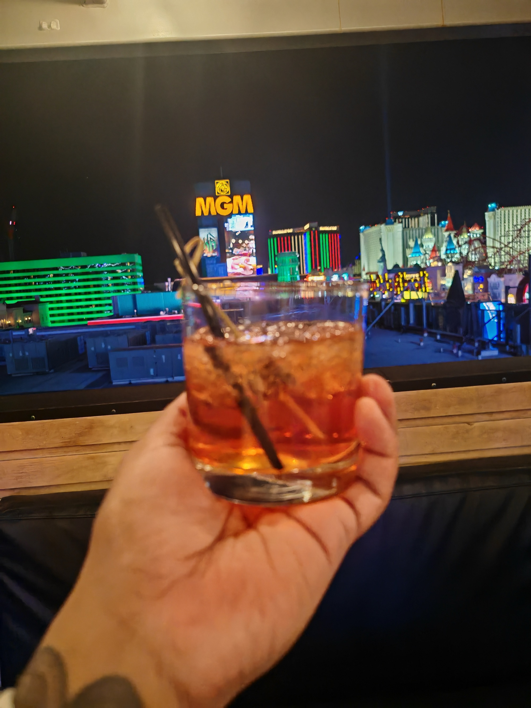
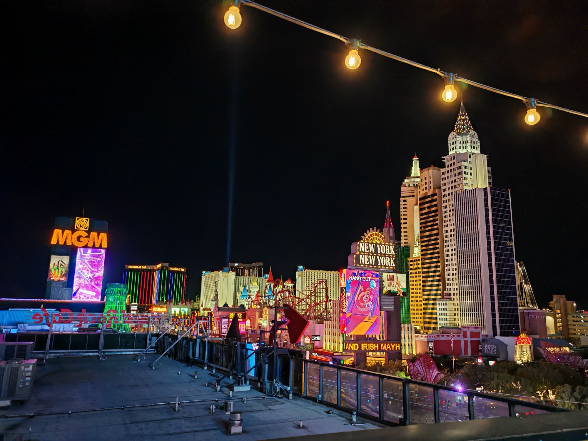
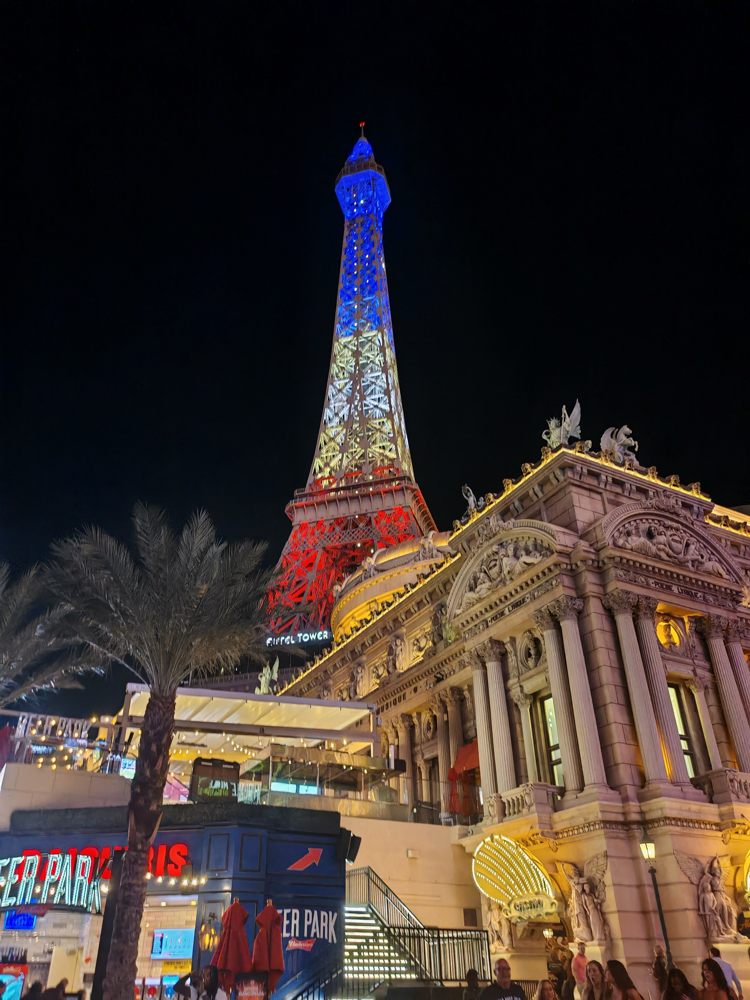
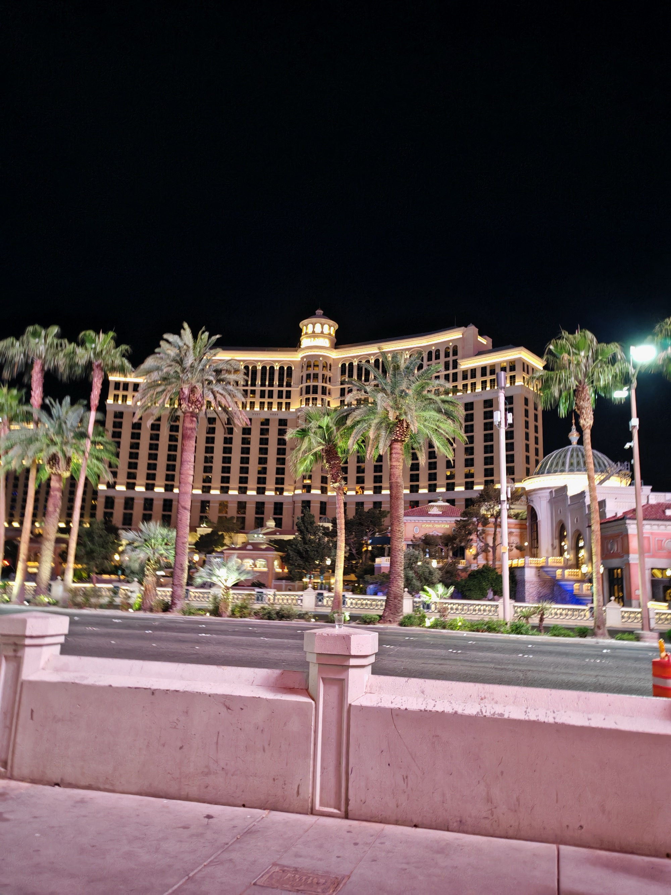
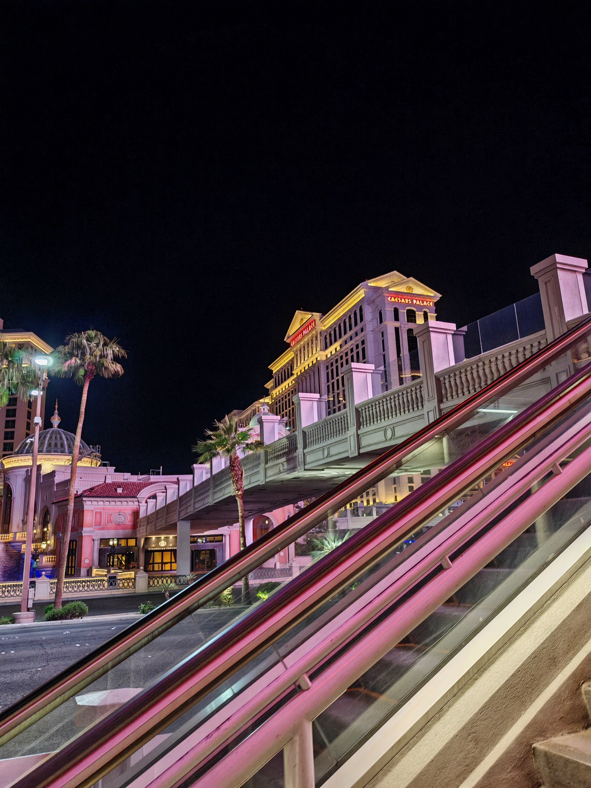

[Beyond](https://www.beyondnow.com/) hosted an evening event on the rooftop at [BrewDog Las Vegas](https://www.brewdog.com/usa/bars/usa/las-vegas) — open bar, the [Las Vegas Strip](https://en.wikipedia.org/wiki/Las_Vegas_Strip) spread out below, colleagues and clients in the same place at the same time.

---

## The view

---

## What I drank

Two [old fashioneds](https://en.wikipedia.org/wiki/Old_fashioned_(cocktail)) — my favourite drink, and made with proper bourbon rather than the [Jack Daniel’s](https://en.wikipedia.org/wiki/Jack_Daniel%27s) substitute that gets passed off as one back in the UK.

The rooftop itself was a good setup — string lights, open air, the whole Strip in frame. The kind of setting that makes conversation easy.

---

## The company

Colleagues, clients, and a few ex-colleagues who have since moved on and are now on the other side of the table as potential clients. Loved catching up properly and celebrating our collectivr success, finding out how much you have in common with people you previously only knew in a work context. A few conversations that I know will continue.

Some team photos were taken on the night — will add those when they land.

---

## After

The night did not end on the rooftop. A group headed to a karaoke bar called [Smelly Cat](https://www.smellycatvegas.com/) somewhere on or near the Strip, where the conversations carried on in a completely different atmosphere. Then the walk back to the [Luxor]() — all the way down the [Strip](https://en.wikipedia.org/wiki/Las_Vegas_Strip) past [Paris Las Vegas](https://en.wikipedia.org/wiki/Paris_Las_Vegas), the [Bellagio](https://en.wikipedia.org/wiki/Bellagio_(resort)), and [Caesars Palace](https://en.wikipedia.org/wiki/Caesars_Palace) at whatever time it was.

Woke up the next morning to find I had already done 10,000 steps before the conference even started. Wild night - and a headache before the final day which was ending in a late flight at 23:30.

---

**[BrewDog Las Vegas](https://www.brewdog.com/usa/bars/usa/las-vegas)** — 3767 Las Vegas Blvd S, Rooftop
