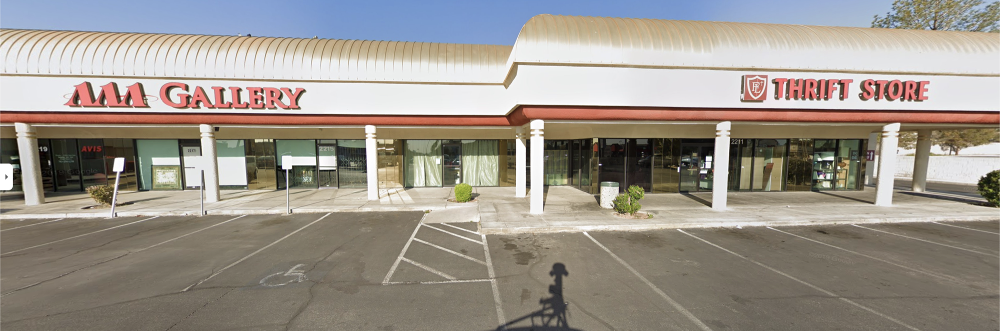
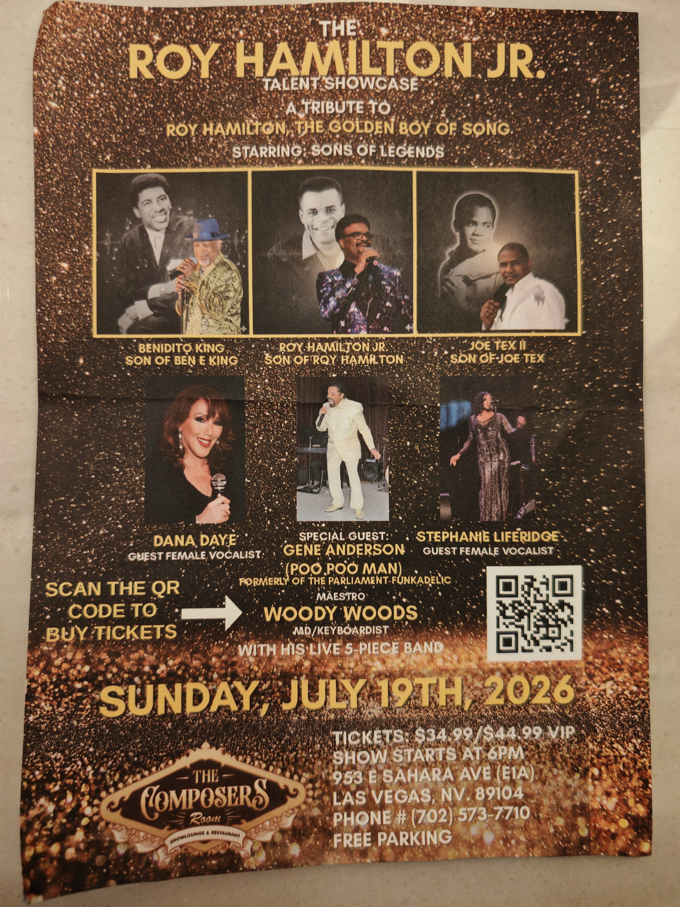
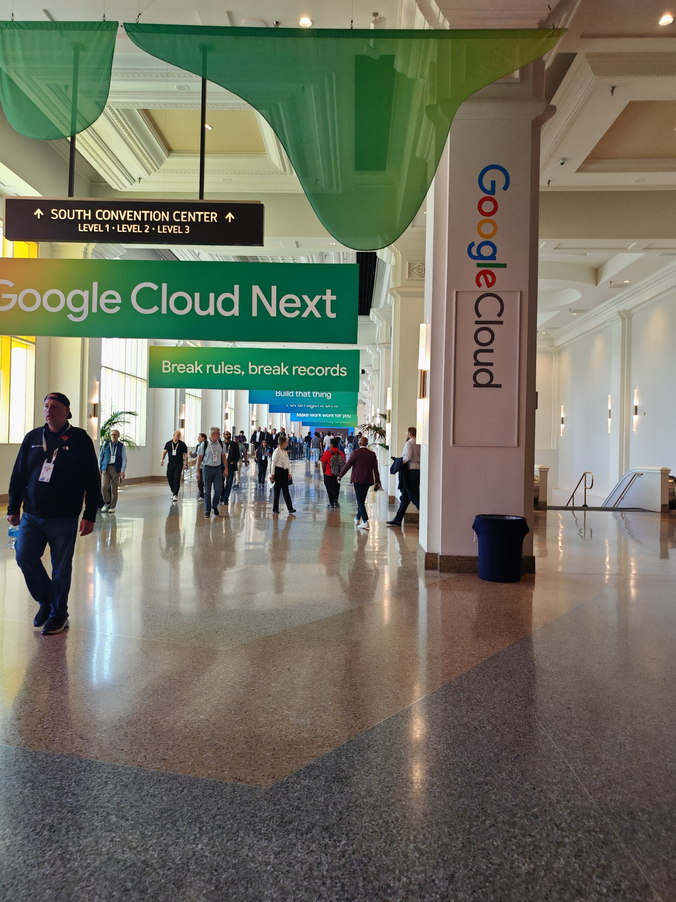

<!--more-->

## Morning — The real Las Vegas

Only had four hours sleep and didn't feel tired at all — despite being awake for almost 24 full hours to power through the jet lag. The body is a mysterious thing.

I technically had the day off. The Partner Summit sessions were scheduled but skewed heavily towards pre-sales and GTM, and I knew I wouldn't get much out of attending. So instead I took an Uber to the suburbs and visited a few of those small shopping mall car parks that are everywhere in America.

I wanted to see the real Las Vegas during the day and chat to a few locals. The intention was to hit a thrift store and find some bargains to take home for the kids. I found [Faith Lutheran Thrift Store](https://www.faithlutheranlv.org/) — everyone genuinely friendly, decent clothes at much better prices than anything you'd find in the UK.

*© Google Street View*

Only found a decent keyring for one of the boys, but had a thoroughly enjoyable conversation with one of the staff. Worth the trip for that alone — if you're in Vegas, talk to the Nevada locals away from the strip.

My Uber driver Roy, who had taken me there, handed me a flyer for his upcoming show on the way back, we had a pretty awesome conversation about a multitude of things. If you're in Vegas in July, I'd recommend checking it out.

Was only out of the hotel for around 90 minutes before heading back.

---

## Partner Summit

Stopped by after returning — mainly to get my bearings for the full conference days ahead. There were a fair few people around but it was actually a very good idea as it turned out.

Ran into four people I'd interviewed in the past, two former colleagues, and another current colleague. Great to see familiar faces in different parts of the world.

Picked up some great food from the Lunch Café — knowing I intentionally wasn't going to have time for that over the next couple of days due to the sessions I had lined up.

Didn't get many photos (of the food). Need to sort that habit out.

---

## Tonight

Team dinner at BrewDog Las Vegas — [read that post]().
