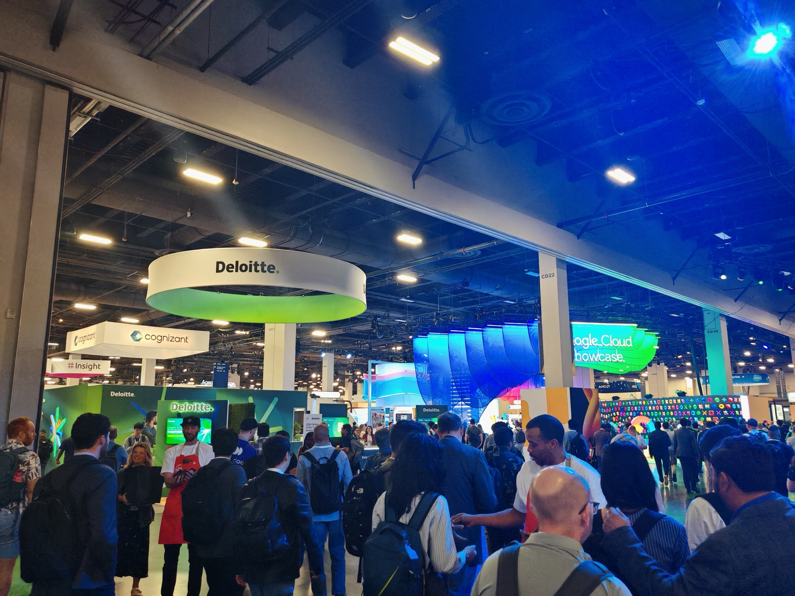

## The day in numbers

| | |
| --- | --- |
| Sessions attended | 7 |
| Distance walked | 10.45km |
| Calories burned | 590 kcal |
| Lunches eaten | 0 |

The [Mandalay Bay Convention Center](https://mandalaybay.mgmresorts.com/en/meetings-groups/meeting-convention-facilities.html) is 2.1 million square feet across three floors — the second largest convention center in Las Vegas, which is itself not short of convention centers. Sessions on Day 1 took me from the main keynote hall to breakout rooms across multiple levels, then down to the Developer Theater inside the Expo Hall and back again. The 10.45km did not come as a surprise by the end of it especially with the walk to and from the Luxor.

---

## Sessions

| Time | Session | Rating |
| --- | --- | --- |
| 09:00 | Opening Keynote | ★★★★★ |
| 11:00 | [Automating Excellence: Gemini and Config Connector]() | ★★★★★ |
| 12:30 | [Red, Green, Refactor, Secure]() | ★★★★★ |
| 13:30 | [Lights, Camera, AI Action!!]() | ★★★ |
| 14:30 | [Self-Confidence]() | ★★★★★ |
| 15:45 | [Full-Stack Improv]() | ★★★★ |
| 17:00 | [AI DevOps Velocity]() | ★★★★★ |

---

## The plan

I had this day mapped out before I landed. Sessions were hand-picked — not by topic alone but by what I thought would be most transferable back to work as well as personal interest. I had deliberately not booked lunch into the schedule. Quest Bars, coffee, and water for the day. I had seen enough from Day 0 food queues to know that is where your afternoon sessions go to die.

It worked. Zero regrets. (Calories were recovered later — see [Wahlburgers]().)

---

## The common thread

Three sessions — Config Connector, Red/Green/Refactor/Secure, and AI DevOps Velocity — turned out to share the same underlying argument approached from different angles.

The [DORA report](https://dora.dev/) came up in two of them explicitly. The finding is uncomfortable: AI increases throughput but also instability, unless you build the structures to contain it. TDD loops, context engineering, platform self-service, GitOps reconciliation — different tools, the same principle. Velocity without structure is just a faster way to accumulate technical debt.

That is the problem I am actively trying to solve internally with RPP. I am currently on a customer project which takes 100% of my working day and so these techniques and tools will form part of my plan to still deliver things internally with AI assistance. These sessions gave me the clearest articulation I have had of what the solution architecture actually looks like.

---

## The Expo Hall

I did not properly enter the Expo Hall until 5pm and even then I only walked a fraction of it — it was en route to the AI DevOps session in the Developer Theater, which sits inside it. Five minutes walking through the space and I immediately knew I had been optimizing my time wrong. Rearranged my schedule for Days 2 and 3 when I got back to my room.

The Puppy Park was also in there. Full write-up in the [AI DevOps Velocity post]().

---

## End of day

Team gave us the evening off instead of a corporate dinner. Actually worked out really well, I needed to decompress and I needed actual calories.

[Wahlburgers, Mandalay Bay.]() Smash burger, tater tots with truffle oil, root beer float. Ate everything. Passed out.

Correct end to a long day.
