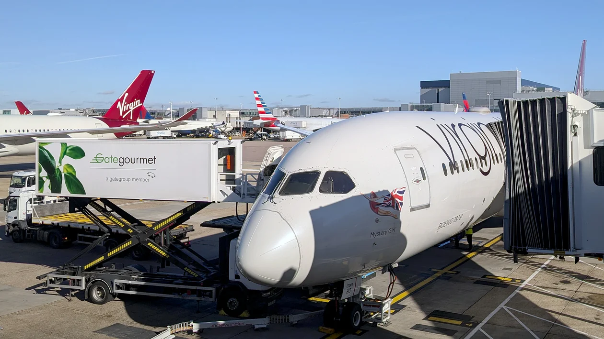
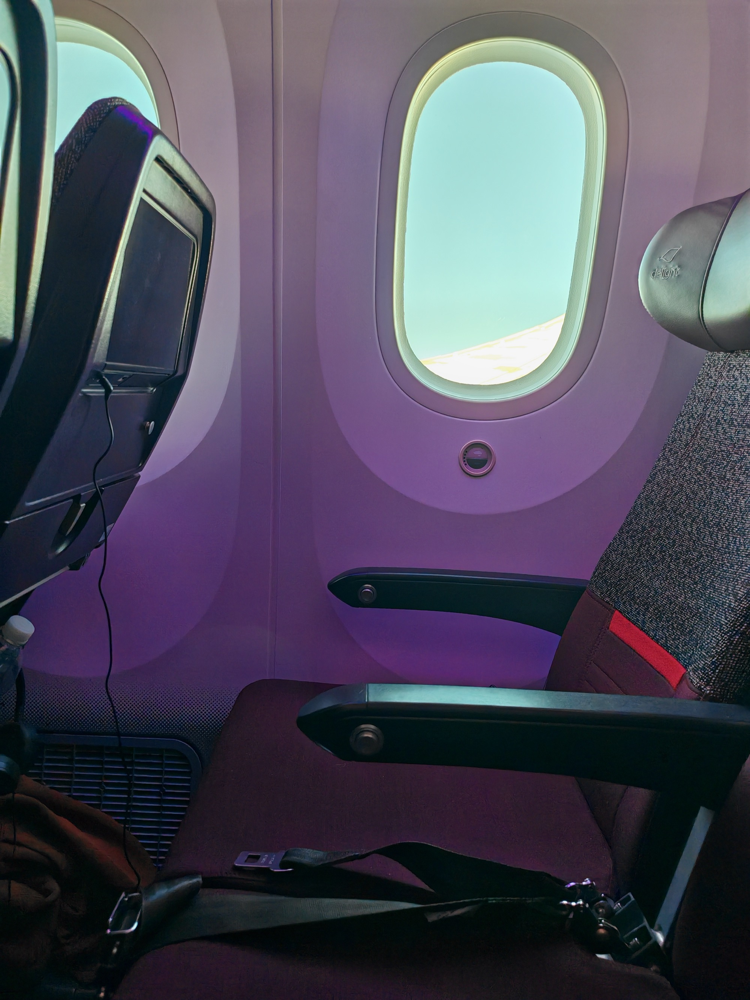
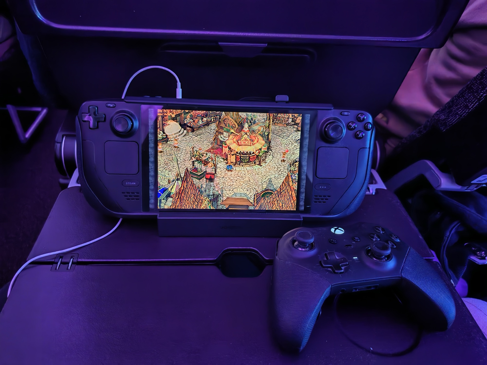
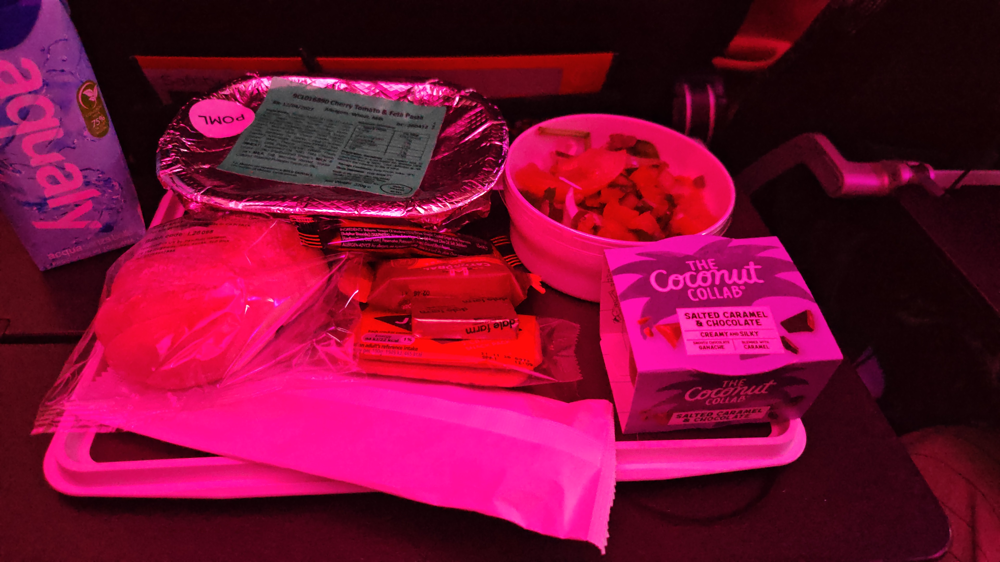
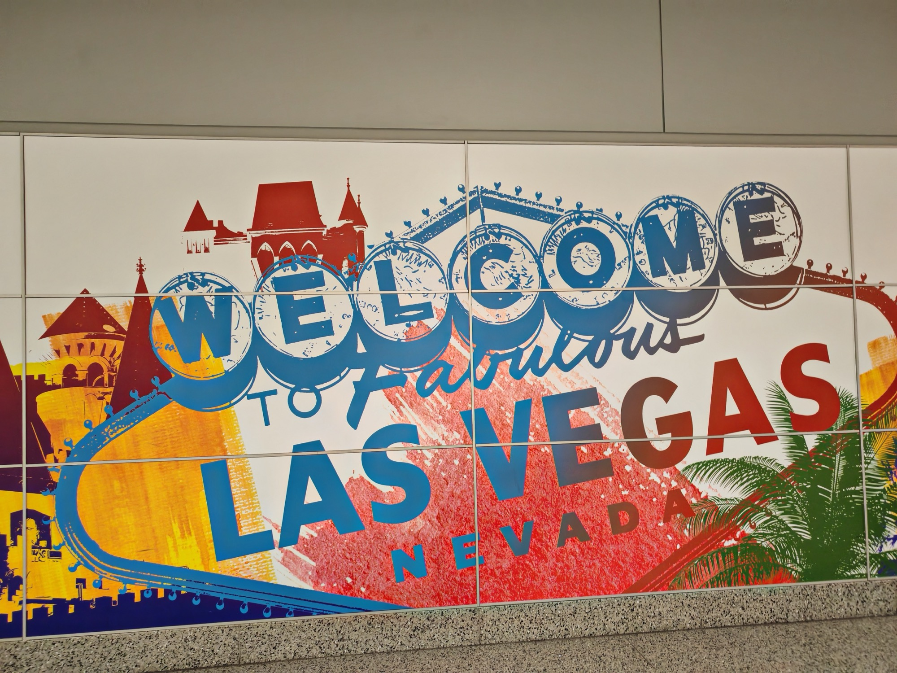

<!--more-->

## Boarding

I have seen nothing like it, boarding was complete 30 minutes after the gate was announced. For those that have travelled as a family before, this was one of those situations that blew my mind.

Unfortunately there was no opportunity to take a photo of the plane with how fast everything was going. So enjoy this stock image instead.

---

## The plane

Smaller than I had it in my head. The last holidays I went on, in 2025 and 2015 were both Emirates on massive Airbuses to Dubai. Then it clicked — this isn't school holiday season. This is Las Vegas, a mainly adult destination, and the cabin was noticeably full of people clearly attending the conference. You could tell from the conversations flowing throughout. Cloud infrastructure at 35,000 feet.

It was still odd, a US-carrier-style layout a foreign concept to me. The contrast of what I expect is becoming very enjoyable!

---

## The seat

Economy Delight. More legroom than economy — which, after a day of trains and terminals, was exactly what I needed. The screen is noticeably better than the Emirates one, which surprised me. Good start.

---

## Entertainment

No Lord of the Rings on the entertainment system. Immediately loses a point.

Settled in for [The Housemaid](https://en.wikipedia.org/wiki/The_Housemaid_(2025_film)), [Wicked: For Good](https://en.wikipedia.org/wiki/Wicked:_For_Good), then random episodes of [The Office US](https://en.wikipedia.org/wiki/The_Office_(American_TV_series)) and [Parks & Recreation](https://en.wikipedia.org/wiki/Parks_and_Recreation) for what is probably the nth time.

I brought my [Steam Deck](https://www.steamdeck.com/) setup - and after some standard Linux Troubleshooting enjoyed the masterpiece [Final Fantasy IX](https://www.cbr.com/final-fantasy-greatest-game-ff9/) again, no regrets whatsoever.

---

## Food

The ones I did take have a weird hue from the cabin lights — but you get the idea.

That said I have finally, officially, joined the [Coconut Collab](https://thecoconutcollab.com/) club. My kids would absolutely love this and I will be reporting back. I also broke the cheese crackers trying to open the packet. As I always do. When will I learn.

We had unlimited snacks and drinks provided through the flight, pizza, high tea, ice cream. All very enjoyable!

---

## WiFi

£12.99 for the mod package. Worth every penny — until the connection dropped in the last three hours and wouldn't recognise my device. Being able to instant message the family was nice.

## Summary

All in all a very enjoyable flight. I somehow experienced nose pressure on the descent which caused a nosebleed. WILD.

Nearly there.

