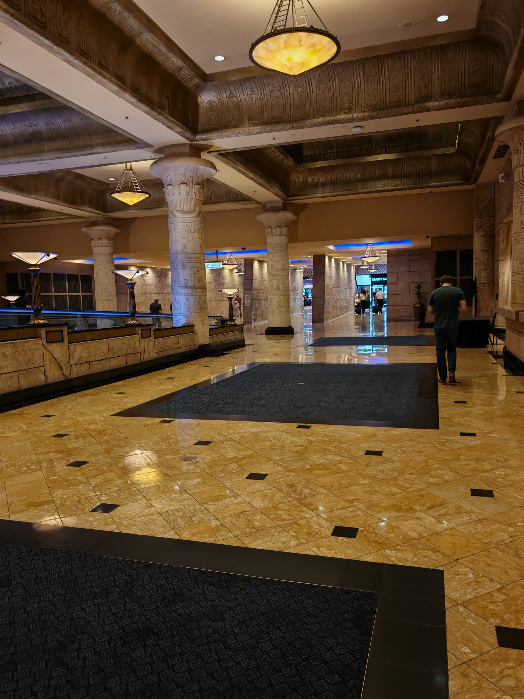
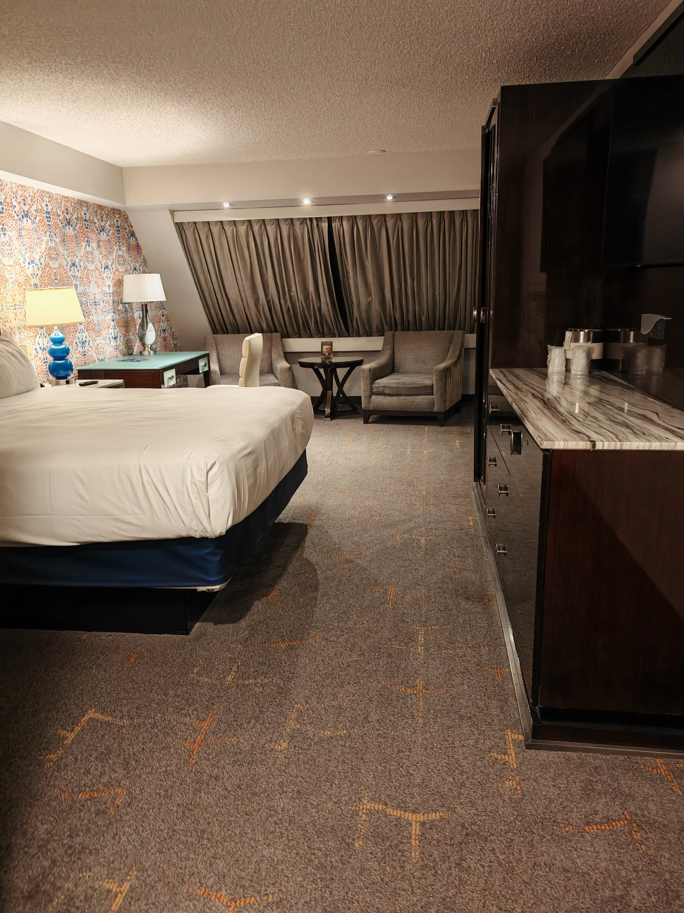
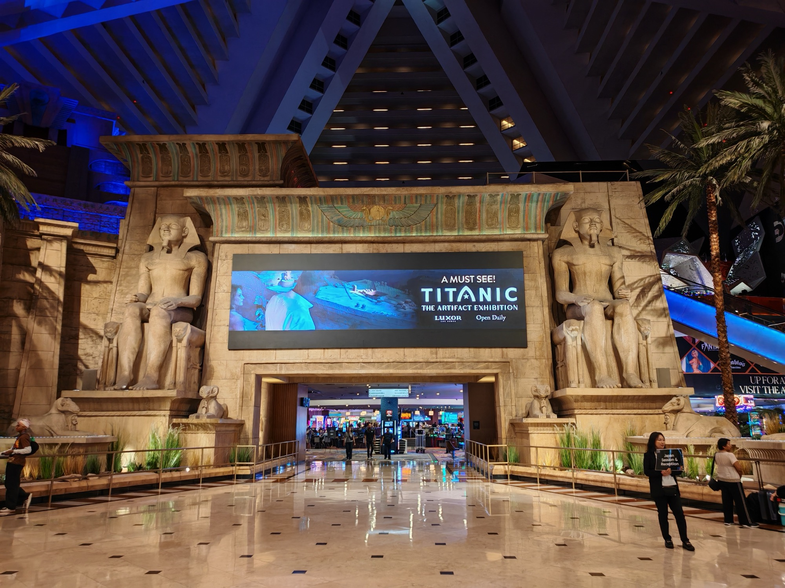
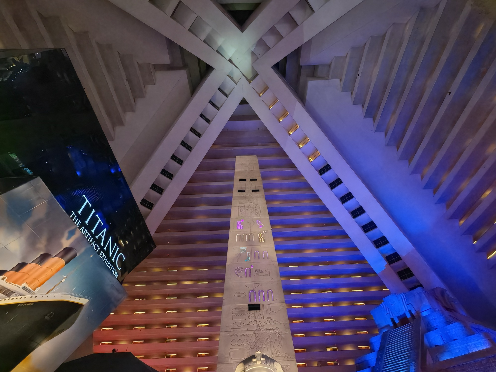
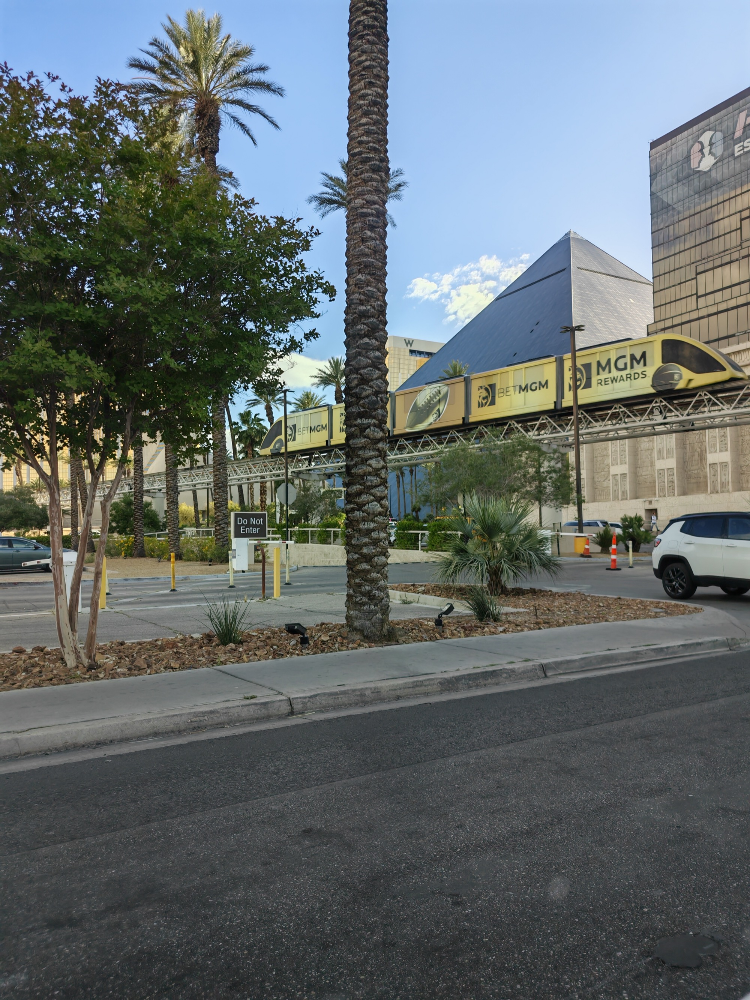

<!--more-->

## Arriving in Las Vegas

Landing was a pretty surreal experience, Las Vegas at night is a full on lightshow. You can see [the Sphere](https://en.wikipedia.org/wiki/Sphere_(venue)) and other notable landmarks as you get lower. To me it actually looked more futuristic than Dubai (at night). Unfortunately I was in an aisle seat so no photo.

Immigration was very straightforward, you stand in a line as they process you, questioning why you are in Vegas, for how long and when you are leaving. They take a photo and fingerprints of both hands, all very respectful.

Best part of this was watching the commercials on the TVs while we waited. So patriotic and cheesy and just so different than the UK. The production values especially seemed lower but these could be historic vids on a loop.

No photos of the terminal really as once you are out of immigration, baggage claim (easy as small numbers on the flight) you are then out the terminal. I used the free Wi-Fi to book myself an Uber to the hotel after sadly failing to use any of the autonomous vehicle apps due to needing a US number. Maybe one day.

Even though 'on paper' the distance looks really close, a walk to the hotel would have taken 2 hours. Sometimes I forget just how big America is!

---

## The Luxor

I am a huge Egypt nerd, it stemmed from childhood reading colourful books about the [Tutankhamun Burial Mask](https://en.wikipedia.org/wiki/Mask_of_Tutankhamun) and then expanded when reading [Matthew Reilly's](https://www.matthewreilly.com/) excellent 7 book [Jack West Jr](https://en.wikipedia.org/wiki/Jack_West_Jr.) series as a teenager. It is one of my all-time favourite book series and I rate it above Harry Potter. Weirdly I never would have heard about this if I didn't see the first entry (Seven Deadly Wonders) in a closed bookshop when walking through an Australian Airport in 2006.

On arrival I was directed to a load of check-in terminals, not a helper in sight. Like many others we struggled to get the passport scanners working but eventually got there. We were not allowed to join the queue to speak to a person for some reason. Anyway you enter in your confirmation number, scan your passport and you are done. You then get an email saying when your room is ready. You go over to ANOTHER set of terminals, take a blank key card, insert it in with your confirmation number which then tells you your room number, the elevator set you use (colour coded) and programs your blank key to be used on the room.

I was fine with all of this but the frustrating part was having to put my own card against the room and subsequently being charged the full stay on that card. I was informed our Travel Company had sent a pre-auth using their card and that would be used for payment. Unfortunately it was not to be. When I did eventually manage to speak to people they tried to be helpful but unfortunately could not resolve the issue before I returned back to the UK. I made a comparison that the tech on this stage (Front Desk) just seemed really legacy compared to what I have seen in London Hotels and how straightforward updating a card on a room would be.

Anyway, expenses it is.

---

## The room

Went for a Pyramid King — the elevators are called [inclinators](https://en.wikipedia.org/wiki/Inclinator), travelling at a 39-degree angle up the face of the pyramid rather than vertically. That was an experience. Additionally only certain inclinators go to certain blocks of rooms. I only know this as I got on the wrong set of blue elevators somehow — mine actually travelled up vertically.

Static charge build up seems to be a regular thing as you walk to and from your room, so be prepared to get the shock pressing elevator buttons or touching your door handle. I eventually got used to it.

Huge comfy King bed, almost too big given we usually have night visitors from the kids — or if multiple are ill, I'll be on the sofa downstairs. It was very comfortable along with decent heating/cooling options. Shower was very powerful also. The downside was that my body clock refuses to adjust so I averaged around 5 hours each night, including 4 on the first which was odd as I stayed awake the entire LHR->LV flight to be able to sleep in the hotel.

TV has good options but the toilet, my word the toilet. This is something I cannot get used to — they use a [siphonic flushing system](https://en.wikipedia.org/wiki/Flush_toilet#Siphonic_vs_washdown) meaning the standing water almost fills the bowl. There are reasons behind this I am sure. I just don't like it.

---

## The atrium

The interior is genuinely impressive. The entire hotel sits inside the pyramid — rooms line all four inclined walls looking down into a central atrium that holds the record as the [world's largest by volume](https://en.wikipedia.org/wiki/Luxor_Las_Vegas) at 29 million cubic feet.

The [Titanic: The Artifact Exhibition](https://luxor.mgmresorts.com/en/entertainment/titanic-the-artifact-exhibition.html) was in residence during the stay — one of the largest collections of Titanic artefacts in the world. Other attractions were a Burlesque show and artifacts from King Tut's tomb. If I stayed longer I would have definitely done the tomb, alas it was not to be.

Overall though, good facilities. Casino takes up a significant part but good food options - I ate at the Original Chicken Tenders Place the first night and just used the on-site markets for the Coffee cans and protein bars for the rest. The chicken place does not hold a candle to slim-chickens so I will not waste time on a review.

---

## The Strip from here

I booked here as it was very close to NEXT, where you just walk through a connected shopping mall to Mandalay Bay. It is also easy to see pretty much anywhere close to the strip in Vegas thanks to the beam. Which shows up in a number of my photos.

The [Luxor Sky Beam](https://en.wikipedia.org/wiki/Luxor_Sky_Beam) is the brightest beam of light in the world — 315,000 watts, 42.3 billion candelas, visible from aircraft up to 275 miles away. You can see it from the air on approach. At street level with the [Excalibur](https://en.wikipedia.org/wiki/Excalibur_Hotel_and_Casino) towers in the foreground it looks like something out of a film.

So far only had the opportunity to walk back to the Luxor after a team dinner at BrewDog. It was very enjoyable with all the night lights, bridges to cross the roads and connected paths to other hotels. The [Excalibur](https://en.wikipedia.org/wiki/Excalibur_Hotel_and_Casino), Mandalay Bay and the W are all part of [MGM Resorts](https://www.mgmresorts.com/) so Wi-Fi is constant throughout. Plenty of options for shops and food.

As someone who loves night cityscapes — I felt completely at ease and zen whenever I was outside.

One tip — buy an eSIM before you travel. I used [Holafly](https://holafly.com/) and it worked perfectly from the moment I landed without needing a physical SIM or a US number. Roughly £17 for 5 days unlimited data.

## Would I recommend?

Yes, great location and easy to get to a number of places.
