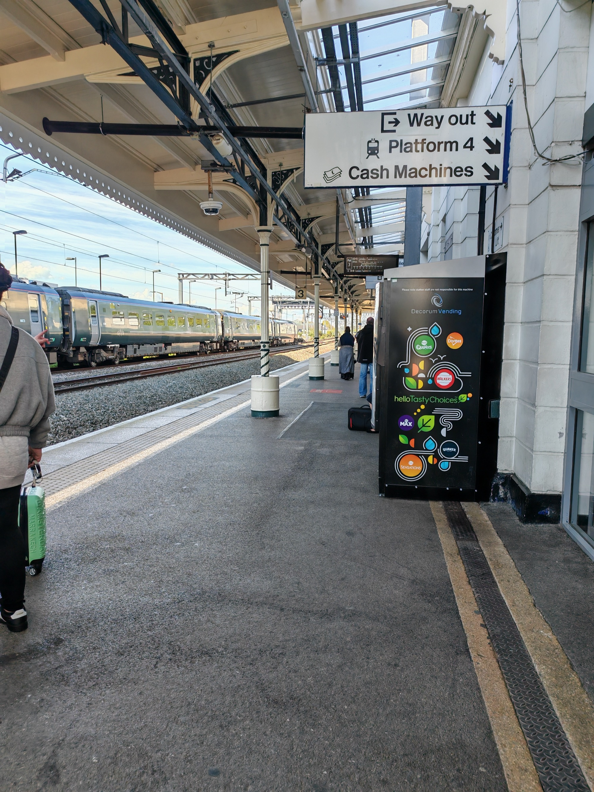
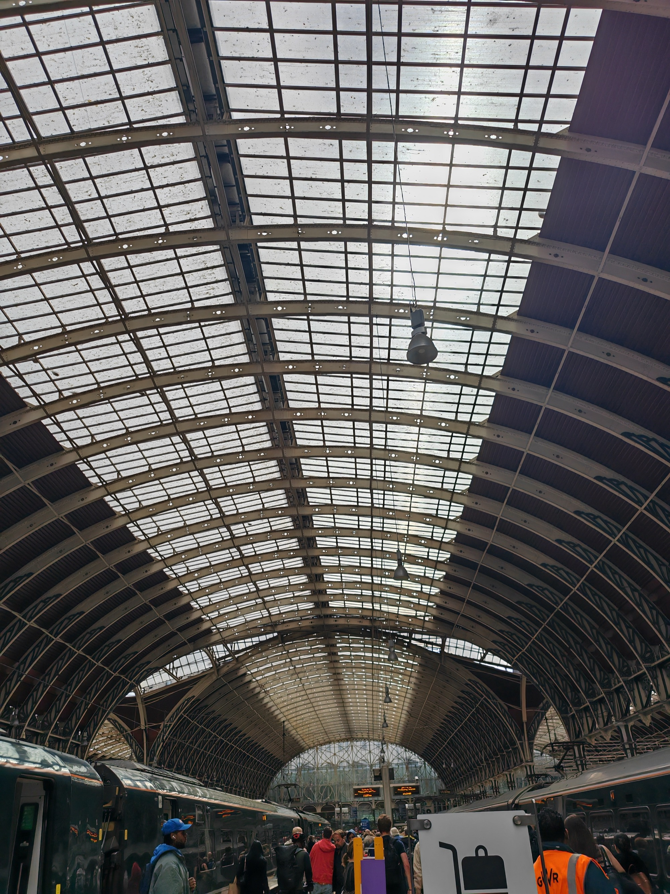
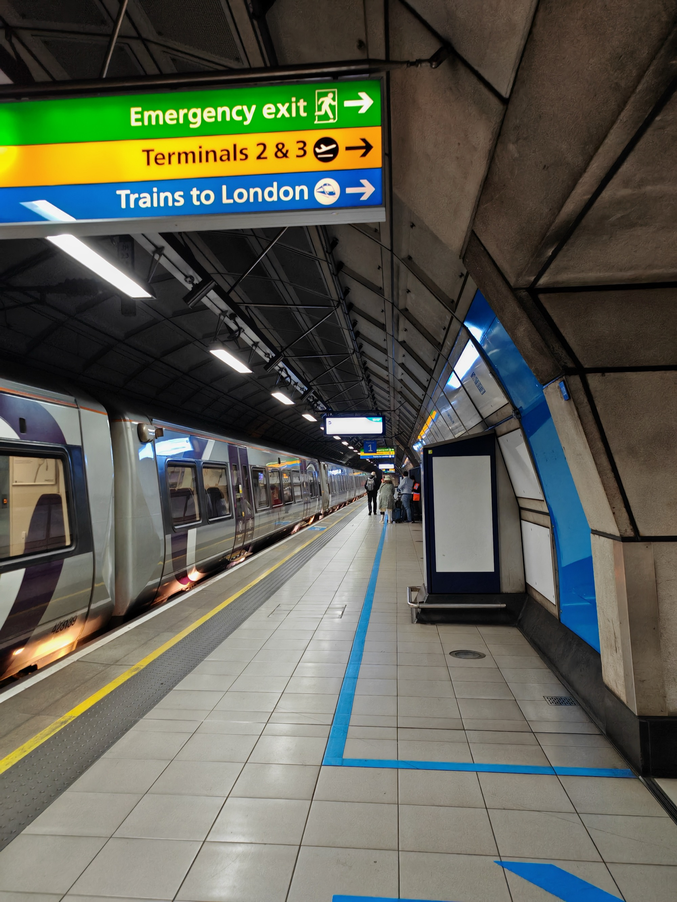
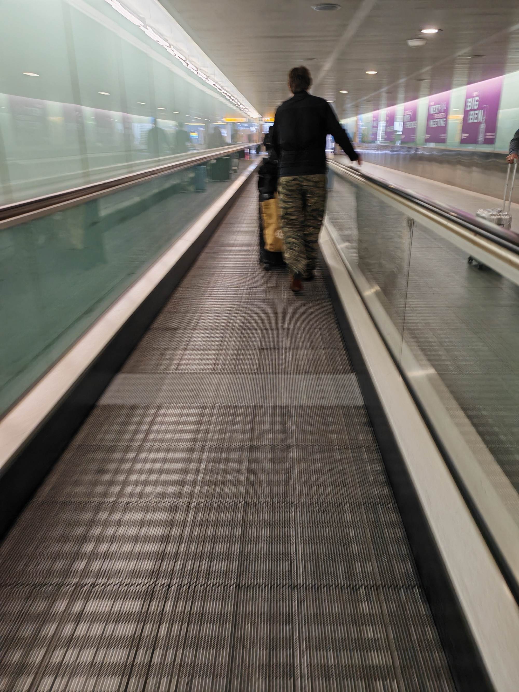
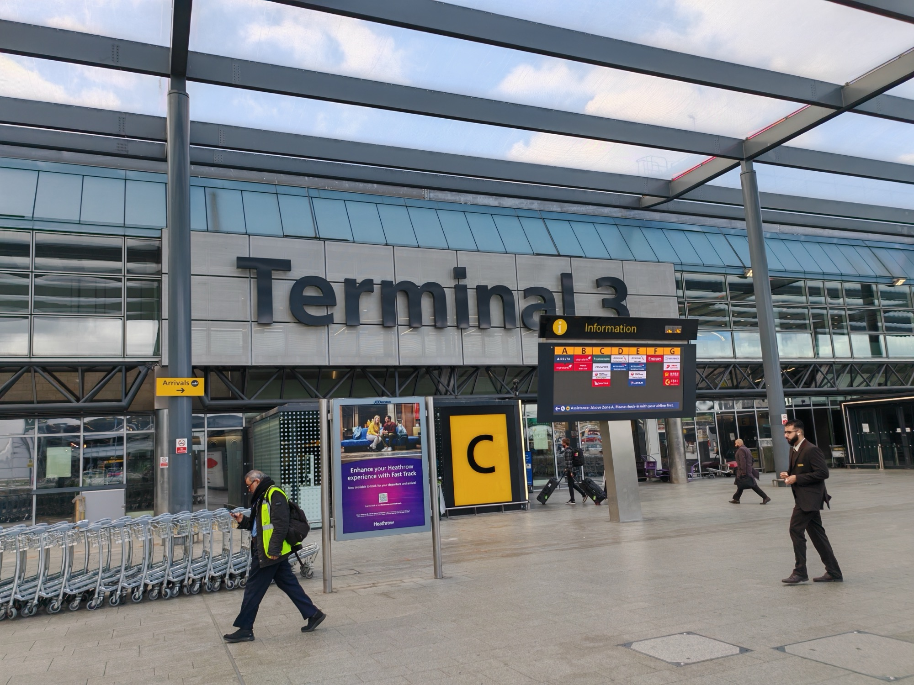

<!--more-->

## Wootton Bassett → Swindon

Trip starts here — not at the airport, not on the plane, but on a platform in Swindon. I said an emotional goodbye to my wife and three sons before catching an Uber to the station.

"Mind the Gap." I saw this everywhere today. Every platform, every crossing point, painted in yellow or stamped into the tarmac. A very British warning — polite, understated, slightly passive aggressive.

It also happened to be what my Arsenal supporting friends have been saying, a lot. Granted this was when they were nine points clear at the top of the Premier League. As of today, they're three points ahead with a game more played. I am no City fan (Manchester United), but I'll be honest — watching Arsenal fans rediscover the meaning of the phrase they'd been using as an ill-timed victory lap is one of the small joys of a difficult season which looks to have a positive ending.

Mind the gap indeed.

---

## Swindon → Paddington

Get to the station to a huge red notice on the screen advising of trespassers (plural) on the line between Reading and London Paddington which resulted in many delays and cancellations. Weirdly the train I was booked on was not, but those either side were and as a result, was ram packed.

The [GWR](https://www.gwr.com/) train was only five carriages — rammed with people and suitcases, which isn't ideal for anyone like me travelling to an airport. That said, thankfully it was one of the less tragic reasons for a rail delay. Trespassers were moved on without incident by the time we got to Reading.

British humour between passengers is a sober necessity when riding by train in the UK under these conditions which sadly is too regular an occurrence. Each acknowledging how things can seem so terrible and expensive in comparison to experiences in other countries. GWR staff as always were genuinely helpful, they are not at blame here.

---

## Paddington

I am always, every single time, genuinely astounded by what humanity builds.

The iron and glass roof at Paddington is the same whether it's rush hour or a quiet weekday morning. It doesn't change. It's just that on a quieter platform, you actually have space to stop and look up at it. For those who've read the [Adrian Mole series](https://en.wikipedia.org/wiki/Adrian_Mole) — in *[True Confessions of Adrian Albert Mole](https://en.wikipedia.org/wiki/True_Confessions_of_Adrian_Albert_Mole,_Margaret_Hilda_Roberts_and_Susan_Lilian_Townsend)* (or [Adrian Mole: The Wilderness Years](https://en.wikipedia.org/wiki/Adrian_Mole:_The_Wilderness_Years)) he dates an aspiring hydraulic engineer called Bianca. When they visit King's Cross she has a similar experience, completely overawed by the architecture and the sheer scale of what people can build. I know exactly how she felt.

---

## Heathrow Express

The last time I took the [Heathrow Express](https://www.heathrowexpress.com/) was when a previous employer sent me to Amsterdam to do Workday HCM testing. To this day I still don't fully understand the reasoning, my second child had just been born and it was the first time I had been away from my family since marriage. The moment I logged in when I arrived I could see you could select a regional tenant — meaning if I could select the UK from the Netherlands, why couldn't I have just selected the Netherlands from the UK? It seemed no one thought to ask that question and I never seemed to get a satisfying answer. That said, I did get to claim McDonald's on expenses (a dream at the time). Multiple times. So maybe not a complete waste.

The Heathrow Express opened in 1998. There is a spirit to it that feels similar to when the Elizabeth Line opened in 2022 — that sense that the city just quietly got better at moving people. The [Elizabeth Line](https://tfl.gov.uk/modes/elizabeth-line/) is the one I take whenever I'm heading into the London office now. It has completely transformed that journey. What used to be a sweaty faff from Paddington on the Circle Line — changes, stops, the whole thing — is now one clean, direct run although still sweaty, sometimes.

Back in 2006 I was an A Level student, grateful to have landed my first part-time job — 1st Line IT Support for a railways consultancy. I was supporting Civil Engineers and CAD/Microstation users, some of whom were working on something referred to at the time as Crossrail. I had no real context for what that meant beyond the code name. I was just a teenager trying to make sure people's machines worked and not break anything I shouldn't.

It was only years later, as an adult reading and understanding news articles, that I made the connection — that the project I'd been hovering around as a very junior support person was what eventually became the Elizabeth Line, which opened fully in 2022. And when I did make that connection, I was genuinely shocked. Not just at the scale of it, but at how long it took. Decades of planning, engineering, delays, and politics to build something that China or the Middle East would seemingly deliver in a fraction of the time. A different conversation for a different day — but it crossed my mind.

I ride it now without thinking. When you travel without kids, for me there is so much self reflection that comes up randomly and long hidden memories that obviously meant something to leave an imprint. The joys of solo travel I guess! I'll go into this in a separate post, something I call "Nostalgia Reset".

The Express itself was smooth. Exactly what it should be.

---

## Terminal 3

I will never not enjoy a travelator. There is no justification for this photo. I just love and am fascinated by them.

Check-in and security went smoothly, this is not silly school holiday season after all. There was a brief moment of confusion — I'd watched a YouTube review of "Economy Delight" for Virgin Atlantic (my seat class) and somehow convinced myself it was Upper Class because it was in the Upper Cabin. I was brought down to reality by a stewardess fairly quickly. But again the overall process was quick and painless, which is really all you want.

Again, I was reminded of my childhood and yearly trips to Goa, India — a family of six or more, hours of queuing, paperwork everywhere, Dad stressing. Technology and process efficiency have genuinely made people's lives better. That's not nothing.

I walked past the duty free watches. When I was a kid, airports for me meant one thing — a new cheap watch for about £20 that was waterproof and had a rotating dial (ideal for fidgeters). It was definitely Sekonda (probably). You would seriously struggle to find anything like that in an airport now. I'm not sure if that's inflation, repositioning, or I'm just old. Probably all three.

Time to find some food.
